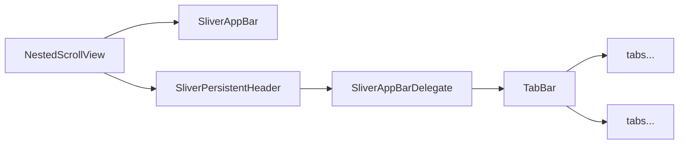

### Hiddable SliverAppbar


### TabBar Nested in SliverAppBar
#### NestedScrollView / SliverAppBar / SliverPersistentHeader / 



##### _SliverAppBarDelegate
```dart
  class _SliverAppBarDelegate extends SliverPersistentHeaderDelegate {
    _SliverAppBarDelegate(this._tabBar);

    final TabBar _tabBar;

    @override
    double get minExtent => _tabBar.preferredSize.height;
    @override
    double get maxExtent => _tabBar.preferredSize.height;

    @override
    Widget build(
        BuildContext context, double shrinkOffset, bool overlapsContent) {
      return new Container(
        child: _tabBar,
      );
    }

    @override
    bool shouldRebuild(_SliverAppBarDelegate oldDelegate) {
      return false;
    }
  }
```


##### NestedScrollView
```dart
Widget build(BuildContext context) {
      return Scaffold(
        body: DefaultTabController(
          length: 2,
          child: NestedScrollView(
            headerSliverBuilder: (BuildContext context, bool innerBoxIsScrolled) {
              return <Widget>[
                SliverAppBar(
                  expandedHeight: 200.0,
                  floating: false,
                  pinned: true,
                  flexibleSpace: FlexibleSpaceBar(
                      centerTitle: true,
                      title: Text("Collapsing Toolbar",
                          style: TextStyle(
                            color: Colors.white,
                            fontSize: 16.0,
                          )),
                      background: Image.network(
                        "https://images.pexels.com/photos/396547/pexels-photo-396547.jpeg?auto=compress&cs=tinysrgb&h=350",
                        fit: BoxFit.cover,
                      )),
                ),
                SliverPersistentHeader(
                  delegate: _SliverAppBarDelegate(
                    TabBar(
                      labelColor: Colors.black87,
                      unselectedLabelColor: Colors.grey,
                      tabs: [
                        Tab(icon: Icon(Icons.info), text: "Tab 1"),
                        Tab(icon: Icon(Icons.lightbulb_outline), text: "Tab 2"),
                      ],
                    ),
                  ),
                  pinned: true,
                ),
              ];
            },
            body: Center(
              child: Text("Sample text"),
            ),
          ),
        ),
      );
    }
```


###  Handy Tool for Preventing Rebuild

```dart 
class ShouldRebuild<T extends Widget> extends StatefulWidget {
  final T child;
  final ShouldRebuildFunction<T> shouldRebuild;
  ShouldRebuild({@required this.child, this.shouldRebuild}):assert((){
    if(child == null){
      throw FlutterError.fromParts(
          <DiagnosticsNode>[
            ErrorSummary('ShouldRebuild widget: builder must be not  null')]
      );
    }
    return true;
  }());
  @override
  _ShouldRebuildState createState() => _ShouldRebuildState<T>();
}

class _ShouldRebuildState<T extends Widget> extends State<ShouldRebuild> {
  @override
  ShouldRebuild<T> get widget => super.widget;
  T oldWidget;
  @override
  Widget build(BuildContext context) {
    final T newWidget = widget.child;
    if (this.oldWidget == null || (widget.shouldRebuild == null ? true : widget.shouldRebuild(oldWidget, newWidget))) {
      this.oldWidget = newWidget;
    }
    return oldWidget;
  }
} 
```

#### usage
```dart 
ShouldRebuild<Counter>(
	shouldRebuild: (oldWidget, newWidget) => oldWidget.counter != newWidget.counter,
	child: Counter(counter: counter,onClick: _incrementCounter,title: '我是优化过的Counter',) ,
),
```


#### 節錄flutter 判斷是否updateChild
```dart
Element updateChild(Element child, Widget newWidget, dynamic newSlot) {
...
      if (child.widget == newWidget) {
        if (child.slot != newSlot)
          updateSlotForChild(child, newSlot);
        return child;
      }
      if (Widget.canUpdate(child.widget, newWidget)) {
        if (child.slot != newSlot)
          updateSlotForChild(child, newSlot);
        child.update(newWidget);
        assert(child.widget == newWidget);
        assert(() {
          child.owner._debugElementWasRebuilt(child);
          return true;
        }());
        return child;
      }

...
} 
```


<!--stackedit_data:
eyJoaXN0b3J5IjpbMTAxNDMzNTI5Miw3MDMxNjQ3NjYsLTEwMD
Q1ODU1OTIsLTMxOTQ0MjE2NV19
-->