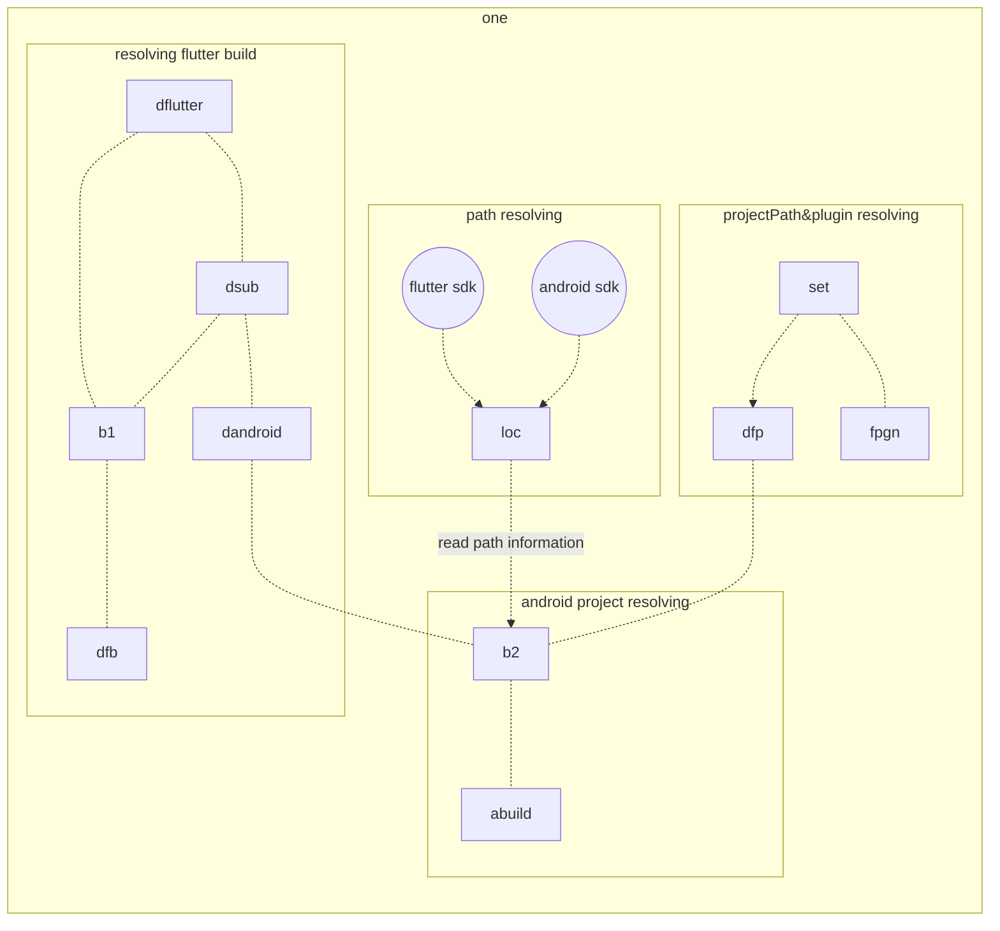

### Hiddable SliverAppbar


### TabBar Nested in SliverAppBar
#### NestedScrollView / SliverAppBar / SliverPersistentHeader / 


```dart
Widget build(BuildContext context) {
      return Scaffold(
        body: DefaultTabController(
          length: 2,
          child: NestedScrollView(
            headerSliverBuilder: (BuildContext context, bool innerBoxIsScrolled) {
              return <Widget>[
                SliverAppBar(
                  expandedHeight: 200.0,
                  floating: false,
                  pinned: true,
                  flexibleSpace: FlexibleSpaceBar(
                      centerTitle: true,
                      title: Text("Collapsing Toolbar",
                          style: TextStyle(
                            color: Colors.white,
                            fontSize: 16.0,
                          )),
                      background: Image.network(
                        "https://images.pexels.com/photos/396547/pexels-photo-396547.jpeg?auto=compress&cs=tinysrgb&h=350",
                        fit: BoxFit.cover,
                      )),
                ),
                SliverPersistentHeader(
                  delegate: _SliverAppBarDelegate(
                    TabBar(
                      labelColor: Colors.black87,
                      unselectedLabelColor: Colors.grey,
                      tabs: [
                        Tab(icon: Icon(Icons.info), text: "Tab 1"),
                        Tab(icon: Icon(Icons.lightbulb_outline), text: "Tab 2"),
                      ],
                    ),
                  ),
                  pinned: true,
                ),
              ];
            },
            body: Center(
              child: Text("Sample text"),
            ),
          ),
        ),
      );
    }
```

```


<!--stackedit_data:
eyJoaXN0b3J5IjpbMTY0MTIyOTY4N119
-->