# Flutter
<!-- START doctoc generated TOC please keep comment here to allow auto update -->
<!-- DON'T EDIT THIS SECTION, INSTEAD RE-RUN doctoc TO UPDATE -->

- [Flutter](#flutter)
  - [addActivityResultListener](#addactivityresultlistener)
  - [Flutter/Android 專案目錄結構說明](#flutterandroid-%E5%B0%88%E6%A1%88%E7%9B%AE%E9%8C%84%E7%B5%90%E6%A7%8B%E8%AA%AA%E6%98%8E)
    - [說明Android Project wrapper for flutter](#%E8%AA%AA%E6%98%8Eandroid-project-wrapper-for-flutter)
    - [未完成](#%E6%9C%AA%E5%AE%8C%E6%88%90)
  - [addNewIntentListener](#addnewintentlistener)
    - [Sample Code](#sample-code)
  - [To Elaborate](#to-elaborate)
    - [BroadCastReceiver Overview](#broadcastreceiver-overview)
    - [BroadCastReceiver examples](#broadcastreceiver-examples)
    - [LocalBroadCastManager](#localbroadcastmanager)
    - [addNewIntentListener](#addnewintentlistener-1)
  - [Channel android to flutter](#channel-android-to-flutter)
    - [Hiddable SliverAppbar](#hiddable-sliverappbar)
    - [TabBar Nested in SliverAppBar](#tabbar-nested-in-sliverappbar)
    - [Handy Tool for Preventing Rebuild](#handy-tool-for-preventing-rebuild)
  - [Trouble Shooting](#trouble-shooting)
    - [Flutter Constaantly Rebuild](#flutter-constaantly-rebuild)
    - [Rendering Problems](#rendering-problems)

<!-- END doctoc generated TOC please keep comment here to allow auto update -->


## addActivityResultListener


## Flutter/Android 專案目錄結構說明

file structure of a flutter project would be look like this
- 📁 FlutterProject
	- 📰 pubspec.yaml 
	- 📁 lib [1]
- 	- 📁 res [2]
	- 📁 android [3]
		- 📁 app
			- 📁 libs
			- 📁 src
			- 📰 build.gradle 
		- 📁 res
		- 📁 assets
		- 📰 build.gradle
		- 📰 settings.gradle
		- 📰 local.properties 

>[1]  libraries written in dart.
>[2] android resource folder for flutter project,  generated by flutter.
>[3]  an android project wrapper for flutter, which contains following structure
>- 📁 app
>     - 📰 build.gradle
>     - 📰 local.properties 
>- 📁 res
>- 📁 assets
>- 📰 build.gradle
>- 📰 settings.gradle
> 


### 說明Android Project wrapper for flutter
#### file structure
- **FlutterProject > android**
	- 📁 app[^1]
		- 📁 libs
		- 📁 src
		- 📰 build.gradle [^2]
	- 📁 res[^*]
	- 📁 assets[^*]
	- 📰 build.gradle[^3]
	- 📰 settings.gradle[^4]
	- 📰 local.properties [^5]


**[1] app** your existing android project 
 #### [1] app folder - 現有android專案

 >需將其folder改名為app，app似乎為flutter默認的android專案名稱，以告知flutter專案設定的位置(build.gradle, settings.gradle)，如果不用默認的名稱似乎也可以，但需要設定project.name及include name，後文會寫到。
>
>android project folder, this would be your existing android project renamed to "app".  "app" seems like a default naming convention for flutter to indicate project entry folder where configurations(build.gradle and local.properties) locates. For not using convention name, you need to setup project name and include name in build.gradle, which will refer later on.
 
------------------------------------------------
 
**[2] build.gradle** : build script for existing android project
#### android專案設定檔 
>若要將現有專案與flutter連結,需在該設定檔中寫入以下資訊
- 載入local.properties
- flutterRoot 
- flutterProject
- apply pluginId **&** apply from
- sourceSets
- applicationId
- dependencies

> #### local.properties
> indicates where flutter.sdk and android.sdk locate.
```groovy
	def localProperties = new Properties()  
	def localPropertiesFile = rootProject.file('local.properties')  
	if (localPropertiesFile.exists()) {  
	    localPropertiesFile.withReader('UTF-8') { reader ->  
	        localProperties.load(reader)  
	    }  
	}
```
> 主要記錄了flutter.sdk及android.sdk的位置, 介由讀取 local.properties 以注入flutter
> - rootProject 指向 android , 
> - localPropertiesFile  指向 android/local.properties

> #### flutterRoot
> read flutter sdk from local.properties into flutterRoot
```groovy
	def flutterVersionCode = localProperties.getProperty('flutter.versionCode')  
	if (flutterVersionCode == null) {  
	    flutterVersionCode = '1'  
	}  
	def flutterVersionName = localProperties.getProperty('flutter.versionName')  
	if (flutterVersionName == null) {  
	    flutterVersionName = '1.0'  
	}
	def flutterRoot = localProperties.getProperty('flutter.sdk')  
	if (flutterRoot == null) {  
	    throw new GradleException("Flutter SDK not found. Define location with flutter.sdk in the local.properties file.")  
	}
```

> #### flutterProject
> specify where flutterProject locates, default value are "../.."
```groovy
	def flutterProject = '../..'
	flutter {  
	    source flutterProject  
	}
```

> #### apply plugin | apply from
> contains following two sections
>  - apply plugins like kotlin which indicates a valid pluginId implmented the plugin interface by project requirements.
>  - apply a build script from flutter
```groovy
	apply plugin: 'com.android.application'  
	apply plugin: 'kotlin-android'  
	apply from: "$flutterRoot/packages/flutter_tools/gradle/flutter.gradle"
```

> #### sourcesSet
> set entry point for finding sources
> - java source
> - res source
	> res 分為二個部份，一個是原有專案的res, 另一個則為flutter專案所需要的 res，由flutter自動產生
>   - res resource of existing android project
>   - res source of current flutter project	
> - assets source
```groovy
	android {  
		sourceSets {  
			main {  
				//manifest.srcFile "src/main/AndroidManifest.xml"  
				java.srcDirs += ['src/main/kotlin', 'src/main/java']  
				res.srcDirs += ['res', flutterProject + '/res']  
				assets.srcDirs += ['assets', flutterProject + '/assets']  
			}  
```

> #### applicationId
> 
```groovy
	android {
		defaultConfig {  
			// applicationId will replace package name specified in AndroidManifest.xml  
			applicationId "com.gknot"  
			minSdkVersion 19  
			targetSdkVersion 28  
			versionName flutterVersionName  
			testInstrumentationRunner "android.support.test.runner.AndroidJUnitRunner"  
		}
```

> #### dependencies
```groovy
	dependencies {  
		implementation fileTree(include: '*.jar', dir: 'libs')  
		implementation "org.jetbrains.kotlin:kotlin-stdlib-jdk7:$kotlin_version"  
		//following dependencies depends on flutter  
		testImplementation 'junit:junit:4.12'  
		androidTestImplementation 'com.android.support.test:runner:1.0.2'  
		androidTestImplementation 'com.android.support.test.espresso:espresso-core:3.0.2'  
	}
```
[file](build.gradle.andoirdpj)

------------------------------------------------

**[*]res and assets** for existing android project
#### 設置android專案 res & assets
> 於上述build.gradle中設定

------------------------------------------------

**[3] build.gradle [4] setting.gradle** for flutter building android
#### flutter android build 專案設定檔
- **build.gradle**
	- kotlin & gradle dependencies
	- add buildDir
	- add existing android project into subproject
	- add clean build
- **settings.gradle**
	- include subproject
	- add flutter plugin
 
```groovy
	// -------------------
	// flutterProject/android/build.gradle....
	buildscript {  
		ext.kotlin_version = '1.3.21'  
		dependencies {  
			classpath 'com.android.tools.build:gradle:3.3.1'  
			classpath "org.jetbrains.kotlin:kotlin-gradle-plugin:$kotlin_version"  
		}  
	}  
	rootProject.buildDir = '../build'  
	subprojects {  
		project.buildDir = "${rootProject.buildDir}/${project.name}"  
	}  
	subprojects {  
		project.evaluationDependsOn(':app')  
	}  
	task clean(type: Delete) {  
		delete rootProject.buildDir  
	}

	// -------------------
	// flutterProject/android/settings.gradle....
	include ':app'  
	def flutterProjectRoot = rootProject.projectDir.parentFile.toPath()  
	def plugins = new Properties()  
	def pluginsFile = new File(flutterProjectRoot.toFile(), '.flutter-plugins')  
	if (pluginsFile.exists()) {  
	    pluginsFile.withReader('UTF-8') { reader -> plugins.load(reader) }  
	}  
	plugins.each { name, path ->  
	    def pluginDirectory = flutterProjectRoot.resolve(path).resolve('android').toFile()  
	    include ":$name"  
	  project(":$name").projectDir = pluginDirectory  
	}
```
> **[NOTE]** the **colon** in Gradle uses to describe paths to subprojects. For example,
> evaluationDependsOn(':api:producer')
> would look for the subproject  `producer`  of the subproject  `api`.

------------------------------------------------

**[5] local.properties**
#### 連結android sdk, flutter sdk
```groovy
	sdk.dir=D:/Users/gordianknot/AppData/Local/Android/android-sdk  
	flutter.sdk=E:\\flutter  
	flutter.versionName=1.0.0  
	flutter.versionCode=1  
	flutter.buildMode=debug
```  

### 未完成
上述方法用了flutter i18n plugin 後由會在 res/value 底下加入 string_xx.arb ,導致編譯時出現 "file name must end with .xml", 目前找不到合適的解決方法，只好手動把flutter 的 resource copy 到 原 android 專案中，並把
```groovy
	android {  
		sourceSets {  
			main {  
				//manifest.srcFile "src/main/AndroidManifest.xml"  
				java.srcDirs += ['src/main/kotlin', 'src/main/java']  
				//res.srcDirs += ['res', flutterProject + '/res']  
				res.srcDirs += ['res']  
				assets.srcDirs += ['assets', flutterProject + '/assets']  
			}  
```
或者只好停用 android studio Flutter i18n 的 plugin


 

 
**Demo project**
<!--stackedit_data:
eyJoaXN0b3J5IjpbMTkxNjgwODAyNCwtMTgyMzA5NDAxNCwtMT
g3MjM3MzM3MCwxODE4NDY0NjYwLDE5NDA5NTM2MDIsMTcyNDE5
NzY0MSwxMDE4MzkxNDYyLDE0NjAzMDgwNTQsMTU2MTAyMjMyOS
w4MDEyNDMyNDYsLTM2NDY4MDMyMSwtMTkzNjQ3OTI1NSwtMTc3
NDY5Njg4Ml19
-->


## addNewIntentListener
### Sample Code
[fetched from github](https://github.com/flutter/plugins/blob/master/packages/firebase_messaging/android/src/main/java/io/flutter/plugins/firebasemessaging/FirebaseMessagingPlugin.java)
```java
import  android.content.BroadcastReceiver;
import io.flutter.plugin.common.MethodCall;
import io.flutter.plugin.common.MethodChannel;
import io.flutter.plugin.common.MethodChannel.MethodCallHandler;
import io.flutter.plugin.common.MethodChannel.Result;
import io.flutter.plugin.common.PluginRegistry.NewIntentListener;
import io.flutter.plugin.common.PluginRegistry.Registrar;

public class FirebaseMessagingPlugin extends BroadcastReceiver implements MethodCallHandler, NewIntentListener {
	private final Registrar registrar;
	private final MethodChannel channel;

	private static final String CLICK_ACTION_VALUE = "FLUTTER_NOTIFICATION_CLICK";
	private static final String TAG = "FirebaseMessagingPlugin";

	public static void registerWith(Registrar registrar) {
		final MethodChannel channel =
		new MethodChannel(registrar.messenger(), "plugins.flutter.io/firebase_messaging");
		final FirebaseMessagingPlugin plugin = new FirebaseMessagingPlugin(registrar, channel);
		registrar.addNewIntentListener(plugin);
		channel.setMethodCallHandler(plugin);
	}

	private FirebaseMessagingPlugin(Registrar registrar, MethodChannel channel) {
		this.registrar = registrar;
		this.channel = channel;
		FirebaseApp.initializeApp(registrar.context());
		IntentFilter intentFilter = new IntentFilter();
		intentFilter.addAction(FlutterFirebaseInstanceIDService.ACTION_TOKEN);
		intentFilter.addAction(FlutterFirebaseMessagingService.ACTION_REMOTE_MESSAGE);
		LocalBroadcastManager manager = LocalBroadcastManager.getInstance(registrar.context());
		manager.registerReceiver(this, intentFilter);
	}

	// BroadcastReceiver implementation.
	@Override
	public void onReceive(Context context, Intent intent) {
		String action = intent.getAction();
		if (action == null) {
			return;
		}
		String tok_service = FlutterFirebaseInstanceIDService.EXTRA_TOKEN;
		String rem_service = FlutterFirebaseInstanceIDService.ACTION_REMOTE_MESSAGE;
		if (action.equals(tok_service )) {
			String token = intent.getStringExtra(tok_service );
			channel.invokeMethod("onToken", token);
		} else if (action.equals(rem_service )) {
			RemoteMessage message = intent.getParcelableExtra(rem_service );
			Map<String, Object> content = parseRemoteMessage(message);
			channel.invokeMethod("onMessage", content);
		}
	}

	@NonNull
	private Map<String, Object> parseRemoteMessage(RemoteMessage message) {
		...
	}

	@Override
	public void onMethodCall(final MethodCall call, final Result result) {
		.......
	}

	@Override
	public boolean onNewIntent(Intent intent) {
		boolean res = sendMessageFromIntent("onResume", intent);
		if (res && registrar.activity() != null) {
			registrar.activity().setIntent(intent);
		}
		return res;
	}

	/** @return true if intent contained a message to send. */
	private boolean sendMessageFromIntent(String method, Intent intent) {
		if (CLICK_ACTION_VALUE.equals(intent.getAction())
			|| CLICK_ACTION_VALUE.equals(intent.getStringExtra("click_action"))) {
			Map<String, String> message = new HashMap<>();
			Bundle extras = intent.getExtras();

			if (extras == null) {
				return false;
			}

			for (String key : extras.keySet()) {
				Object extra = extras.get(key);
				if (extra != null) {
					message.put(key, extra.toString());
				}
			}

			channel.invokeMethod(method, message);
			return true;
		}
		return false;
	}
}
```

## To Elaborate
### BroadCastReceiver Overview
>[BroadcastReceiver](http://developer.android.com/reference/android/content/BroadcastReceiver.html) 是一個相當常用的類別，它可以用來監聽廣播，並做一些事情。  我們可以先創建一個類別，並且繼承BroadcastReceiver這個類別，實作它要我們做的方法。

```java
	public class MyBroadcastReceiver extends BroadcastReceiver {
		@Override
		public void onReceive(Context context, Intent intent) {
		}
	}
```
>當有人發送廣播給這個BroadcastReceiver時，就會觸發onReceive方法。   **別忘了在AndroidManifest.xml加入這個receiver。**  
```xml
	<receiver android:name=".MyBroadcastReceiver"></receiver>  
```
>下一步，你必須把這個receiver註冊到背景之中。  此時你有兩種選擇。  第一種，在程式片段裡面註冊。  這種的好處是，你可以在特定的頁面裡面在註冊(register)接收器，而且可以註銷(**unregister**)你的接收器。

```java
	//創建一個IntentFilte物件
	IntentFilter intentFilter = new IntentFilter();
	//加入Action的辨識字串
	intentFilter.addAction("Hello");
	//註冊我們創建的BroadcastReceiver
	registerReceiver(new MyBroadcastReceiver() , intentFilter);
	Intent intent = new Intent();
	intent.setAction("Hello");
	sendBroadcast(intent);
```
>以FlutterFireBasePlugin 為例 則使用了 **localBrocastManager**
```java
	IntentFilter intentFilter = new IntentFilter();
	intentFilter.addAction("path.to.action.name");
	LocalBroadcastManager manager = LocalBroadcastManager.getInstance(registrar.context());
	manager.registerReceiver(this, intentFilter);
```


----
### BroadCastReceiver examples

- BroadCastReceiver > register on resum, unregister on pause
  : Example on Network Connection Receiver

```xml
	<uses-permission android:name="android.permission.ACCESS_NETWORK_STATE"/>
```
```java
@Override  
public void onResume() { 
	super.onResume(); 
	// 註冊mConnReceiver，並用IntentFilter設置接收的事件類型為網路開關  	
	this.registerReceiver(
		mConnReceiver,
		new IntentFilter(ConnectivityManager.CONNECTIVITY_ACTION)); 
}
@Override  
public void onPause() { 
	super.onPause(); 
	// 解除註冊  
	this.unregisterReceiver(mConnReceiver); 
}
```

- BroadCastReceiver > onReceive
	: Example on Network Connection Receiver
```java
	// BroadcastReceiver implementation.
	@Override
	public void onReceive(Context context, Intent intent) {
		// get action string from intent
		String action = intent.getAction();
		if (action == null) {
			return;
		}
		if (action.equals("action_name") {
			String token = intent.getStringExtra("action_name");
			channel.invokeMethod("onToken", token);
		} else if (action.equals("action_nameB") {
			RemoteMessage message =
			intent.getParcelableExtra("action_nameB");
			Map<String, Object> content = parseRemoteMessage(message);
			channel.invokeMethod("onMessage", content);
		}
	}
```


### LocalBroadCastManager

在寫Android應用時候，有時候或多或少的需要運用廣播來解決某些需求，我們知道廣播有一個特性，就是使用**sendBroadcast**(intent);發送廣播時，手機內所有注冊了**BroadcastReceiver**的應用都可以在接收到這個廣播的，並在**BroadcastReceiver**的**onReceive**()方法進行匹配，而應用是否使用這個廣播則是取決與我們定義的Action與廣播接收者的是否匹配，也就是說平常我們使用的廣播是全局的廣播，誰都有權收到。所以這就有可能產生安全漏洞和隱私數據泄密：

> - 假如別人反編譯你的apk後知道了你的Action，那麼第三方應用就可以發送與該Action匹配的廣播，而你的應用也可以接收到，所以這就有可能被第三方利用這個來搞一些事
> - 同樣假如別人知道了你應用內的Action，當你使用廣播來傳輸一些數據的時候，而其它應用也能接受到這個廣播，通過Action匹配，就有可能獲取到你的私密數據

- **LocalBroadcastManager**.getInstance
	- params 
		- **Context** context 
	- @return **LocalBroadcastManager**

- **LocalBroadcastManager**
	- registerReceiver  | unregisterReceiver
		- params
			- **BroadcastReceiver** receiver
			- **IntentFilter** filter
	- sendBroadCast  
		-  params
			- **Intent** intent

```java
	IntentFilter intentFilter =  new  IntentFilter();
	intentFilter.addAction("path.to.action.name"); 
	LocalBroadcastManager manager = LocalBroadcastManager.getInstance(context); 
	manager.registerReceiver(receiver, intentFilter);
```

#### LocalBroadcastManager cannot be used with pendingIntent
The point behind a  `PendingIntent`  is to allow  _some other process_to perform an action you request, such as sending a broadcast. The point behind  `LocalBroadcastManager`  is to keep broadcast  _within your process_. Hence, a  `PendingIntent`  can issue a regular broadcast, but not one via  `LocalBroadcastManager`.

`PendingIntent` cannot work with `LocalBroadcastManager`. A `PendingIntent` is designed to work across process boundaries; `LocalBroadcastManager` is designed to _not_ work across process boundaries.


### addNewIntentListener
**definition**
```java
Registrar.addNewIntentListener(NewIntentListener listener)
interface NewIntentListener {
	boolean onNewIntent(Intent intent)
}
```
**example**


<!--stackedit_data:
eyJoaXN0b3J5IjpbMTYzMjczOTI5MCwtMTQ4NTU5ODQxNywyNj
c0MDY0NDYsLTcxOTk3NDk3Nyw4NDE4MzMzODBdfQ==
-->

 
## Channel android to flutter


--------------------------------------------------------

**Mediator In Detail**
>**MOn**: Mediator Events  |  **MAct**: Mediator Actions  |  **FOn**: Events of FakeActivity 
>**FDo**: Logic of Fake Activity  |  **JDo**: Logic of Core Lib

```mermaid
sequenceDiagram
participant MUi
participant MEvent
participant MProc
participant MAct
participant .

MProc-->>MProc: initialize plugins ❓
Note over MProc,MAct: A1) instantiate all FakeActivity and strip useless code in onCreate<br>A2) setup intentFilters for each FakeActivity<br>📙 Note: brainstorming-A2

MProc-->>MProc: prepare intenFilter mappings ❓

Note over MProc, MAct: B1) each fakeActivity has several intentFilters<br>B2) each fakeActivity map to a unique string action<br>__represents an explicit activity request.<br>_<br> find out who is requesting from and to.
MProc-->> .: onCreate for initialization and intial detection
MProc-->>MEvent: Ready!



Note over MUi, .: 👷 Scenario1: startActivity while discovering Tag<br>.<br>.

Note over MEvent, .: 👷 Scenario1-A: onNewIntent [O]<br>. . . .call onNewIntent or not by comparing current fakeActivity with intent new one<br>. . . .if it's the same then call onNewIntent, if it's not then call onCreate<br>📙 Note: brainstorming-A1
MEvent-->>MEvent: onNewIntent [O]
MEvent-->>MProc: getTargetByIntent [V]
MProc-->>MProc: getTargetByIntent
MProc-->>MProc: startFakeActivityExplicit - already created
MProc-->>. : onNewIntent [O]
. -->> . : onNewIntent[O] process ❓

Note over MEvent, .: 👷 Scenario1-B: onNewIntent [X]<br>.
MEvent-->>MEvent: onNewIntent [X]
MEvent-->>MProc: getTargetByIntent [V]
MProc-->>MProc: getTargetByIntent
MProc-->>MProc: startFakeActivityExplicit - not created
MProc-->>MProc: createFakeActivity
MProc->> . : onCreate
. -->> . : process ❓
Note left of .: e.g. vitration, initiate Ntag, startDemo,<br>show auth dialog


Note over MProc, .: 👷 Scenario1-B1: delegate ui to user<br>.
. ->> MUi: UI response, listen for result [O] [X]
MUi -->> MEvent: listen for result  [O] [X]
MUi -->> MUi: user interact or none
MUi -->> MEvent: onResult
MEvent -->> MEvent: onResult
MProc -->> MEvent: getTargetByIntent(context, intent)
MEvent -->> . : onActivityResult


Note over MProc, .: 👷 Scenario1-B2: direct ui to user<br>.
. ->> MAct: startFakeActivity
MAct -->> MAct: startFakeActivity
MAct -->> MProc: getTargetByIntent
MProc -->> MProc: getTargetByIntent
MProc -->> MProc: startExplicitActivity
MProc -->> MProc: createFakeActivity
MProc ->> . : onCreate
. -->> MUi : Ui response



Note over MUi, .: 👷 Scenario2: startActivityForResult while trigger auth request<br>.<br>.

Note over MEvent, .: 👷 Scenario2-A: onNewIntent [O]<br>. . . . 
MEvent-->>MEvent: onNewIntent [O]
MEvent-->>. : onNewIntent [O]
. -->> . : onNewIntent[O] process ❓

MEvent-->>MEvent: onNewIntent
MEvent-->>MProc: getTargetByIntent [V]
MProc-->>MProc: getTargetByIntent
MProc-->>MProc: startFakeActivityForResultExplicit
MProc-->>MProc: createFakeActivityForResult
MProc->> . : onCreate - open auth
. -->> . : process ❓
Note left of .: e.g. show auth dialog
. ->> MUi: UI response, listen for result [O] [X]
MUi -->> MUi: user interact or none
MUi -->> MEvent: listen for result  [O] [X]
MEvent -->> MEvent: onActivityResult, result passed from dart to platform
MEvent ->> . : call onActivityResult with result
. -->> . : onActivityResult [pass] [failed]
. ->> MAct: startFakeActivity
MAct -->> MAct: startFakeActivity
MAct -->> MProc: getTargetByIntent
MProc -->> MProc: getTargetByIntent
MProc -->> MProc: startExplicitActivity
MProc -->> MProc: createFakeActivity
MProc ->> . : onCreate  

```

**brainstorming in A1 -  how onNewIntent in behavior - IDEATION**
- fakeActivity has no ui resources
	- once instantiated, never mind disposing for release resources just like normal library
		- fakeActivity only create once - onCreate only called once
			- ❓ allways call onNewIntent while receiving intent requests???
	- in real Activity: each Activity might hold its own resources, but fakeActivity should not operate like that
		- some resources can be shared
			- current intent & nfcintent
				- difference between the two ❓
			- demo library
			- 

**narrow down**:
- instantiate each fakeActivity without constructor
- dependencies thru injection
- DI thru mediator
	- ntag demo, intent, nfcadapter 
- remember nfcintent - tag detected
- call onNewIntent while already instantiated


**brainstorming in A2 - setup intentFilter for each FakeActivity - IDEATION**
- what we already have
	- intent matching logic; but it may not work while exposing to customized mediator
	- matching logic only works under some circumstances ---- applied after intentFilter written in manifest.xml
- prepare intentFilter for each FakeActivity while initializing each FakeActivity

**narrow down**
- implement intentFilter manually instread of using the one in manifest.xml


-------------------------------------------------------
**FakeActivity in Detail**


--------------------------------------------------------




```mermaid
sequenceDiagram
participant Activity
participant Mediator
participant Fake
participant Jar


Note over Activity, Fake: 👷 Scenario1: Before Ready

Activity -->> Mediator: A1 initialize plugin
Mediator -->> Fake: A2 initialize fake activity
Fake -->> Fake: prepare intent logic
Fake -->> Mediator: A3 setup handlers to mediator
Mediator -->> Mediator: prepare dart channel
Mediator -->> Activity: A4 Ready, set initial states
Activity -->> Activity: A5 delegate lifecycle
Activity -->> Mediator: Finish handing over lifecycle control flow to Mediator


Note over Mediator, Jar: 👷 Scenario2: Ready - call Jar while discovering tag 

Mediator-->> Mediator: B0 discover tag, onNewIntent, findout receiver
Mediator->>Jar: B1 do work directly without starting another activity
Jar->>Mediator: B2 response
Mediator-->>Mediator: B3 Flutter UI


Note over Mediator, Jar: 👷 Scenario3: Ready - startActivity while discovering tag

Mediator-->> Mediator: C0 discover tag, onNewIntent, findout receiver
Mediator-->>Mediator: C0 startActivity
Mediator->>Fake: C1 onCreate
Fake-->>Fake: C2 do work
Fake->>Jar:C3 call Jar
Jar->>Fake:C4 response
Fake-->>Fake:C5 prepare intent
Fake->>Mediator: C6 startActivity from Fake
Mediator-->>Mediator: C7 startActivity->onNewIntent ...
Mediator->>Fake: C8 onCreate


Note over Mediator, Jar: 👷 Scenario4: Ready - startActivity triggered by Fake layer

Fake->>Mediator: D0 startActivity by user or...


Note over Mediator: Jump to Scenario 2
Note over Mediator: Jump to Scenario 3


Note over Mediator, Jar: 👷 Scenario5: Ready - startActivityForResult while discovering tag
Mediator-->> Mediator: E0 discover tag, onNewIntent, findout receiver
Mediator-->>Mediator:E1 startActivityForResult
Mediator-->>Fake: E2 onCreate
Fake-->>Fake: E3 do work
Fake-->>Jar:E4 call Jar
Jar-->>Fake:E5
Fake->>Mediator: onActivityResult
Mediator-->>Mediator: UI 
```

------------------
 


Original System
: **A1**: Action1, **A2**: Action2, **Sys**: internal system


--------------------------------------------------------

Replace Sys with Mediator
: **A1**: Action1, **A2**: Action2, **Mediator**: customized mediator for mimic-behaviors of internal system


<!--stackedit_data:
eyJoaXN0b3J5IjpbNDQ5MDM4NDA0LC0yMTExMDU5MjMwLDQ3NT
Q4MTc4MCwtOTk2MzEyNDQwLDE5OTUxOTQ4NTcsMjAzNjA3OTI4
MiwtMTM2ODY0NDE2NiwtMTQ2MDE2MzgwNiwtMTcyMTk0MTkyMy
wxNTQ1NTc1NzQsNzI3NTE5NzgsMTg1MDE1ODkzNiwtMTE0MjYx
Mzk5MywtMzg4MzM2OTU3LDEzNzgyMTk3MDgsLTEyMTQ0OTA3Mz
UsLTMwODIzMDQ4NCw2MDM4MDM2NDgsLTE0NTM4ODAwMDgsLTE0
NzYyNjIzODNdfQ==
-->


### Hiddable SliverAppbar


### TabBar Nested in SliverAppBar
#### NestedScrollView / SliverAppBar / SliverPersistentHeader / 


##### _SliverAppBarDelegate
```dart
  class _SliverAppBarDelegate extends SliverPersistentHeaderDelegate {
    _SliverAppBarDelegate(this._tabBar);

    final TabBar _tabBar;

    @override
    double get minExtent => _tabBar.preferredSize.height;
    @override
    double get maxExtent => _tabBar.preferredSize.height;

    @override
    Widget build(
        BuildContext context, double shrinkOffset, bool overlapsContent) {
      return new Container(
        child: _tabBar,
      );
    }

    @override
    bool shouldRebuild(_SliverAppBarDelegate oldDelegate) {
      return false;
    }
  }
```


##### NestedScrollView
```dart
Widget build(BuildContext context) {
      return Scaffold(
        body: DefaultTabController(
          length: 2,
          child: NestedScrollView(
            headerSliverBuilder: (BuildContext context, bool innerBoxIsScrolled) {
              return <Widget>[
                SliverAppBar(
                  expandedHeight: 200.0,
                  floating: false,
                  pinned: true,
                  flexibleSpace: FlexibleSpaceBar(
                      centerTitle: true,
                      title: Text("Collapsing Toolbar",
                          style: TextStyle(
                            color: Colors.white,
                            fontSize: 16.0,
                          )),
                      background: Image.network(
                        "https://images.pexels.com/photos/396547/pexels-photo-396547.jpeg?auto=compress&cs=tinysrgb&h=350",
                        fit: BoxFit.cover,
                      )),
                ),
                SliverPersistentHeader(
                  delegate: _SliverAppBarDelegate(
                    TabBar(
                      labelColor: Colors.black87,
                      unselectedLabelColor: Colors.grey,
                      tabs: [
                        Tab(icon: Icon(Icons.info), text: "Tab 1"),
                        Tab(icon: Icon(Icons.lightbulb_outline), text: "Tab 2"),
                      ],
                    ),
                  ),
                  pinned: true,
                ),
              ];
            },
            body: Center(
              child: Text("Sample text"),
            ),
          ),
        ),
      );
    }
```


###  Handy Tool for Preventing Rebuild

```dart 
class ShouldRebuild<T extends Widget> extends StatefulWidget {
  final T child;
  final ShouldRebuildFunction<T> shouldRebuild;
  ShouldRebuild({@required this.child, this.shouldRebuild}):assert((){
    if(child == null){
      throw FlutterError.fromParts(
          <DiagnosticsNode>[
            ErrorSummary('ShouldRebuild widget: builder must be not  null')]
      );
    }
    return true;
  }());
  @override
  _ShouldRebuildState createState() => _ShouldRebuildState<T>();
}

class _ShouldRebuildState<T extends Widget> extends State<ShouldRebuild> {
  @override
  ShouldRebuild<T> get widget => super.widget;
  T oldWidget;
  @override
  Widget build(BuildContext context) {
    final T newWidget = widget.child;
    if (this.oldWidget == null || (widget.shouldRebuild == null ? true : widget.shouldRebuild(oldWidget, newWidget))) {
      this.oldWidget = newWidget;
    }
    return oldWidget;
  }
} 
```

#### usage
```dart 
ShouldRebuild<Counter>(
	shouldRebuild: (oldWidget, newWidget) => oldWidget.counter != newWidget.counter,
	child: Counter(counter: counter,onClick: _incrementCounter,title: '我是优化过的Counter',) ,
),
```


#### 節錄flutter 判斷是否updateChild
```dart
@protected  
Element updateChild(Element child, Widget newWidget, dynamic newSlot) {  
  assert(() {  
	if (newWidget != null && newWidget.key is GlobalKey) {  
		final GlobalKey key = newWidget.key;  
		key._debugReserveFor(this);  
	}  
    return true;  
  }());  
  if (newWidget == null) {  
    if (child != null)  
      deactivateChild(child);  
    return null;  
  }  
  if (child != null) {  
    if (child.widget == newWidget) {  
      if (child.slot != newSlot)  
        updateSlotForChild(child, newSlot);  
    return child;  
  }  
  if (Widget.canUpdate(child.widget, newWidget)) {  
	if (child.slot != newSlot)  
        updateSlotForChild(child, newSlot);  
	child.update(newWidget);  
    assert(child.widget == newWidget);  
    assert(() {  
	  child.owner._debugElementWasRebuilt(child);  
	  return true;  
    }());  
    return child;  
  }  
  deactivateChild(child);  
  assert(child._parent == null);  
  }  
  return inflateWidget(newWidget, newSlot);  
}
```


<!--stackedit_data:
eyJoaXN0b3J5IjpbLTExOTUwODAxMTcsNzAzMTY0NzY2LC0xMD
A0NTg1NTkyLC0zMTk0NDIxNjVdfQ==
-->


## Trouble Shooting  
  
### Flutter Constaantly Rebuild  
  
to infer why flutter constantly rebuilds, consider following   
situation for further analysis.  
  
- #### ⚡ UniqueKey Wrongly Used:   
   uniqueley implicates that ___it is unique to itself___ which means its unique on   
    every rebuild, hence highly incorrespondent to StatefulWidget. If wrongly  
    used uniquekey to statefulWidget, it would force statefulWIdget to  
    recreate without saving any state...  
      
    __📝 example:__      
  > none...
  
  #### ⚡ Widget Constantly Changed on It's Child Visually  
  
  When parent doesn't have any visual constraints to it's  
    child, it's possible that some visually changed on child   
    could entail reconstruction of it's parent.  
  
    __📝 example:__  
    >A Container, which constantly change it's size, nested inside   
    another Container with no width been assigned to. This implicity  
    means the parent Container will forced to re-render on   
    constantly visually changed by it's child, since it doesn't  
    specify any width constraints to flutter.  
     >
    > 📝 Since width is unassigned in parent [Container], this would   
    force it's parent widget to re-render, hence rebuild occurs...  
      
	      
	```dart  
	Future.delayed(Duration(milliseconds: 500), (){  
		property_progress += 0.01; setState((){});  });  
		return Container(  
		 key: ValueKey('empty one...'), 
		 height: widget.height, 
		 /// width is unassigned here, this would force 
		 /// it's parent widget to re-render, hence rebuild 
		 /// occurs... 
		 // width: widget.width, 
		 color: Colors.blueGrey, 
		 alignment: AlignmentDirectional.centerStart, 
		 child: Container( 
			 height: widget.height, 
			 width: widget.width * min(property_progress, 1), 
			 color: MColors.random ));   
	```  
	
  __Solution:__  
  Assign width in parent [Container].  
      
	```dart  
	Future.delayed(Duration(milliseconds: 500), (){  
		property_progress += 0.01; setState((){});  });  
		return Container(  
		 key: ValueKey('empty one...'), 
		 height: widget.height, 
		 width: widget.width, 
		 color: Colors.blueGrey, 
		 alignment: AlignmentDirectional.centerStart, 
		 child: Container( 
			 height: widget.height, 
			 width: widget.width * min(property_progress, 1), 
			 color: MColors.random ));      
	```  
	
### Rendering Problems  
  
1) ### Accessing Size Information at Build Time  
	 __message:__  
	 
	 The following assertion was thrown building [WIDGET]  
	 <span style="color:blue">__Cannot get size during build.__</span>  
	         
	        ___Circumstance:___   
	> 1) pass newly created constraints from parent into child within build stage
	> 2) access context.size from build stage ?? 
	         
	       ___Solution___  
	 > 1) use layout builder to fetch constrains when you need to get  
	> size information dynamically  
	> 2) pass a constant constraints from parent into child  
          
2) ### LayoutBuilder Nested in IntrinsicHeight Widget

<!--stackedit_data:
eyJoaXN0b3J5IjpbOTg2MjQzNzIxLDE0MDQ4NDUxOTEsLTExNT
ExNTY4MV19
-->
