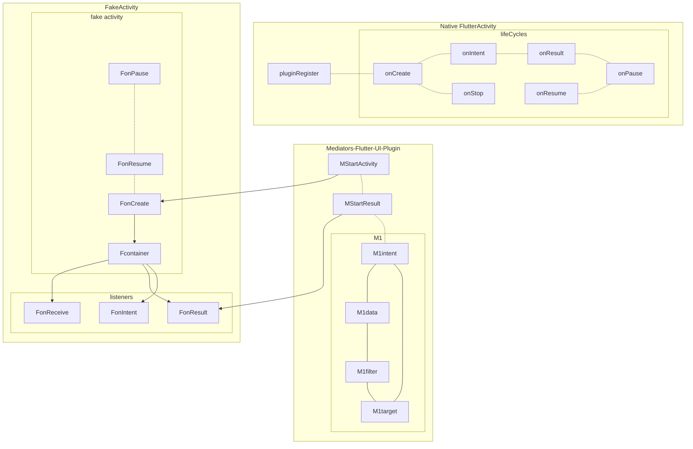

## addActivityResultListener



```mermaid
sequenceDiagram
participant Native
participant Mediator
participant Fake
participant Core

Note: left of Nat
Native -->> Mediator: A1 initialize plugin
Mediator -->> Fake: A2 initialize fake activity
Fake -->> Fake: prepare intent logic
Fake -->> Mediator: A3 setup handlers to mediator
Mediator -->> Mediator: prepare dart channel
Mediator -->> Native: A4 Ready, set initial states
Native -->> Native: A5 setup events can't be delegate
Native -->> Mediator: A6 onPause, onResume...
Native -->> Mediator: hands over lifecycle control flow

Mediator-->> Mediator: B0 discover tag, onNewIntent, findout receiver
Mediator-->>Mediator: B1 startActivity
Mediator-->>Core: B2 do work directly without another activity
Core-->>Mediator: B3 response

Mediator-->> Mediator: C0 discover tag, onNewIntent, findout receiver
Mediator-->>Fake: C1 onCreate
Fake-->>Fake: C2 do work
Fake-->>Core:C3 call core
Core-->>Fake:C4 response
Fake-->>Fake:C5 prepare intent
Fake->>Mediator: C6 startActivity

Mediator-->>Fake: B1 get receiver by intent
Fake-->>Fake:B2 do work

Fake-->>Mediator:B3 response to fake ui

 
 Mediator-->>Mediator: C0 user trigger action
 
 Mediator-->>Mediator: D0 user trigger action for result

```
<!--stackedit_data:
eyJoaXN0b3J5IjpbLTMyODAxNjUzLDg2MDMyNjM0NSwxNTQ3OT
E2NzkxLC0yODQzODI5MTMsLTEwNTg0ODY2NjMsLTQzNDkzMTcw
OF19
-->