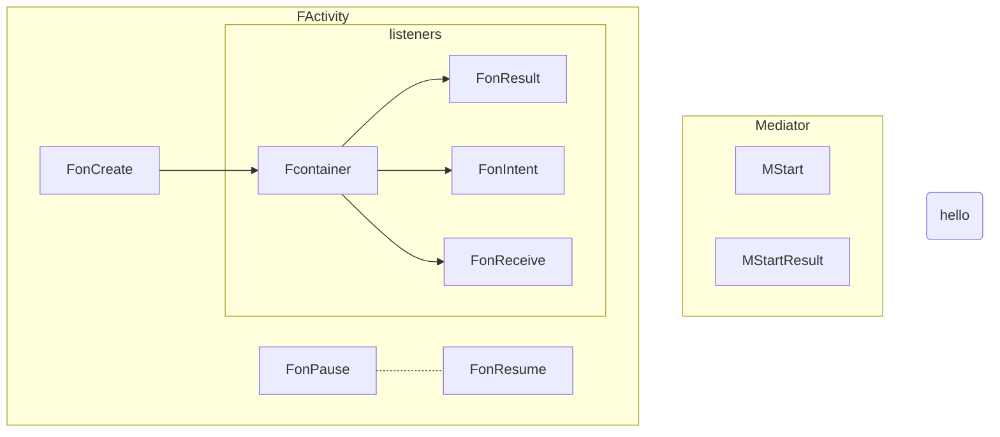

## addActivityResultListener

```java


```



```mermaid
graph TB
	S(hello)
	subgraph Mediator
		MStart
		MStartResult
	end
	subgraph FActivity
		FonCreate
		FonPause 
		FonResume 
		FonResult 
		FonIntent 
		FonReceive 
		FonCreate --> Fcontainer
		
		subgraph listeners
		Fcontainer --> FonIntent
		Fcontainer --> FonResult
		Fcontainer --> FonReceive
		end
		

		FonPause -.- FonResume
	end


```
<!--stackedit_data:
eyJoaXN0b3J5IjpbLTExMjc5NjYxMTcsLTI4NDM4MjkxMywtMT
A1ODQ4NjY2MywtNDM0OTMxNzA4XX0=
-->