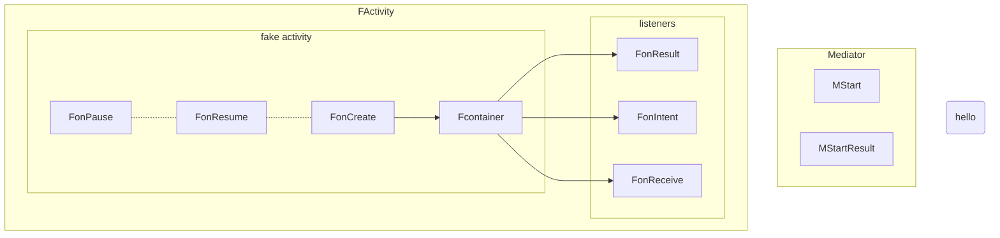

## addActivityResultListener

```java


```



```mermaid
graph TB
	S(hello)
	subgraph Mediator
		MStart
		MStartResult
	end
	subgraph FActivity
		FonCreate
		FonPause 
		FonResume 
		FonResult 
		FonIntent 
		FonReceive 
		
		subgraph fake activity
			FonPause -.- FonResume
			FonResume -.- FonCreate
			FonCreate --> Fcontainer
		end
		
		subgraph listeners
			Fcontainer --> FonIntent
			Fcontainer --> FonResult
			Fcontainer --> FonReceive
		end
		
		
		
	end


```
<!--stackedit_data:
eyJoaXN0b3J5IjpbOTAxNDY2MjEsLTI4NDM4MjkxMywtMTA1OD
Q4NjY2MywtNDM0OTMxNzA4XX0=
-->