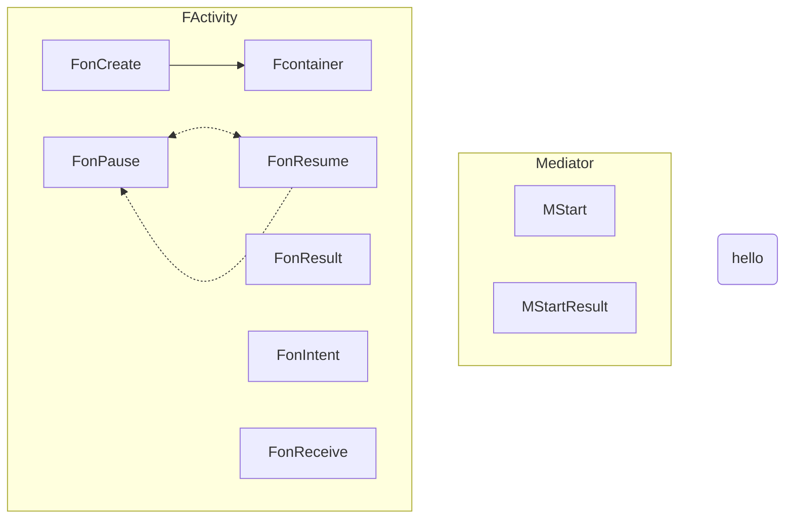

## addActivityResultListener

```java


```



```mermaid
graph TB
	S(hello)
	subgraph Mediator
		MStart
		MStartResult
	end
	subgraph FActivity
		FonCreate
		FonPause 
		FonResume 
		FonResult 
		FonIntent 
		FonReceive 
		FonCreate --> Fcontainer
		FonPause <-.-> FonResume
		FonResume -.-> FonPause
		Fcontainer
	end


```
<!--stackedit_data:
eyJoaXN0b3J5IjpbMTYxNjQ3MTYyNSwtMjg0MzgyOTEzLC0xMD
U4NDg2NjYzLC00MzQ5MzE3MDhdfQ==
-->