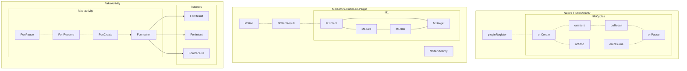

## addActivityResultListener

```java


```



```mermaid
graph TB
	subgraph Native FlutterActivity
		pluginRegister
		pluginRegister -.- onCreate
		subgraph lifeCycles
			onCreate -.- onIntent
			onIntent -.- onResult
			onResult -.- onPause
			onResume -.- onPause
			onCreate -.- onStop
		end
	end
	subgraph Mediators-Flutter-UI-Plugin
		subgraph M1
			M1intent --- M1target
			M1intent --- M1data
			M1data --- M1filter
			M1filter --- M1target
		end
		MStartActivity
		MStartResult
		MStart -.- MStartResult
		MStartResult -.- M1intent
	end
	
	subgraph FakeActivity
		FonCreate
		FonPause 
		FonResume 
		FonResult 
		FonIntent 
		FonReceive 
		
		subgraph fake activity
			FonPause -.- FonResume
			FonResume -.- FonCreate
			FonCreate --> Fcontainer
		end
		
		subgraph listeners
			Fcontainer --> FonIntent
			Fcontainer --> FonResult
			Fcontainer --> FonReceive
		end
		
		
		
	end


```
<!--stackedit_data:
eyJoaXN0b3J5IjpbNDk1MzY5NDExLC0yODQzODI5MTMsLTEwNT
g0ODY2NjMsLTQzNDkzMTcwOF19
-->