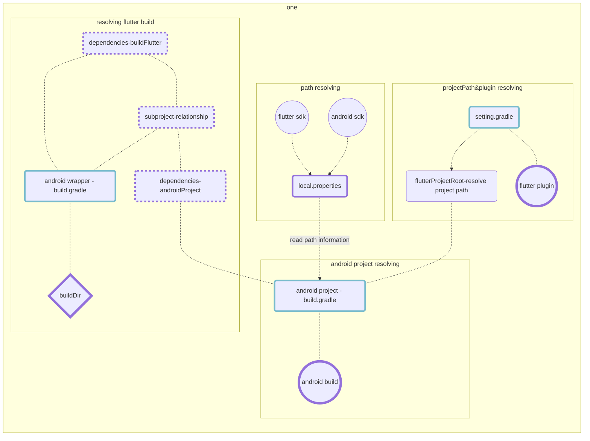
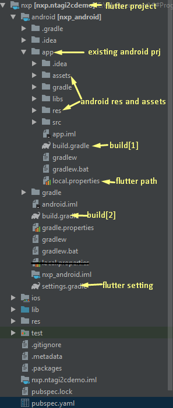

## Flutter/Android 專案目錄結構說明

file structure of a flutter project would be look like this
- 📁 FlutterProject
	- 📰 pubspec.yaml 
	- 📁 lib [1]
- 	- 📁 res [2]
	- 📁 android [3]
		- 📁 app
			- 📁 libs
			- 📁 src
			- 📰 build.gradle 
		- 📁 res
		- 📁 assets
		- 📰 build.gradle
		- 📰 settings.gradle
		- 📰 local.properties 

>[1]  libraries written in dart.
>[2] android resource folder for flutter project,  generated by flutter.
>[3]  an android project wrapper for flutter, which contains following structure
>- 📁 app
>     - 📰 build.gradle
>     - 📰 local.properties 
>- 📁 res
>- 📁 assets
>- 📰 build.gradle
>- 📰 settings.gradle
> 


### 說明Android Project wrapper for flutter
#### file structure
- **FlutterProject > android**
	- 📁 app[^1]
		- 📁 libs
		- 📁 src
		- 📰 build.gradle [^2]
	- 📁 res[^*]
	- 📁 assets[^*]
	- 📰 build.gradle[^3]
	- 📰 settings.gradle[^4]
	- 📰 local.properties [^5]


**[1] app** your existing android project 
 #### [1] app folder - 現有android專案

 >需將其folder改名為app，app似乎為flutter默認的android專案名稱，以告知flutter專案設定的位置(build.gradle, settings.gradle)，如果不用默認的名稱似乎也可以，但需要設定project.name及include name，後文會寫到。
>
>android project folder, this would be your existing android project renamed to "app".  "app" seems like a default naming convention for flutter to indicate project entry folder where configurations(build.gradle and local.properties) locates. For not using convention name, you need to setup project name and include name in build.gradle, which will refer later on.
 
------------------------------------------------
 
**[2] build.gradle** : build script for existing android project
#### android專案設定檔 
>若要將現有專案與flutter連結,需在該設定檔中寫入以下資訊
- 載入local.properties
- flutterRoot 
- flutterProject
- apply pluginId **&** apply from
- sourceSets
- applicationId
- dependencies

> #### local.properties
> indicates where flutter.sdk and android.sdk locate.
```groovy
	def localProperties = new Properties()  
	def localPropertiesFile = rootProject.file('local.properties')  
	if (localPropertiesFile.exists()) {  
	    localPropertiesFile.withReader('UTF-8') { reader ->  
	        localProperties.load(reader)  
	    }  
	}
```
> 主要記錄了flutter.sdk及android.sdk的位置, 介由讀取 local.properties 以注入flutter
> - rootProject 指向 android , 
> - localPropertiesFile  指向 android/local.properties

> #### flutterRoot
> read flutter sdk from local.properties into flutterRoot
```groovy
	def flutterVersionCode = localProperties.getProperty('flutter.versionCode')  
	if (flutterVersionCode == null) {  
	    flutterVersionCode = '1'  
	}  
	def flutterVersionName = localProperties.getProperty('flutter.versionName')  
	if (flutterVersionName == null) {  
	    flutterVersionName = '1.0'  
	}
	def flutterRoot = localProperties.getProperty('flutter.sdk')  
	if (flutterRoot == null) {  
	    throw new GradleException("Flutter SDK not found. Define location with flutter.sdk in the local.properties file.")  
	}
```

> #### flutterProject
> specify where flutterProject locates, default value are "../.."
```groovy
	def flutterProject = '../..'
	flutter {  
	    source flutterProject  
	}
```

> #### apply plugin | apply from
> contains following two sections
>  - apply plugins like kotlin which indicates a valid pluginId implmented the plugin interface by project requirements.
>  - apply a build script from flutter
```groovy
	apply plugin: 'com.android.application'  
	apply plugin: 'kotlin-android'  
	apply from: "$flutterRoot/packages/flutter_tools/gradle/flutter.gradle"
```

> #### sourcesSet
> set entry point for finding sources
> - java source
> - res source
	> res 分為二個部份，一個是原有專案的res, 另一個則為flutter專案所需要的 res，由flutter自動產生
>   - res resource of existing android project
>   - res source of current flutter project	
> - assets source
```groovy
	android {  
		sourceSets {  
			main {  
				//manifest.srcFile "src/main/AndroidManifest.xml"  
				java.srcDirs += ['src/main/kotlin', 'src/main/java']  
				res.srcDirs += ['res', flutterProject + '/res']  
				assets.srcDirs += ['assets', flutterProject + '/assets']  
			}  
```

> #### applicationId
> 
```groovy
	android {
		defaultConfig {  
			// applicationId will replace package name specified in AndroidManifest.xml  
			applicationId "com.gknot"  
			minSdkVersion 19  
			targetSdkVersion 28  
			versionName flutterVersionName  
			testInstrumentationRunner "android.support.test.runner.AndroidJUnitRunner"  
		}
```

> #### dependencies
```groovy
	dependencies {  
		implementation fileTree(include: '*.jar', dir: 'libs')  
		implementation "org.jetbrains.kotlin:kotlin-stdlib-jdk7:$kotlin_version"  
		//following dependencies depends on flutter  
		testImplementation 'junit:junit:4.12'  
		androidTestImplementation 'com.android.support.test:runner:1.0.2'  
		androidTestImplementation 'com.android.support.test.espresso:espresso-core:3.0.2'  
	}
```
[file](build.gradle.andoirdpj)

------------------------------------------------

**[*]res and assets** for existing android project
#### 設置android專案 res & assets
> 於上述build.gradle中設定

------------------------------------------------

**[3] build.gradle [4] setting.gradle** for flutter building android
#### flutter android build 專案設定檔
- **build.gradle**
	- kotlin & gradle dependencies
	- add buildDir
	- add existing android project into subproject
	- add clean build
- **settings.gradle**
	- include subproject
	- add flutter plugin
 
```groovy
	// -------------------
	// flutterProject/android/build.gradle....
	buildscript {  
		ext.kotlin_version = '1.3.21'  
		dependencies {  
			classpath 'com.android.tools.build:gradle:3.3.1'  
			classpath "org.jetbrains.kotlin:kotlin-gradle-plugin:$kotlin_version"  
		}  
	}  
	rootProject.buildDir = '../build'  
	subprojects {  
		project.buildDir = "${rootProject.buildDir}/${project.name}"  
	}  
	subprojects {  
		project.evaluationDependsOn(':app')  
	}  
	task clean(type: Delete) {  
		delete rootProject.buildDir  
	}

	// -------------------
	// flutterProject/android/settings.gradle....
	include ':app'  
	def flutterProjectRoot = rootProject.projectDir.parentFile.toPath()  
	def plugins = new Properties()  
	def pluginsFile = new File(flutterProjectRoot.toFile(), '.flutter-plugins')  
	if (pluginsFile.exists()) {  
	    pluginsFile.withReader('UTF-8') { reader -> plugins.load(reader) }  
	}  
	plugins.each { name, path ->  
	    def pluginDirectory = flutterProjectRoot.resolve(path).resolve('android').toFile()  
	    include ":$name"  
	  project(":$name").projectDir = pluginDirectory  
	}
```
> **[NOTE]** the **colon** in Gradle uses to describe paths to subprojects. For example,
> evaluationDependsOn(':api:producer')
> would look for the subproject  `producer`  of the subproject  `api`.

------------------------------------------------

**[5] local.properties**
#### 連結android sdk, flutter sdk
```groovy
	sdk.dir=D:/Users/gordianknot/AppData/Local/Android/android-sdk  
	flutter.sdk=E:\\flutter  
	flutter.versionName=1.0.0  
	flutter.versionCode=1  
	flutter.buildMode=debug
```  

### 未完成
上述方法用了flutter i18n plugin 後由會在 res/value 底下加入 string_xx.arb ,導致編譯時出現 "file name must end with .xml", 目前找不到合適的解決方法，只好手動把flutter 的 resource copy 到 原 android 專案中，並把
```groovy
	android {  
		sourceSets {  
			main {  
				//manifest.srcFile "src/main/AndroidManifest.xml"  
				java.srcDirs += ['src/main/kotlin', 'src/main/java']  
				//res.srcDirs += ['res', flutterProject + '/res']  
				res.srcDirs += ['res']  
				assets.srcDirs += ['assets', flutterProject + '/assets']  
			}  
```
或者只好停用 android studio Flutter i18n 的 plugin


 

 

