```mermaid
```
graph TB
    sq[Square shape] --> ci((Circle shape))

    subgraph A subgraph
        od>Odd shape]-- Two line<br/>edge comment --> ro
        di{Diamond with <br/> line break} -.-> ro(Rounded<br>square<br>shape)
        di==>ro2(Rounded square shape)
    end

    %% Notice that no text in shape are added here instead that is appended further down
    e --> od3>Really long text with linebreak<br>in an Odd shape]

    %% Comments after double percent signs
    e((Inner / circle<br>and some odd <br>special characters)) --> f(,.?!+-*ز)

    cyr[Cyrillic]-->cyr2((Circle shape Начало));

     classDef green fill:#9f6,stroke:#333,stroke-width:2px;
     classDef orange fill:#f96,stroke:#333,stroke-width:4px;
     class sq,e green
     class di orange
```

## Add Android Project Into Flutter
實際目錄結構如下圖


## Flutter/Android 專案目錄結構說明

file structure of a flutter project would be look like this
- 📁 FlutterProject
	- 📰 pubspec.yaml 
	- 📁 lib [1]
	- 📁 android [2]
	- 📁 res [3]
>[1]  libraries written in dart.
[2]  an android project wrapper for flutter, which contains following structure
> - 📁 app
	- 📰 build.gradle
	- 📰 local.properties 
>- 📁 res
>- 📁 assets
>- 📰 build.gradle
>- 📰 settings.gradle
>
>[3] android resource folder for flutter project,  generated by flutter.

### 說明Android Project wrapper for flutter
#### file structure
- 📁 app[^1]
	- 📁 libs
	- 📁 src
	- 📰 build.gradle [^2]
- 📁 res[^*]
- 📁 assets[^*]
- 📰 build.gradle[^3]
- 📰 settings.gradle[^4]
- 📰 local.properties [^5]

**[1] app** your existing android project 
 #### 現有的android project
 需將其folder改名為app，app似乎為flutter默認的android專案名稱，以告知flutter專案設定的位置(build.gradle, settings.gradle)，如果不用默認的名稱似乎也可以，但需要設定project.name及include name，後文會寫到。

android project folder, this would be your existing android project renamed to "app".  "app" seems like a default naming convention for flutter to indicate project entry folder where configurations(build.gradle and local.properties) locates. For not using convention name, you need to setup project name and include name in build.gradle, which will refer later on.
 
 
**[2] build.gradle** : build script for existing android project
#### 現有專案設定檔 
若要將現有專案與flutter連結,需在該設定檔中寫入以下資訊
- 載入local.properties
- flutterRoot 
- flutterProject
- apply pluginId **&** apply from
- sourceSets
- applicationId
- dependencies

> #### local.properties
> indicates where flutter.sdk and android.sdk locate.
```groovy
	def localProperties = new Properties()  
	def localPropertiesFile = rootProject.file('local.properties')  
	if (localPropertiesFile.exists()) {  
	    localPropertiesFile.withReader('UTF-8') { reader ->  
	        localProperties.load(reader)  
	    }  
	}
```
> 主要記錄了flutter.sdk及android.sdk的位置, 介由讀取 local.properties 以注入flutter
> - rootProject 指向 android , 
> - localPropertiesFile  指向 android/local.properties

> #### flutterRoot
> read flutter sdk from local.properties into flutterRoot
```groovy
	def flutterVersionCode = localProperties.getProperty('flutter.versionCode')  
	if (flutterVersionCode == null) {  
	    flutterVersionCode = '1'  
	}  
	def flutterVersionName = localProperties.getProperty('flutter.versionName')  
	if (flutterVersionName == null) {  
	    flutterVersionName = '1.0'  
	}
	def flutterRoot = localProperties.getProperty('flutter.sdk')  
	if (flutterRoot == null) {  
	    throw new GradleException("Flutter SDK not found. Define location with flutter.sdk in the local.properties file.")  
	}
```

> #### flutterProject
> specify where flutterProject locates, default value are "../.."
```groovy
	def flutterProject = '../..'
	flutter {  
	    source flutterProject  
	}
```

> #### apply plugin | apply from
> contains following two sections
>  - apply plugins like kotlin which indicates a valid pluginId implmented the plugin interface by project requirements.
>  - apply a build script from flutter
```groovy
	apply plugin: 'com.android.application'  
	apply plugin: 'kotlin-android'  
	apply from: "$flutterRoot/packages/flutter_tools/gradle/flutter.gradle"
```

> #### sourcesSet
> set entry point for finding sources
> - java source
> - res source
	> res 分為二個部份，一個是原有專案的res, 另一個則為flutter專案所需要的 res，由flutter自動產生
>   - res resource of existing android project
>   - res source of current flutter project	
> - assets source
```groovy
	android {  
		sourceSets {  
			main {  
				//manifest.srcFile "src/main/AndroidManifest.xml"  
				java.srcDirs += ['src/main/kotlin', 'src/main/java']  
				res.srcDirs += ['res', flutterProject + '/res']  
				assets.srcDirs += ['assets', flutterProject + '/assets']  
			}  
```

> #### applicationId
> 
```groovy
	android {
		defaultConfig {  
			// applicationId will replace package name specified in AndroidManifest.xml  
			applicationId "com.gknot"  
			minSdkVersion 19  
			targetSdkVersion 28  
			versionName flutterVersionName  
			testInstrumentationRunner "android.support.test.runner.AndroidJUnitRunner"  
		}
```

> #### dependencies
```groovy
	dependencies {  
		implementation fileTree(include: '*.jar', dir: 'libs')  
		implementation "org.jetbrains.kotlin:kotlin-stdlib-jdk7:$kotlin_version"  
		//following dependencies depends on flutter  
		testImplementation 'junit:junit:4.12'  
		androidTestImplementation 'com.android.support.test:runner:1.0.2'  
		androidTestImplementation 'com.android.support.test.espresso:espresso-core:3.0.2'  
	}
```

**[*]res and assets** for existing android project
#### 現有專案的 res & assets
於上述build.gradle中設定

**[3] build.gradle [4] setting.gradle** for flutter building android
#### flutter android build 專案設定檔
- **build.gradle**
	- kotlin & gradle dependencies
	- add buildDir
	- add existing android project into subproject
	- add clean build
- **settings.gradle**
	- include subproject
	- add flutter plugin
 
```groovy
	// -------------------
	// flutterProject/android/build.gradle....
	buildscript {  
		ext.kotlin_version = '1.3.21'  
		dependencies {  
			classpath 'com.android.tools.build:gradle:3.3.1'  
			classpath "org.jetbrains.kotlin:kotlin-gradle-plugin:$kotlin_version"  
		}  
	}  
	rootProject.buildDir = '../build'  
	subprojects {  
		project.buildDir = "${rootProject.buildDir}/${project.name}"  
	}  
	subprojects {  
		project.evaluationDependsOn(':app')  
	}  
	task clean(type: Delete) {  
		delete rootProject.buildDir  
	}

	// -------------------
	// flutterProject/android/settings.gradle....
	include ':app'  
	def flutterProjectRoot = rootProject.projectDir.parentFile.toPath()  
	def plugins = new Properties()  
	def pluginsFile = new File(flutterProjectRoot.toFile(), '.flutter-plugins')  
	if (pluginsFile.exists()) {  
	    pluginsFile.withReader('UTF-8') { reader -> plugins.load(reader) }  
	}  
	plugins.each { name, path ->  
	    def pluginDirectory = flutterProjectRoot.resolve(path).resolve('android').toFile()  
	    include ":$name"  
	  project(":$name").projectDir = pluginDirectory  
	}
```
> **[NOTE]** the **colon** in Gradle uses to describe paths to subprojects. For example,
> evaluationDependsOn(':api:producer')
> would look for the subproject  `producer`  of the subproject  `api`.


**[5] local.properties**
```groovy
	sdk.dir=D:/Users/gordianknot/AppData/Local/Android/android-sdk  
	flutter.sdk=E:\\flutter  
	flutter.versionName=1.0.0  
	flutter.versionCode=1  
	flutter.buildMode=debug
```


		
```


<!--stackedit_data:
eyJoaXN0b3J5IjpbMTU5ODE3MDE0LDEwMTgzOTE0NjIsMTQ2MD
MwODA1NCwxNTYxMDIyMzI5LDgwMTI0MzI0NiwtMzY0NjgwMzIx
LC0xOTM2NDc5MjU1LC0xNzc0Njk2ODgyXX0=
-->