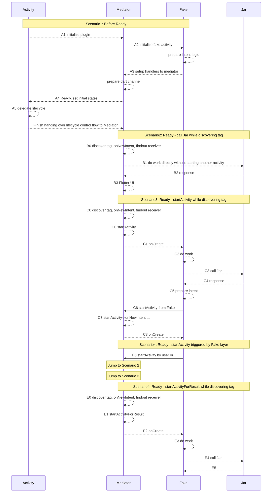
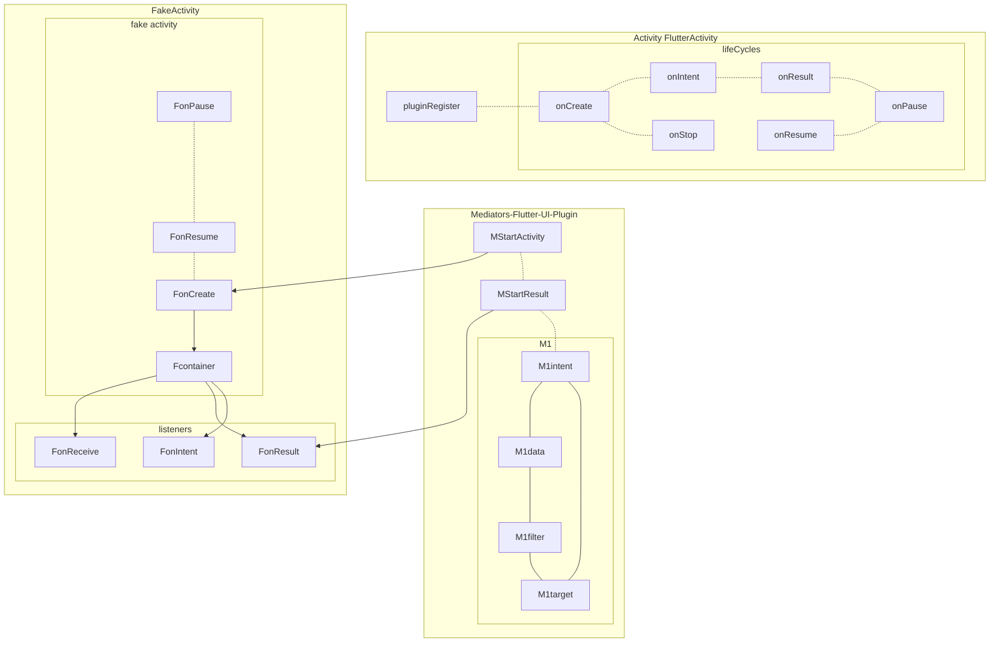

```mermaid
sequenceDiagram
participant Activity
participant Mediator
participant Fake
participant Jar


Note over Activity, Fake: Scenario1: Before Ready

Activity -->> Mediator: A1 initialize plugin
Mediator -->> Fake: A2 initialize fake activity
Fake -->> Fake: prepare intent logic
Fake -->> Mediator: A3 setup handlers to mediator
Mediator -->> Mediator: prepare dart channel
Mediator -->> Activity: A4 Ready, set initial states
Activity -->> Activity: A5 delegate lifecycle
Activity -->> Mediator: Finish handing over lifecycle control flow to Mediator


Note over Mediator, Jar: Scenario2: Ready - call Jar while discovering tag 

Mediator-->> Mediator: B0 discover tag, onNewIntent, findout receiver
Mediator-->>Jar: B1 do work directly without starting another activity
Jar-->>Mediator: B2 response
Mediator-->>Mediator: B3 Flutter UI


Note over Mediator, Jar: Scenario3: Ready - startActivity while discovering tag

Mediator-->> Mediator: C0 discover tag, onNewIntent, findout receiver
Mediator-->>Mediator: C0 startActivity
Mediator-->>Fake: C1 onCreate
Fake-->>Fake: C2 do work
Fake-->>Jar:C3 call Jar
Jar-->>Fake:C4 response
Fake-->>Fake:C5 prepare intent
Fake->>Mediator: C6 startActivity from Fake
Mediator-->>Mediator: C7 startActivity->onNewIntent ...
Mediator-->>Fake: C8 onCreate


Note over Mediator, Jar: Scenario4: Ready - startActivity triggered by Fake layer

Fake->>Mediator: D0 startActivity by user or...


Note over Mediator: Jump to Scenario 2
Note over Mediator: Jump to Scenario 3


Note over Mediator, Jar: Scenario4: Ready - startActivityForResult while discovering tag
Mediator-->> Mediator: E0 discover tag, onNewIntent, findout receiver
Mediator-->>Mediator:E1 startActivityForResult
Mediator-->>Fake: E2 onCreate
Fake-->>Fake: E3 do work
Fake-->>Jar:E4 call Jar
Jar-->>Fake:E5
```

------------------

```mermaid
graph TB
	subgraph Activity FlutterActivity
		pluginRegister
		pluginRegister -.- onCreate
		subgraph lifeCycles
			onCreate -.- onIntent
			onIntent -.- onResult
			onResult -.- onPause
			onResume -.- onPause
			onCreate -.- onStop
		end
	end
	subgraph Mediators-Flutter-UI-Plugin
		subgraph M1
			M1intent --- M1target
			M1intent --- M1data
			M1data --- M1filter
			M1filter --- M1target
		end
		MStartActivity
		MStartResult
		MStartActivity -.- MStartResult
		MStartResult -.- M1intent
	end
	
	subgraph FakeActivity
		FonCreate
		FonPause 
		FonResume 
		FonResult 
		FonIntent 
		FonReceive 
		
		subgraph fake activity
			FonPause -.- FonResume
			FonResume -.- FonCreate
			FonCreate --> Fcontainer
		end
		
		subgraph listeners
			Fcontainer --> FonIntent
			Fcontainer --> FonResult
			Fcontainer --> FonReceive
		end
		
		
		MStartActivity --> FonCreate
		MStartResult --> FonResult
	end
```

<!--stackedit_data:
eyJoaXN0b3J5IjpbLTE5OTg3MTc4NjQsLTQ1NzY2MzExNyw4NT
g1NDYwMjJdfQ==
-->