 

--------------------------------------------------------

**Mediator In Detail**
>**MOn**: Mediator Events  |  **MAct**: Mediator Actions  |  **FOn**: Events of FakeActivity 
>**FDo**: Logic of Fake Activity  |  **JDo**: Logic of Core Lib

**brainstorming in A1 -  how onNewIntent in behavior - IDEATION**
- fakeActivity has no ui resources
	- once instantiated never mind disposing for release just like normal library
		- only create once - onCreate only called once
			- ❓ allways call onNewIntent while new receiving intent requests???
	- in real Activity: each Activity might hold its own resources, but fakeActivity should not operate like that
		- some resources can be shared
			- current intent & nfcintent
				- difference between the two ❓
			- demo library
			- 

**narrow down**:
- instantiate each fakeActivity without constructor
- dependencies thru injection
- DI thru mediator
	- ntag demo, intent, nfcadapter 
- remember nfcintent - tag detected
- call onNewIntent while already instantiated

**brainstorming in A2 - setup intentFilter for each FakeActivity - IDEATION**
- what we already have
	- intent matching logic; but it may not work while exposing to customized mediator
	- matching logic only works under some circumstances ---- applied after intentFilter written in manifest.xml
- prepare intentFilter for each FakeActivity while initializing each FakeActivity

**narrow down**
- implement intentFilter manually instread of using the one in manifest.xml

-------------------------------------------------------
**FakeActivity in Detail**

--------------------------------------------------------

```mermaid
sequenceDiagram
participant Activity
participant Mediator
participant Fake
participant Jar


Note over Activity, Fake: 👷 Scenario1: Before Ready

Activity -->> Mediator: A1 initialize plugin
Mediator -->> Fake: A2 initialize fake activity
Fake -->> Fake: prepare intent logic
Fake -->> Mediator: A3 setup handlers to mediator
Mediator -->> Mediator: prepare dart channel
Mediator -->> Activity: A4 Ready, set initial states
Activity -->> Activity: A5 delegate lifecycle
Activity -->> Mediator: Finish handing over lifecycle control flow to Mediator


Note over Mediator, Jar: 👷 Scenario2: Ready - call Jar while discovering tag 

Mediator-->> Mediator: B0 discover tag, onNewIntent, findout receiver
Mediator->>Jar: B1 do work directly without starting another activity
Jar->>Mediator: B2 response
Mediator-->>Mediator: B3 Flutter UI


Note over Mediator, Jar: 👷 Scenario3: Ready - startActivity while discovering tag

Mediator-->> Mediator: C0 discover tag, onNewIntent, findout receiver
Mediator-->>Mediator: C0 startActivity
Mediator->>Fake: C1 onCreate
Fake-->>Fake: C2 do work
Fake->>Jar:C3 call Jar
Jar->>Fake:C4 response
Fake-->>Fake:C5 prepare intent
Fake->>Mediator: C6 startActivity from Fake
Mediator-->>Mediator: C7 startActivity->onNewIntent ...
Mediator->>Fake: C8 onCreate


Note over Mediator, Jar: 👷 Scenario4: Ready - startActivity triggered by Fake layer

Fake->>Mediator: D0 startActivity by user or...


Note over Mediator: Jump to Scenario 2
Note over Mediator: Jump to Scenario 3


Note over Mediator, Jar: 👷 Scenario5: Ready - startActivityForResult while discovering tag
Mediator-->> Mediator: E0 discover tag, onNewIntent, findout receiver
Mediator-->>Mediator:E1 startActivityForResult
Mediator-->>Fake: E2 onCreate
Fake-->>Fake: E3 do work
Fake-->>Jar:E4 call Jar
Jar-->>Fake:E5
Fake->>Mediator: onActivityResult
Mediator-->>Mediator: UI 
```

------------------
 

Original System
: **A1**: Action1, **A2**: Action2, **Sys**: internal system

--------------------------------------------------------

Replace Sys with Mediator
: **A1**: Action1, **A2**: Action2, **Mediator**: customized mediator for mimic-behaviors of internal system

<!--stackedit_data:
eyJoaXN0b3J5IjpbMTk5NTE5NDg1NywyMDM2MDc5MjgyLC0xMz
Y4NjQ0MTY2LC0xNDYwMTYzODA2LC0xNzIxOTQxOTIzLDE1NDU1
NzU3NCw3Mjc1MTk3OCwxODUwMTU4OTM2LC0xMTQyNjEzOTkzLC
0zODgzMzY5NTcsMTM3ODIxOTcwOCwtMTIxNDQ5MDczNSwtMzA4
MjMwNDg0LDYwMzgwMzY0OCwtMTQ1Mzg4MDAwOCwtMTQ3NjI2Mj
M4MywtMTEyNDM4NzA2NiwtNDU3NjYzMTE3LDg1ODU0NjAyMl19

-->