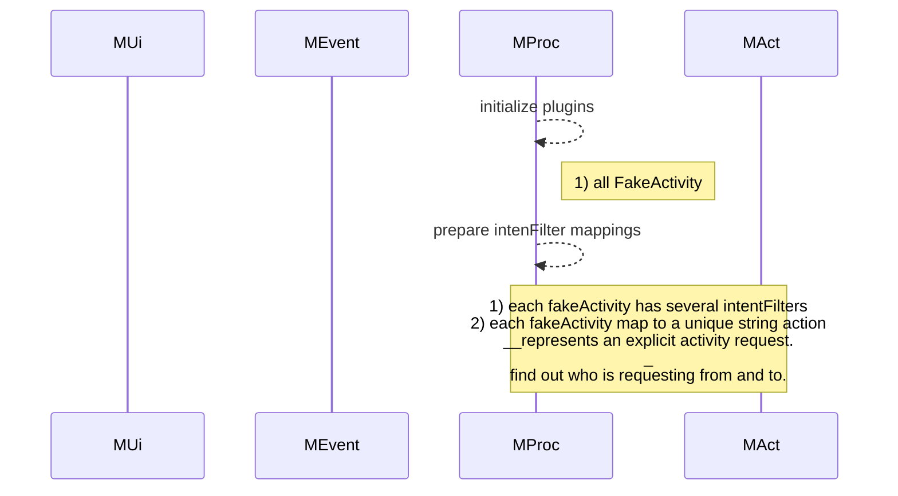

Original System
: **A1**: Action1, **A2**: Action2, **Sys**: internal system

--------------------------------------------------------

Customize with Mediator
: **A1**: Action1, **A2**: Action2, **Mediator**: customized mediator for mimic behaviors of internal system

--------------------------------------------------------

**Mediator In Detail**
>**MOn**: Mediator Events  |  **MAct**: Mediator Actions  |  **FOn**: Events of FakeActivity 
>**FDo**: Logic of Fake Activity  |  **JDo**: Logic of Core Lib

--------------------------------------------------------

>**MOn**: Mediator Events  |  **MAct**: Mediator Actions  |  **FOn**: Events of FakeActivity 
>**FDo**: Logic of Fake Activity  |  **JDo**: Logic of Core Lib

>**MOn**: Mediator Events  |  **MAct**: Mediator Actions  |  **FOn**: Events of FakeActivity 
>**FDo**: Logic of Fake Activity  |  **JDo**: Logic of Core Lib

----------------

------------------

<!--stackedit_data:
eyJoaXN0b3J5IjpbMTU0NTYxMDM1OCwtMTQ1Mzg4MDAwOCwtMT
Q3NjI2MjM4MywtMTEyNDM4NzA2NiwtNDU3NjYzMTE3LDg1ODU0
NjAyMl19
-->