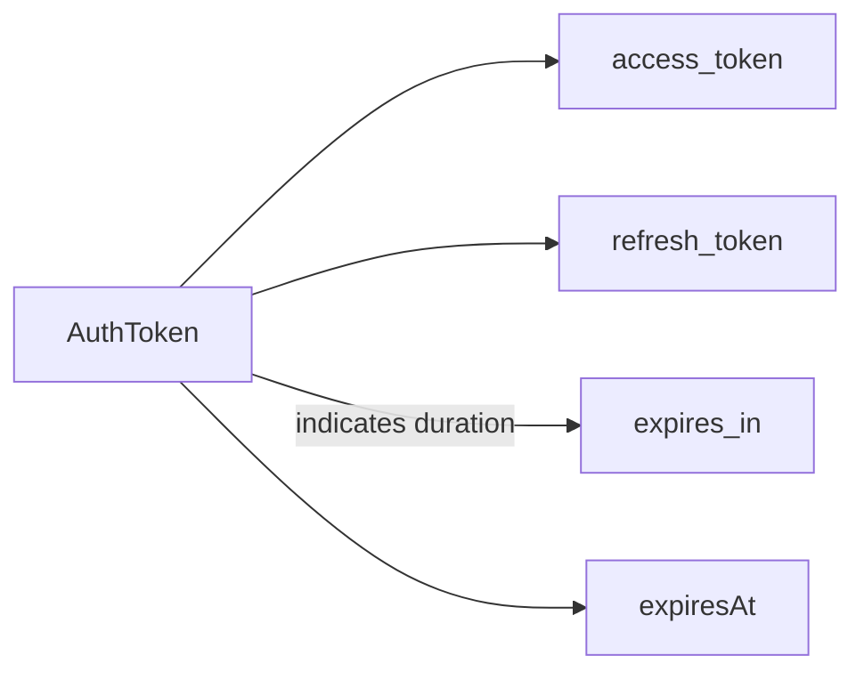

### AuthToken

```mermaid
graph LR
access_token
refresh_token
expires_in
expiresAt

AuthToken --> access_token
AuthToken --> refresh_token
AuthToken -->|indicates duration| expires_in
AuthToken --> expiresAt

```
```mermaid
graph TB


```

<!--stackedit_data:
eyJoaXN0b3J5IjpbLTY1ODk4NTk5MiwtMTE5MDAyMDA2NiwtMT
E0ODk5MDIzNywtODQ5MzMxNzc4LDIwNDAyOTc2MjJdfQ==
-->