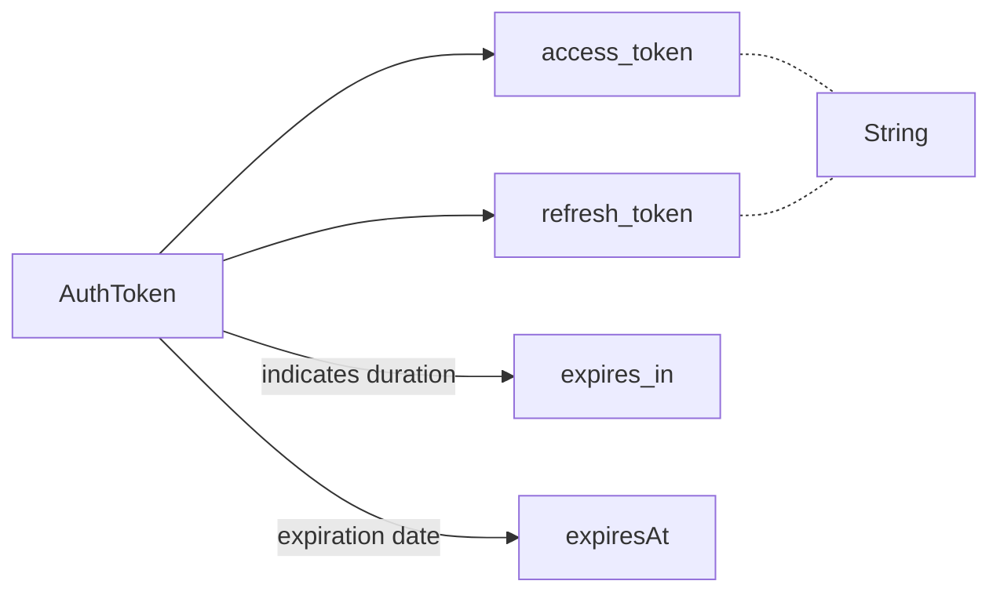

### AuthToken

```mermaid
graph LR
access_token -.- String
refresh_token -.- String
expires_in
expiresAt

AuthToken --> access_token
AuthToken --> refresh_token
AuthToken -->|indicates duration| expires_in
AuthToken -->|expiration date| expiresAt

```
```mermaid
graph TB


```

<!--stackedit_data:
eyJoaXN0b3J5IjpbLTc0ODM1NDQxLC0xMTkwMDIwMDY2LC0xMT
Q4OTkwMjM3LC04NDkzMzE3NzgsMjA0MDI5NzYyMl19
-->