## AuthorizationToken
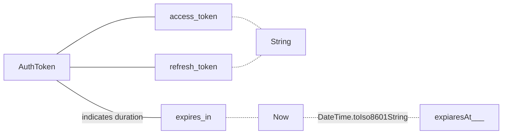
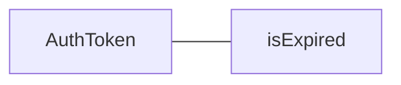
```dart
fromMap() =>
{
	"access_token"..., "refresh_token"..., "expires_in": 3000
}
Map<String, dynamic> asMap() =>  
{  
	"access_token": accessToken,  
	"refresh_token": refreshToken,  
	"expiresAt": expiresAt.toIso8601String()  
};
```

## StorageProvider
 ```mermaid
graph LR
StorageProvider
load -.- path
store -.- path
delete -.- path
StorageProvider -.- load
StorageProvider -.- store
StorageProvider -.- delete

```

## User
```dart
int id;  
String email;  
List<Note> notes = [];  
AuthorizationToken token;
bool get isAuthenticated => 
	token != null && !token.isExpired;
```
## noteService
### noteService.SetAuthenticateUser
param - **User** user
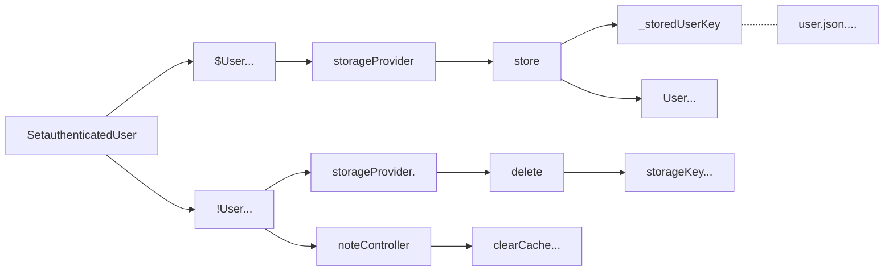

### noteContoller.executeClientRequest
param - **Request** request
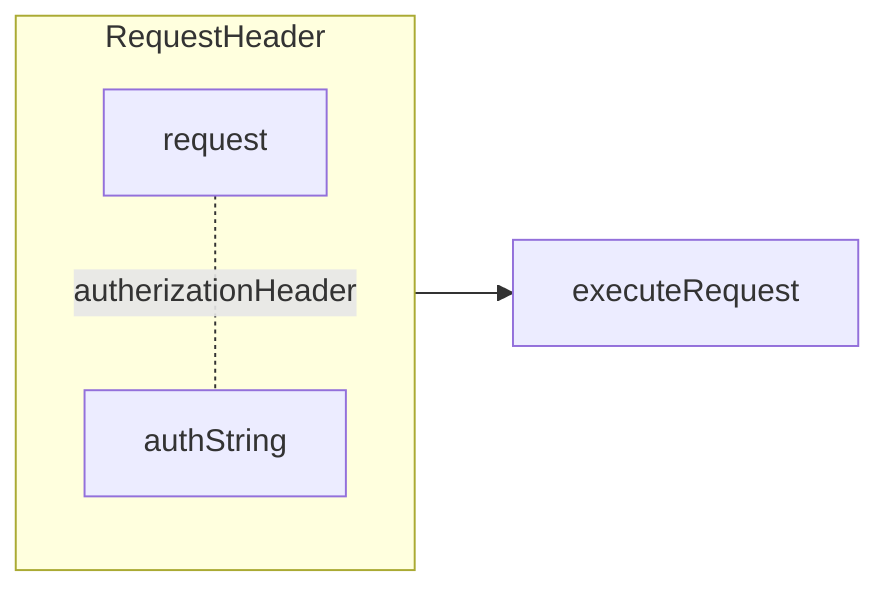
```dart
Future<Response> executeClientRequest(Request request) async {  
  request.headers[HttpHeaders.authorizationHeader] = clientAuthorization;  
  return executeRequest(request);  
}
```

### noteContoller.executeRequest
param - **Request** request
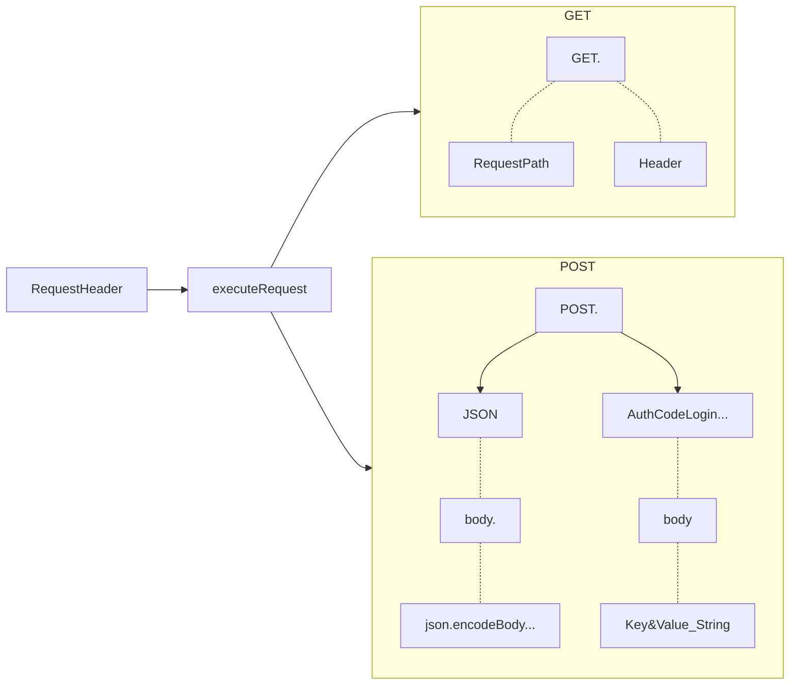

### noteContoller.executeUserRequest
param - Request request
param - AuthorizationToken token
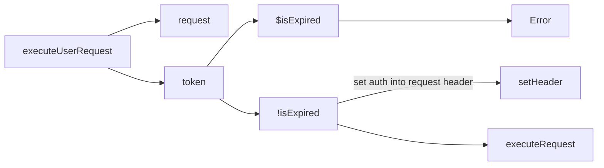

### noteContoller._loadPersistentUser
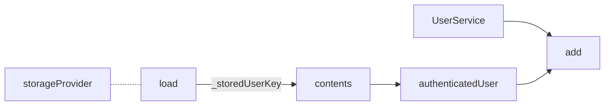
## ServiceController
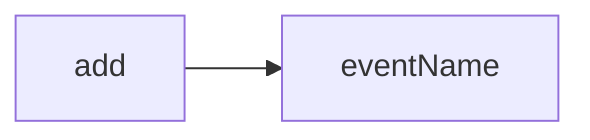

## UserService
### UserService.login
- param - **register** username
- param - **String** password
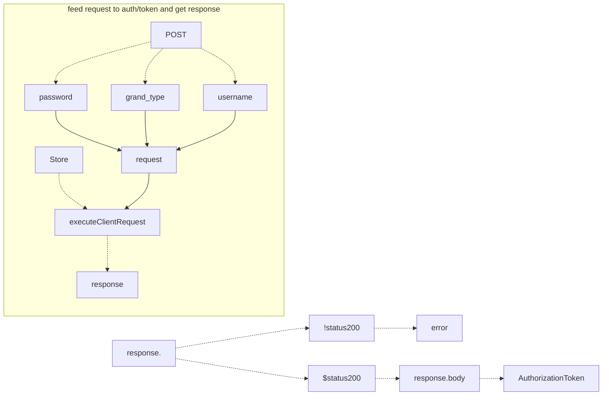
### UserService.register
- param - **register** username
- param - **String** password
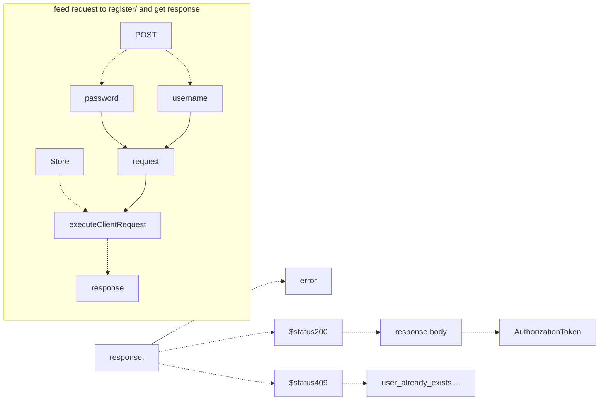


### UserService.getAuthenticatedUser
- param - **AuthorizationToken** token
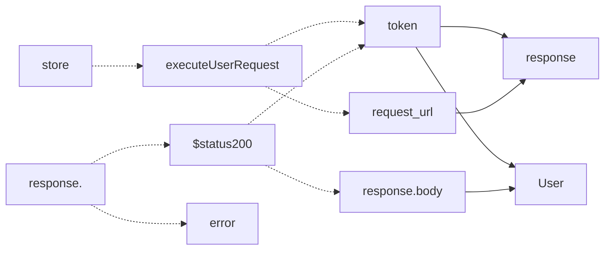


### Store
```mermaid
graph TB

```


<!--stackedit_data:
eyJoaXN0b3J5IjpbLTE4NzIyMTQwMDgsMjc3NjgwNjAxLC0xOD
MyMzM1MzUwLC01MTA0NDc3MTgsNzEzNzYxMDE1LC0xOTk1NTQx
NTQ4LDExODA5Mjk5NTUsMTQ3Njc1NDk2MSwyMTQ3MjQyODgxLC
0xMTQwMzg1ODMzLDc3NjMyNzgwOCw3NTI5MzI0OCwyNDMxMDQ3
ODQsNjMyMDcwNjkzLDExMzU4MjExMzIsLTc0ODM1NDQxLC0xMT
kwMDIwMDY2LC0xMTQ4OTkwMjM3LC04NDkzMzE3NzgsMjA0MDI5
NzYyMl19
-->