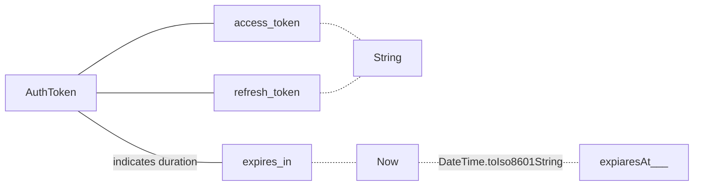
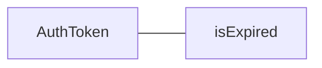

### AuthToken


```dart
fromMap() =>
{
	"access_token"..., "refresh_token"..., "expires_in": 3000
}
Map<String, dynamic> asMap() =>  
{  
	"access_token": accessToken,  
	"refresh_token": refreshToken,  
	"expiresAt": expiresAt.toIso8601String()  
};
```
```mermaid
graph TB


```


<!--stackedit_data:
eyJoaXN0b3J5IjpbMTAwOTI1MjgwMywtNzQ4MzU0NDEsLTExOT
AwMjAwNjYsLTExNDg5OTAyMzcsLTg0OTMzMTc3OCwyMDQwMjk3
NjIyXX0=
-->