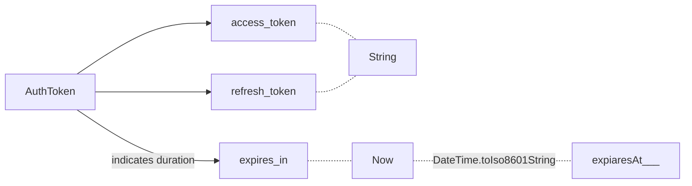

### AuthToken

```dart
Map<String, dynamic> asMap() =>  
    {  
      "access_token": accessToken,  
  "refresh_token": refreshToken,  
  "expiresAt": expiresAt.toIso8601String()  
    };
```
```mermaid
graph TB


```


<!--stackedit_data:
eyJoaXN0b3J5IjpbNTg1OTQzMzc4LC03NDgzNTQ0MSwtMTE5MD
AyMDA2NiwtMTE0ODk5MDIzNywtODQ5MzMxNzc4LDIwNDAyOTc2
MjJdfQ==
-->