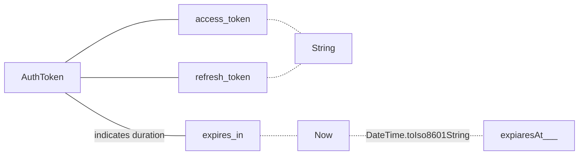
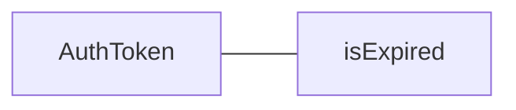
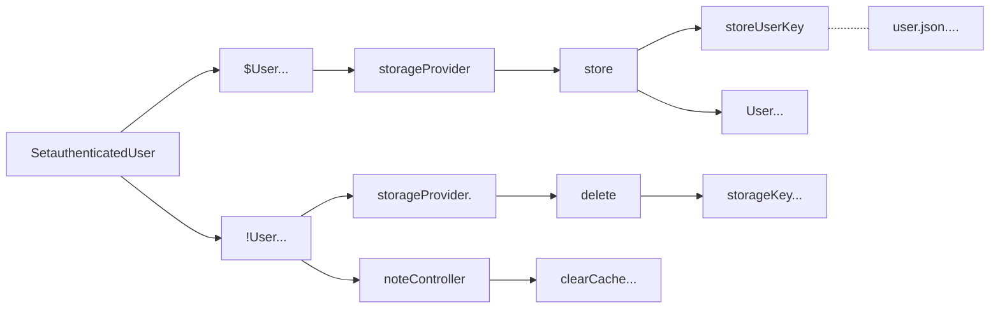
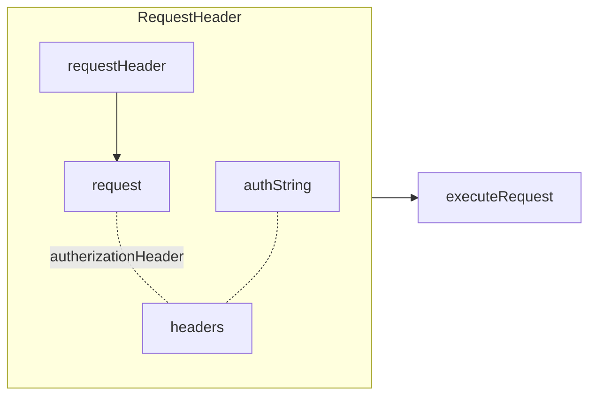
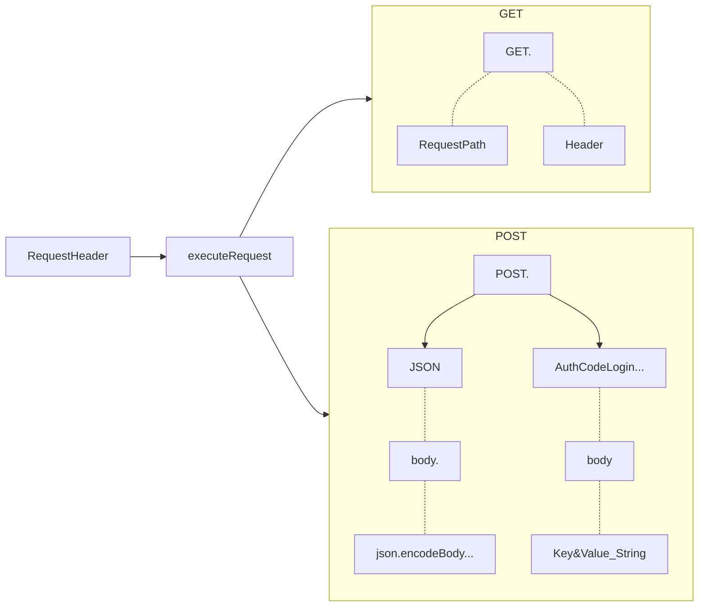
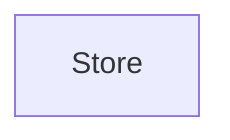

### AuthToken


```dart
fromMap() =>
{
	"access_token"..., "refresh_token"..., "expires_in": 3000
}
Map<String, dynamic> asMap() =>  
{  
	"access_token": accessToken,  
	"refresh_token": refreshToken,  
	"expiresAt": expiresAt.toIso8601String()  
};
```

### StorageProvider
 ```mermaid
graph LR
StorageProvider
load -.- path
store -.- path
delete -.- path
StorageProvider -.- load
StorageProvider -.- store
StorageProvider -.- delete

```


### User
```dart
int id;  
String email;  
List<Note> notes = [];  
AuthorizationToken token;
bool get isAuthenticated => 
	token != null && !token.isExpired;
```

### noteService.SetAuthenticateUser
param - **User** user


### noteContoller.executeClientRequest
param - **Request** request


### noteContoller.executeRequest
param - **Request** request


### noteContoller.executeUserRequest
param - Request request
param - AuthorizationToken token


### Store
```mermaid
graph TB


```


### UserService



<!--stackedit_data:
eyJoaXN0b3J5IjpbMjQzMTA0Nzg0LDYzMjA3MDY5MywxMTM1OD
IxMTMyLC03NDgzNTQ0MSwtMTE5MDAyMDA2NiwtMTE0ODk5MDIz
NywtODQ5MzMxNzc4LDIwNDAyOTc2MjJdfQ==
-->