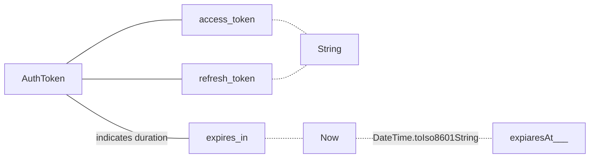
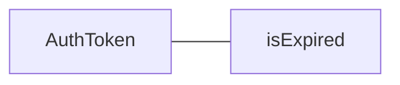
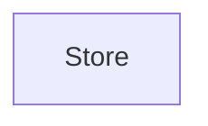

### AuthToken


```dart
fromMap() =>
{
	"access_token"..., "refresh_token"..., "expires_in": 3000
}
Map<String, dynamic> asMap() =>  
{  
	"access_token": accessToken,  
	"refresh_token": refreshToken,  
	"expiresAt": expiresAt.toIso8601String()  
};
```

###
 
### noteService
```mermaid
graph LR


```


### Store
```mermaid
graph TB


```


### UserService



<!--stackedit_data:
eyJoaXN0b3J5IjpbNjc4MjA5NTIwLDExMzU4MjExMzIsLTc0OD
M1NDQxLC0xMTkwMDIwMDY2LC0xMTQ4OTkwMjM3LC04NDkzMzE3
NzgsMjA0MDI5NzYyMl19
-->