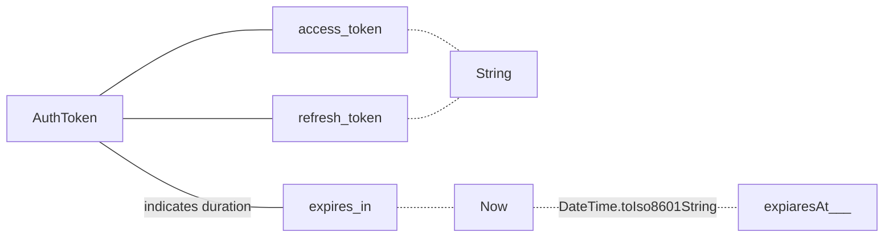
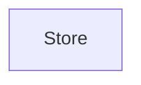

### AuthToken


```dart
fromMap() =>
{
	"access_token"..., "refresh_token"..., "expires_in": 3000
}
Map<String, dynamic> asMap() =>  
{  
	"access_token": accessToken,  
	"refresh_token": refreshToken,  
	"expiresAt": expiresAt.toIso8601String()  
};
```

### StorageProvider
 ```mermaid
graph LR
StorageProvider
load -.- path
store -.- path
delete -.- path
StorageProvider-.- load
StorageProvider -.- store
StorageProvider -.- 
```

### noteService
```mermaid
graph LR


```


### Store
```mermaid
graph TB


```


### UserService



<!--stackedit_data:
eyJoaXN0b3J5IjpbLTE3NDQzNzg1NywxMTM1ODIxMTMyLC03ND
gzNTQ0MSwtMTE5MDAyMDA2NiwtMTE0ODk5MDIzNywtODQ5MzMx
Nzc4LDIwNDAyOTc2MjJdfQ==
-->