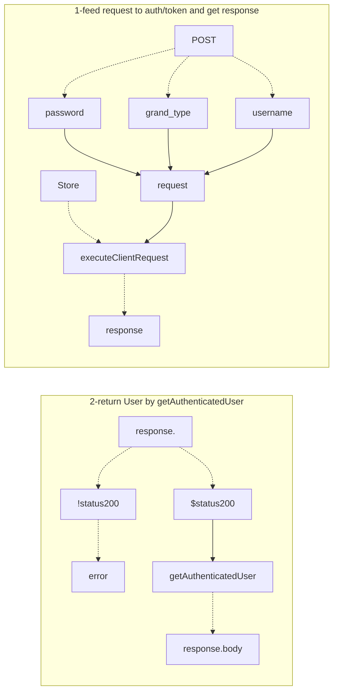
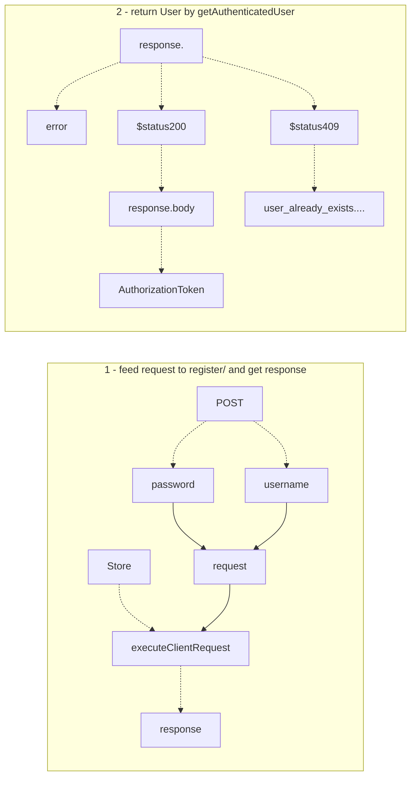

## AuthorizationToken


```dart
fromMap() =>
{
	"access_token"..., "refresh_token"..., "expires_in": 3000
}
Map<String, dynamic> asMap() =>  
{  
	"access_token": accessToken,  
	"refresh_token": refreshToken,  
	"expiresAt": expiresAt.toIso8601String()  
};
```

## StorageProvider
 ```mermaid
graph LR
StorageProvider
load -.- path
store -.- path
delete -.- path
StorageProvider -.- load
StorageProvider -.- store
StorageProvider -.- delete

```

## User
```dart
int id;  
String email;  
List<Note> notes = [];  
AuthorizationToken token;
bool get isAuthenticated => 
	token != null && !token.isExpired;
```

## ServiceController


## UserService: ServiceController
### UserService.login
- param - **register** username
- param - **String** password
- return - **Future(User)**
- vars - **Store** store

```dart
Future<User> login(String username, String password) async {  
  var req = new Request.post("/auth/token", {  
    "username": username,  
  "password": password,  
  "grant_type": "password"  
  }, contentType: new ContentType("application", "x-www-form-urlencoded"));  
  var response = await store.executeClientRequest(req);  
  if (response.error != null) {  
    addError(response.error);  
  return null;  
  }  
  switch (response.statusCode) {  
    case 200: return getAuthenticatedUser(token: new AuthorizationToken.fromMap(response.body));  
  default: addError(new APIError(response.body["error"]));  
  }  
  return null;  
}
```


### UserService.register
- param - **register** username
- param - **String** password
- return - **Future\<User>**



### UserService.getAuthenticatedUser
- param - **AuthorizationToken** token


## Store
- vars - NoteService noteController
- vars - UserService userController


### Store.authenticatedUser
- param - **User** user

### Store.executeClientRequest
- param - **Request** request

```dart
Future<Response> executeClientRequest(Request request) async {  
  request.headers[HttpHeaders.authorizationHeader] = clientAuthorization;  
  return executeRequest(request);  
}
```

### Store.executeRequest
param - **Request** request


### Store.executeUserRequest
param - **Request** request
param - **AuthorizationToken** token

```dart
Future<Response> executeUserRequest(Request request, {AuthorizationToken token}) async {  
  AuthorizationToken t = token ?? authenticatedUser?.token;  
  if (t?.isExpired ?? true) {  
    throw new UnauthenticatedException();  
  }  
  request.headers[HttpHeaders.authorizationHeader] = t.authorizationHeaderValue;  
  var response = await executeRequest(request);  
  if (response.statusCode == 401) {  
    // Refresh the token, try again  
  }  
  return response;  
}
```

### Store._loadPersistentUser
```mermaid
graph LR
storageProvider -.- load
load --> |_storedUserKey| contents
contents --> authenticatedUser
UserService--> add
authenticatedUser --> add


<!--stackedit_data:
eyJoaXN0b3J5IjpbLTEzOTkzMTk3NDAsLTI3MTIzNzE3NSwtMj
U2NjIwMzc5LC0xMDY5MTI0NTEyLC0yODEyMTE5MDAsMTY1NDIx
NjI3LDk3MzAyMTQ2NCwtMTY5NTY2OTQwOCwtNjI0MTk2NjA0LD
I3NzY4MDYwMSwtMTgzMjMzNTM1MCwtNTEwNDQ3NzE4LDcxMzc2
MTAxNSwtMTk5NTU0MTU0OCwxMTgwOTI5OTU1LDE0NzY3NTQ5Nj
EsMjE0NzI0Mjg4MSwtMTE0MDM4NTgzMyw3NzYzMjc4MDgsNzUy
OTMyNDhdfQ==
-->