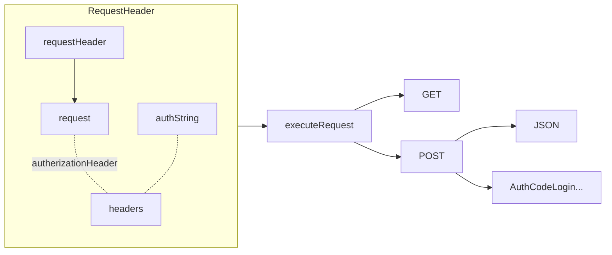

### AuthToken


```dart
fromMap() =>
{
	"access_token"..., "refresh_token"..., "expires_in": 3000
}
Map<String, dynamic> asMap() =>  
{  
	"access_token": accessToken,  
	"refresh_token": refreshToken,  
	"expiresAt": expiresAt.toIso8601String()  
};
```

### StorageProvider
 ```mermaid
graph LR
StorageProvider
load -.- path
store -.- path
delete -.- path
StorageProvider -.- load
StorageProvider -.- store
StorageProvider -.- delete

```

### noteService.authenticateUser
param - **User** user


### noteContoller.executeClientRequest
param - **Request** request



### Store
```mermaid
graph TB


```


### UserService


<!--stackedit_data:
eyJoaXN0b3J5IjpbLTE4NjE4MzA5NzYsMTEzNTgyMTEzMiwtNz
Q4MzU0NDEsLTExOTAwMjAwNjYsLTExNDg5OTAyMzcsLTg0OTMz
MTc3OCwyMDQwMjk3NjIyXX0=
-->