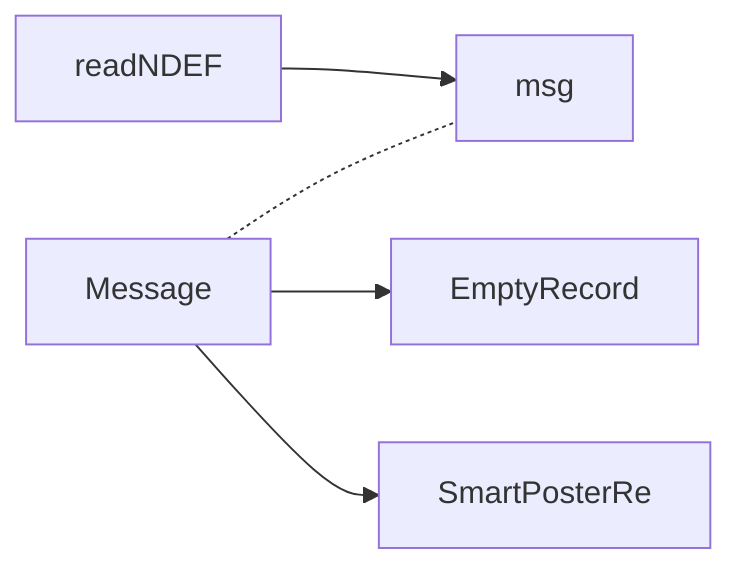

### NDEF()
read | write NDEF

msg: **NDEFMessage** | write: **NdefFragment.Boolean** 
NDEFWrite: 在這裡將 AAR 寫入 NdefRecords 中的第二筆 (android官方建議寫入第二筆)

```kotlin
public void NDEF() throws IOException {
// Check if the operation is read or write
if (NdefFragment.isWriteChosen()) {
	// NDEF Message to write in the tag
	NdefMessage msg = null;

	// Get the selected NDEF type since the creation of the NDEF Msg
	// will vary depending on the type
	if (NdefFragment.getNdefType().equalsIgnoreCase(...)) {
		msg = createNdefTextMessage(NdefFragment.getText());
	} else if (NdefFragment.getNdefType().equalsIgnoreCase(...))) {
		msg = createNdefUriMessage(NdefFragment.getText());
	} else if (NdefFragment.getNdefType().equalsIgnoreCase(...))) {
		msg = createNdefBSSPMessage();
	} else if (NdefFragment.getNdefType().equalsIgnoreCase(...))) {
		msg = createNdefSpMessage(NdefFragment.getSpTitle(), NdefFragment.getSpLink());
	}
	if(msg == null) {
		toastText(main, "Please add correct input values", Toast.LENGTH_LONG) ;
		NdefFragment.setAnswer(...error...);
	}
	if(NdefFragment.isAarRecordSelected()) {
		NdefRecord aarRecord = NdefRecord.createApplicationRecord(PseudoMainActivity.getPACKAGE_NAME());

          assert msg != null;
          NdefRecord records[] = msg.getRecords();
		records  = Arrays.copyOf(records, records.length + 1);
		records[records.length - 1] = aarRecord;
		msg = new NdefMessage(records);
	}
	try {
		long timeToWriteNdef = NDEFWrite(msg);
		toastText(main, "write tag successfully done", Toast.LENGTH_LONG) ;
		NdefFragment.setAnswer("Tag successfully written");

		assert msg != null;
		int bytes = msg.toByteArray().length;

		String Message = "";

		// Transmission Results
		Message = Message.concat("Speed (" + bytes + " Byte / "
				+ timeToWriteNdef + " ms): "
				+ String.format("%.0f", bytes / (timeToWriteNdef / 1000.0))
				+ " Bytes/s");
		NdefFragment.setDatarate(Message);
	} catch (Exception e) {
		toastText(main, "write tag failed", Toast.LENGTH_LONG) ;
		NdefFragment.setDatarate("Error writing NDEF");
		e.printStackTrace();
	}
} else {
	ndefreadtask = new NDEFReadTask();
	ndefreadtask.execute();
}
}
```


### NDEFReadTask()


**doInBackground**

readNDEF: **reader** | Message: **NDEFTool.Message**
<!--stackedit_data:
eyJoaXN0b3J5IjpbLTk1MzE1OTU1NCwxOTg1MzkxMTc4LC04Mj
g1NTYzM119
-->