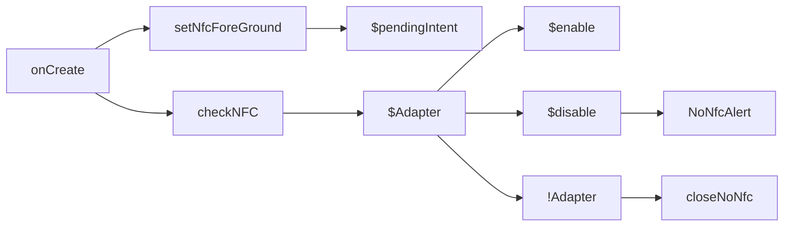
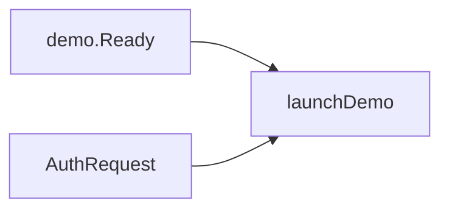
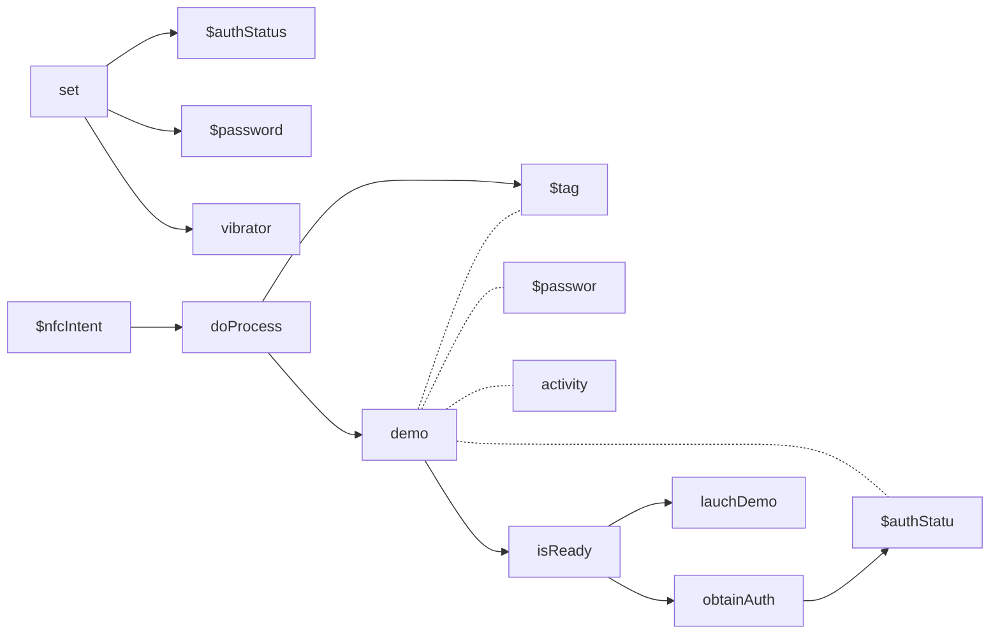
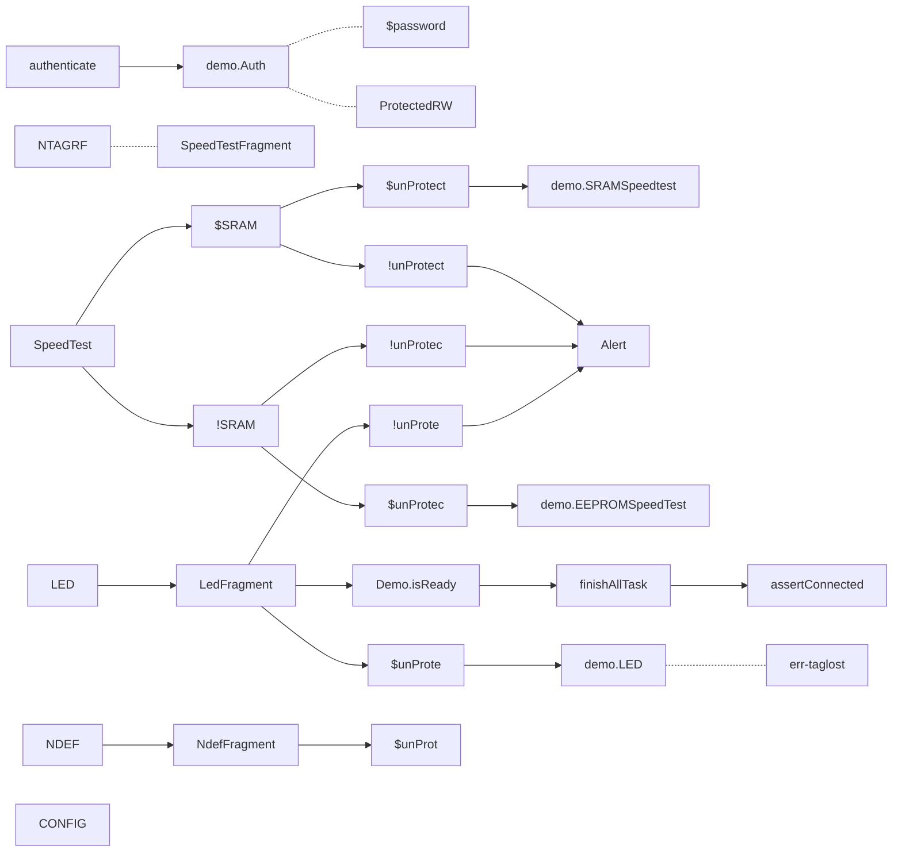

onCreate

```mermaid
graph LR
	onCreate
	setNfcForeGround
	checkNFC

	onCreate --> setNfcForeGround
	onCreate --> checkNFC
	setNfcForeGround --> $pendingIntent
	checkNFC --> $Adapter
	$Adapter --> $enable
	$Adapter --> $disable
	$disable --> NoNfcAlert
	$Adapter --> !Adapter
	!Adapter --> closeNoNfc
```

```mermaid
graph LR
	onPause --> $Adapter
	onPause --> !Adapter
	$Adapter --> disableForeGround
	$Adapter --> Demo.finisTask
```
onActivityResult

```mermaid
graph LR
  demo.Ready --> launchDemo
  AuthRequest --> launchDemo
  
```

onNewIntent

```mermaid
graph LR
	set --> $authStatus
	set --> $password
	set --> vibrator
	$nfcIntent --> doProcess
	doProcess --> $tag
	doProcess --> demo
	demo -.- $passwor
	demo -.- $authStatu
	demo -.- $tag
	demo -.- activity
	demo --> isReady
	isReady --> obtainAuth
	obtainAuth --> $authStatu
	isReady --> lauchDemo
```

launchDemo

```mermaid
graph LR
authenticate --> demo.Auth
demo.Auth -.- $password
demo.Auth -.- ProtectedRW


NTAGRF -.- SpeedTestFragment
SpeedTest --> $SRAM
SpeedTest --> !SRAM
$SRAM --> $unProtect
$SRAM --> !unProtect
$unProtect--> demo.SRAMSpeedtest
!unProtect--> Alert
!SRAM --> $unProtec
!SRAM --> !unProtec
$unProtec --> demo.EEPROMSpeedTest
!unProtec --> Alert


LED --> LedFragment
LedFragment --> Demo.isReady
Demo.isReady --> finishAllTask
finishAllTask --> assertConnected
LedFragment --> $unProte
LedFragment --> !unProte
$unProte --> demo.LED
demo.LED -.- err-taglost
!unProte --> Alert


NDEF --> NdefFragment


NdefFragment --> $unProt


CONFIG
```
<!--stackedit_data:
eyJoaXN0b3J5IjpbLTQ3OTMyODQ1Miw2NzQ5NTkxNzQsMTM1Mz
c2NjU0Myw0OTM4NDA4XX0=
-->