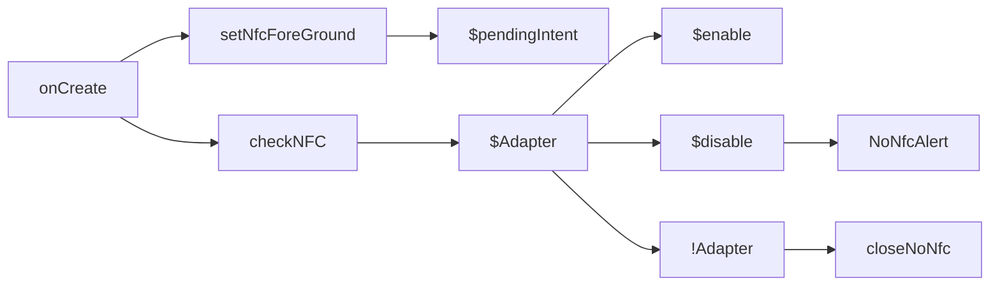
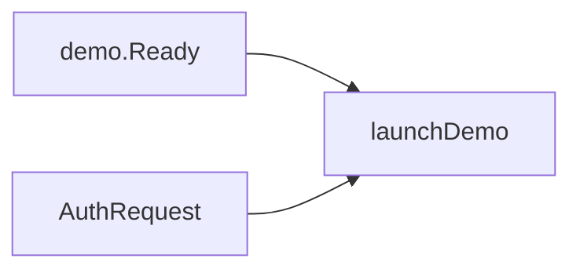
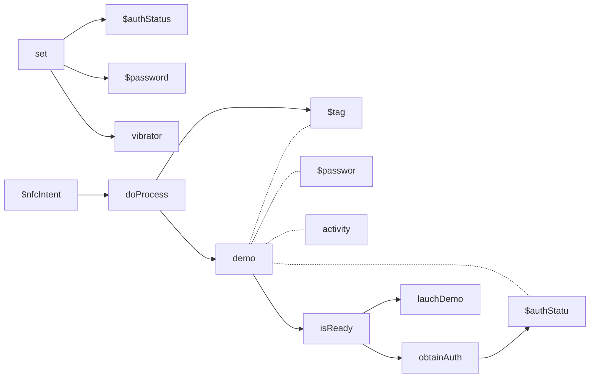
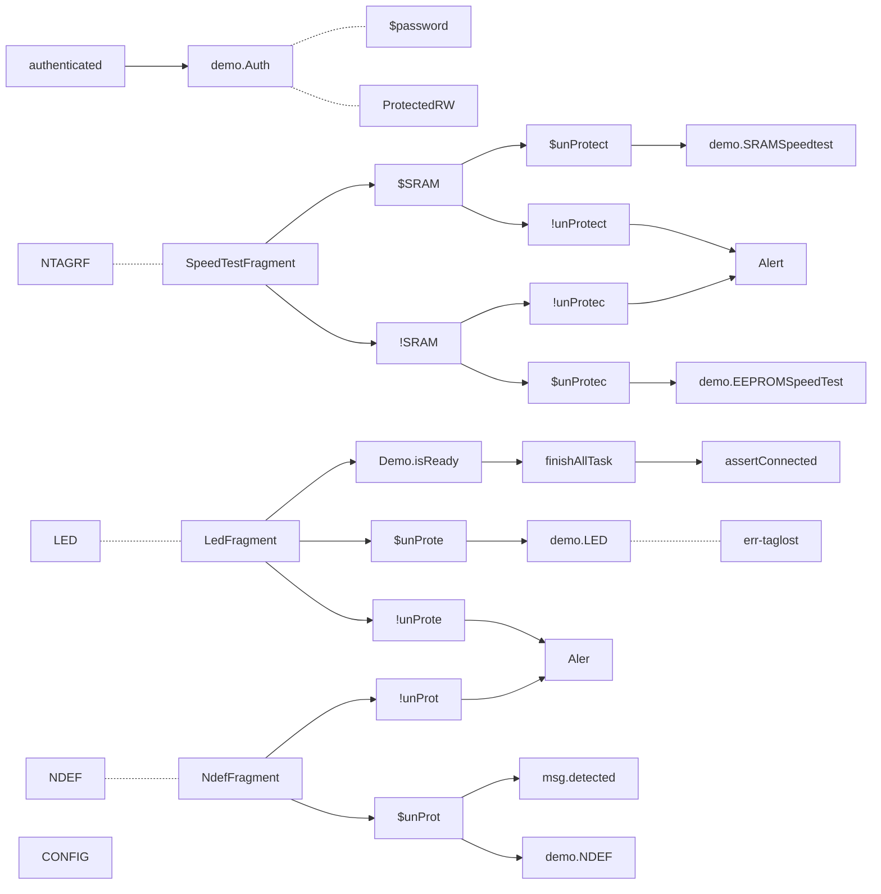
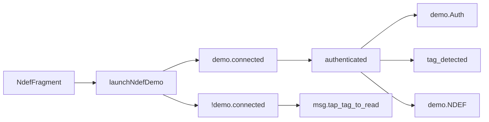

### onCreate


### onPause

### onActivityResult


### onNewIntent


### launchDemo


### ShowXDialog
- FlashDialog
- AboutDialog
- HelpDialog
- DebugDialog
```mermaid
graph LR

```


### launchNdefDemo


<!--stackedit_data:
eyJoaXN0b3J5IjpbMTk5NTg5NTgzLC0xNTYyNzc2NzYxLC0xND
EyOTI5NDI3LC05ODMwMzU4MzEsNjc0OTU5MTc0LDEzNTM3NjY1
NDMsNDkzODQwOF19
-->