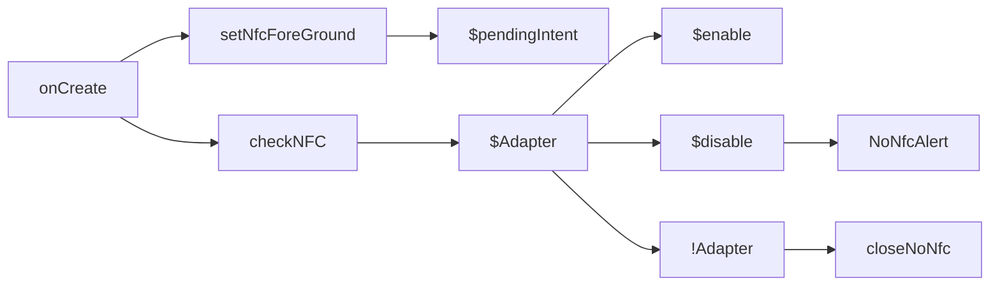
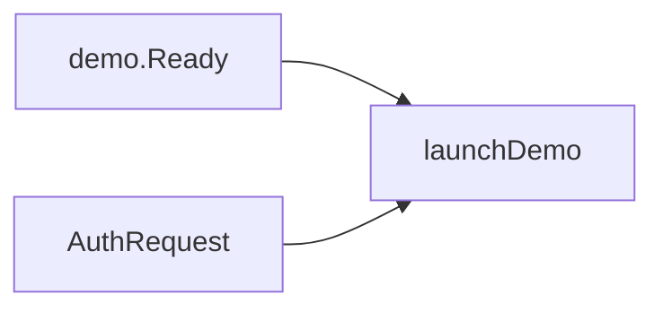
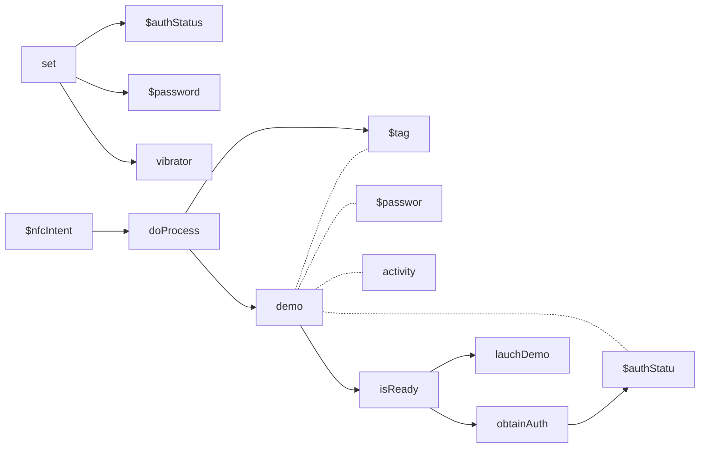
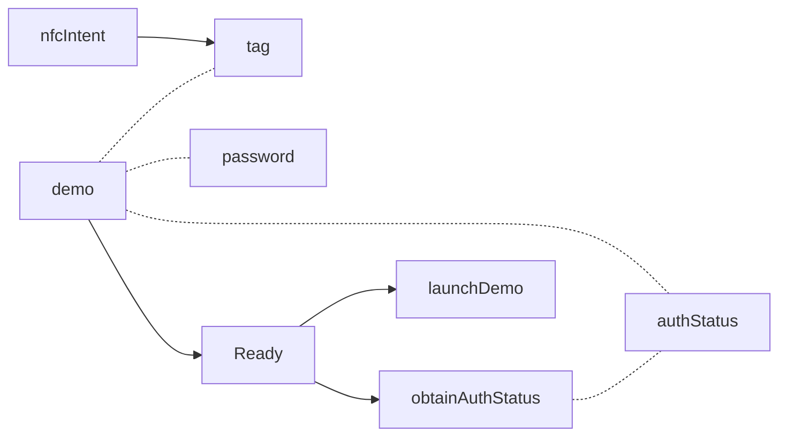
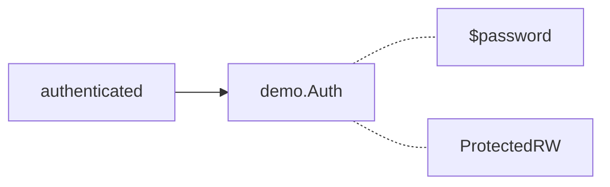
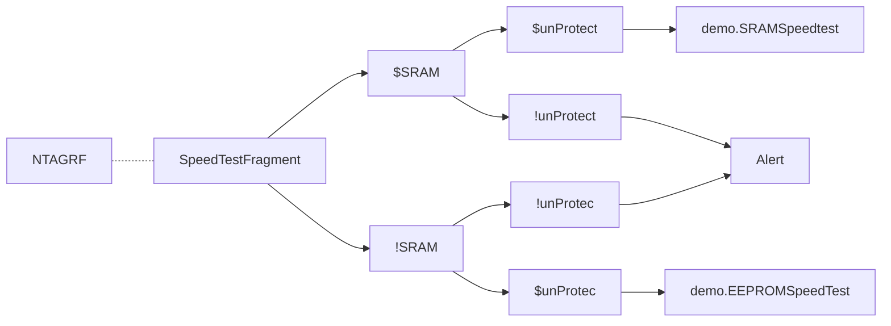
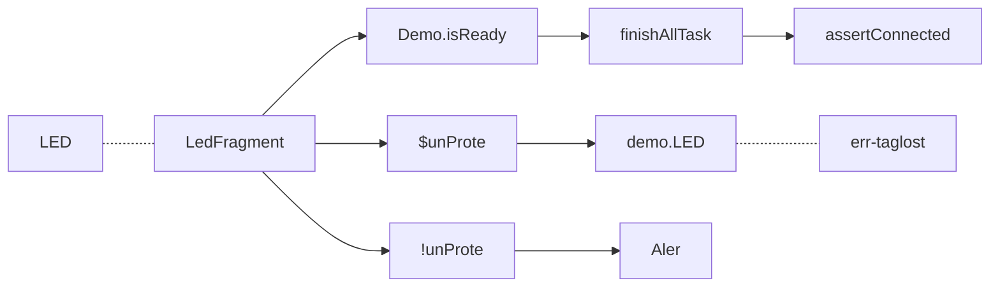
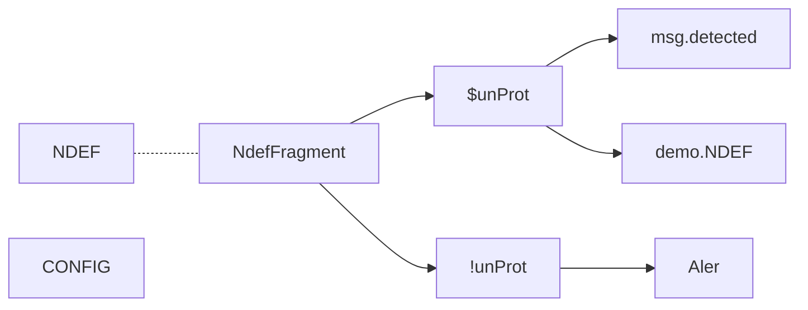
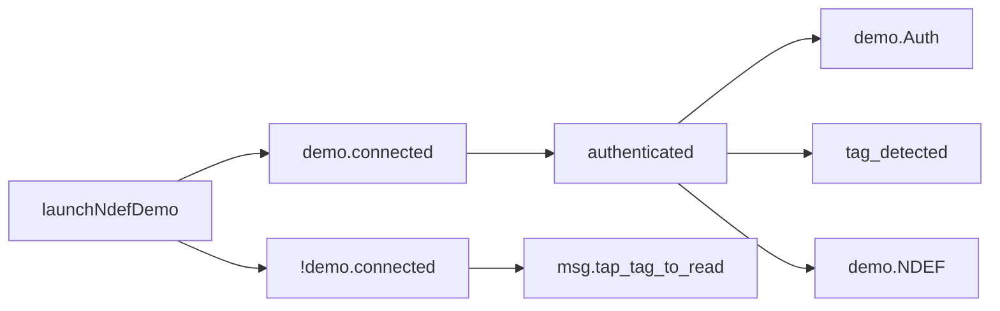

### onCreate


```kotlin
private fun checkNFC() {  
   if (mAdapter != null) {  
      if (!mAdapter!!.isEnabled) {  
         Dart.showSettingNoNfcAlert(this)  
      }  
   } else {  
      Dart.closeAppNoNfcAlert(this)  
   }  
}
fun setNfcForeground() {
  mPendingIntent = PendingIntent.getActivity(
  registrar.activity(), 0,
  Intent(registrar.context(), javaClass)
       .addFlags(Intent.FLAG_ACTIVITY_SINGLE_TOP), 0)
   }
```

### onPause

### onActivityResult


### onNewIntent


#### doProcess


### launchDemo


> #### launchDemo - SpeedTest


> #### launchDemo - LED test

> #### launchDemo - NDEF Test


### launchNdefDemo
> call from NdefFragment


<!--stackedit_data:
eyJoaXN0b3J5IjpbLTY5MjQxNjc4MiwtMjA1MDQ3MzQ3OCwtMT
k3MzI2NTIzNCwtMTU2Mjc3Njc2MSwtMTQxMjkyOTQyNywtOTgz
MDM1ODMxLDY3NDk1OTE3NCwxMzUzNzY2NTQzLDQ5Mzg0MDhdfQ
==
-->