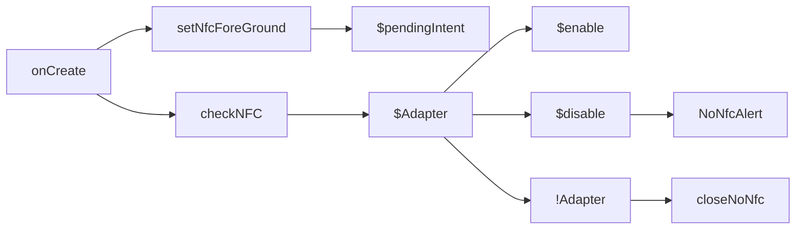
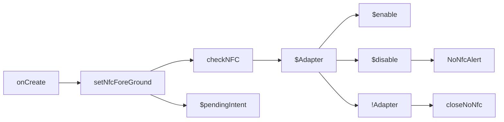

```mermaid
graph LR
	onCreate
	setNfcForeGround
	checkNFC


	onCreate --> setNfcForeGround
	onCreate --> checkNFC
	setNfcForeGround --> $pendingIntent
	checkNFC --> $Adapter
	$Adapter --> $enable
	$Adapter --> $disable
	$disable --> NoNfcAlert
	$Adapter --> !Adapter
	!Adapter --> closeNoNfc

```

```mermaid
graph LR
	onCreate
	setNfcForeGround
	checkNFC


	onCreate --> setNfcForeGround
	setNfcForeGround --> checkNFC
	setNfcForeGround --> $pendingIntent
	checkNFC --> $Adapter
	$Adapter --> $enable
	$Adapter --> $disable
	$disable --> NoNfcAlert
	$Adapter --> !Adapter
	!Adapter --> closeNoNfc

```
<!--stackedit_data:
eyJoaXN0b3J5IjpbMjU3OTU0OTgxLDQ5Mzg0MDhdfQ==
-->