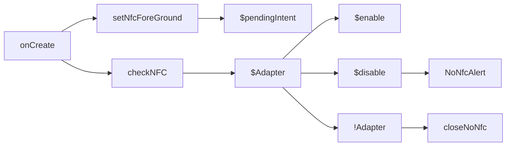
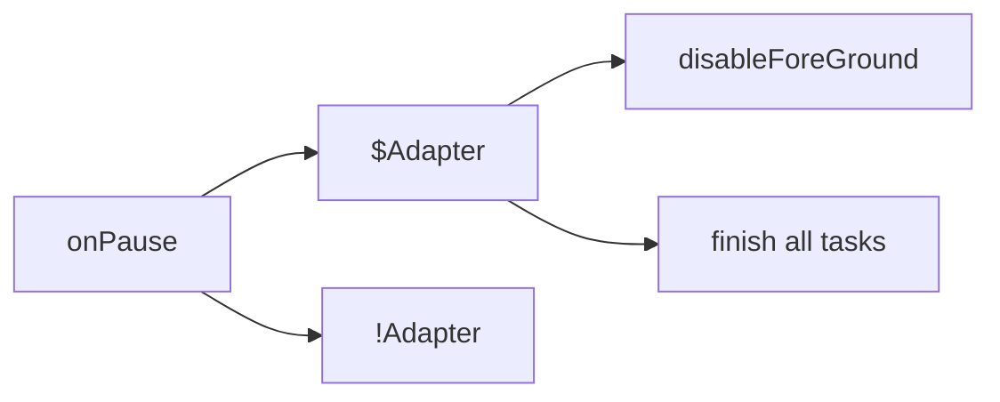

onCreate

```mermaid
graph LR
	onCreate
	setNfcForeGround
	checkNFC

	onCreate --> setNfcForeGround
	onCreate --> checkNFC
	setNfcForeGround --> $pendingIntent
	checkNFC --> $Adapter
	$Adapter --> $enable
	$Adapter --> $disable
	$disable --> NoNfcAlert
	$Adapter --> !Adapter
	!Adapter --> closeNoNfc
```

```mermaid
graph LR
	onPause --> $Adapter
	onPause --> !Adapter
	$Adapter --> disableForeGround
	$Adapter --> finisTask[finish all tasks]
	

```
<!--stackedit_data:
eyJoaXN0b3J5IjpbMTQ0NDgyOTU0Myw0OTM4NDA4XX0=
-->