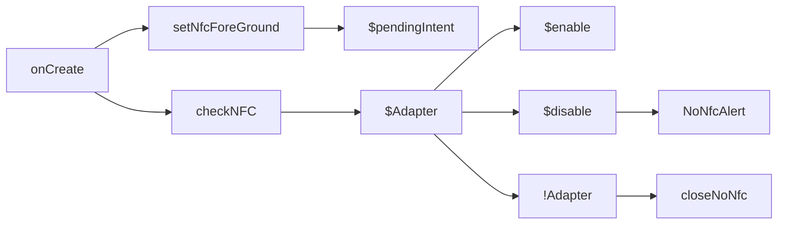
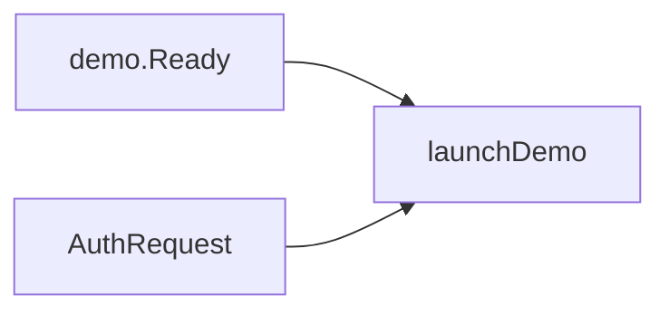
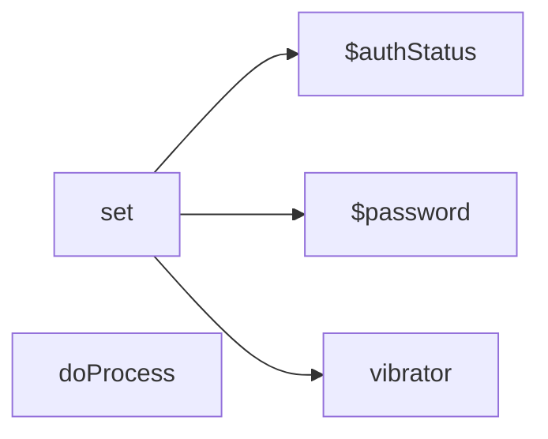

onCreate

```mermaid
graph LR
	onCreate
	setNfcForeGround
	checkNFC

	onCreate --> setNfcForeGround
	onCreate --> checkNFC
	setNfcForeGround --> $pendingIntent
	checkNFC --> $Adapter
	$Adapter --> $enable
	$Adapter --> $disable
	$disable --> NoNfcAlert
	$Adapter --> !Adapter
	!Adapter --> closeNoNfc
```

```mermaid
graph LR
	onPause --> $Adapter
	onPause --> !Adapter
	$Adapter --> disableForeGround
	$Adapter --> Demo.finisTask
```
onActivityResult

```mermaid
graph LR
  demo.Ready --> launchDemo
  AuthRequest --> launchDemo
  
```

onNewIntent

```mermaid
graph LR
	set --> $authStatus
	set --> $password
	set --> vibrator
	doProcess
```
<!--stackedit_data:
eyJoaXN0b3J5IjpbLTIwOTk0NzMyMjcsNDkzODQwOF19
-->