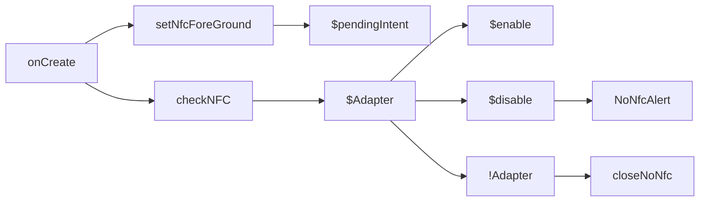
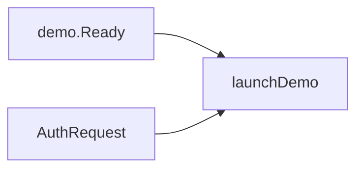
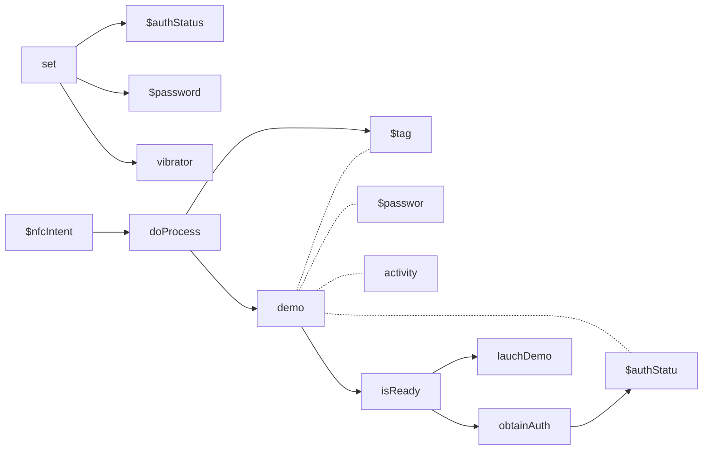
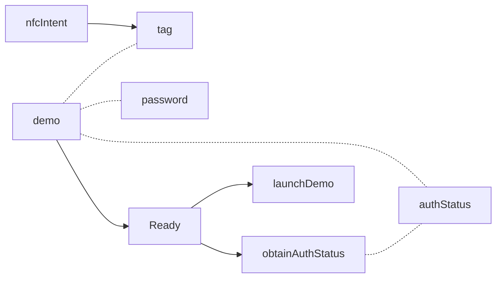
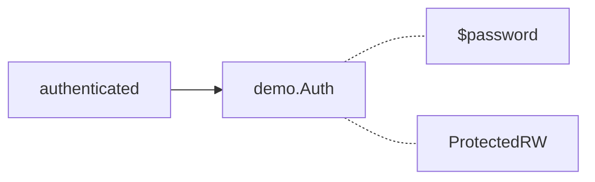
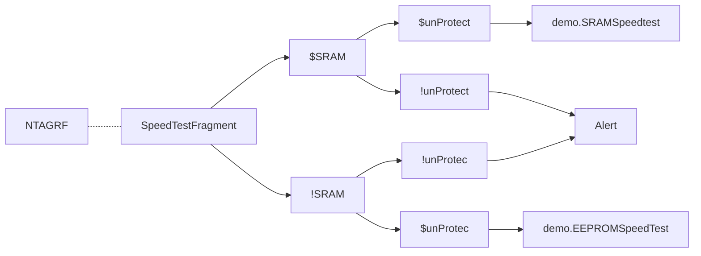
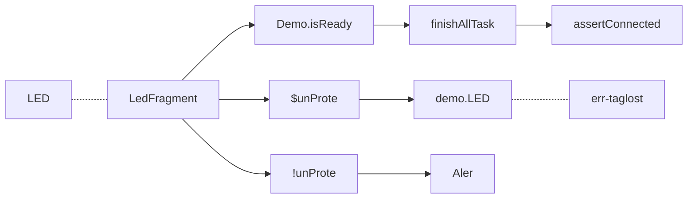
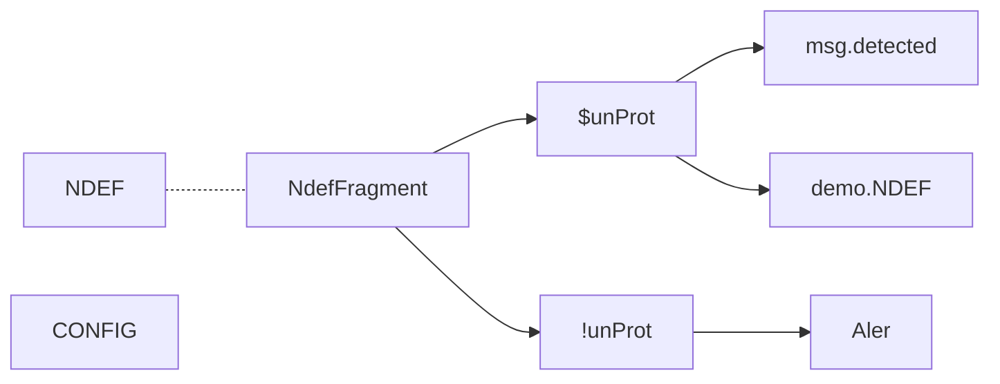
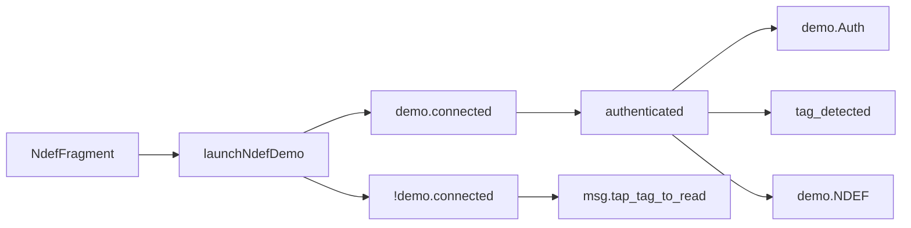

### onCreate

### onPause

### onActivityResult

### onNewIntent

#### doProcess

### launchDemo

> #### launchDemo - SpeedTest

> #### launchDemo - LED test

> #### launchDemo - NDEF Test

### launchNdefDemo

<!--stackedit_data:
eyJoaXN0b3J5IjpbLTE5NzMyNjUyMzQsLTE1NjI3NzY3NjEsLT
E0MTI5Mjk0MjcsLTk4MzAzNTgzMSw2NzQ5NTkxNzQsMTM1Mzc2
NjU0Myw0OTM4NDA4XX0=
-->