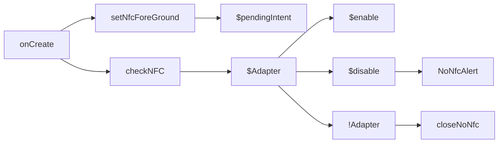
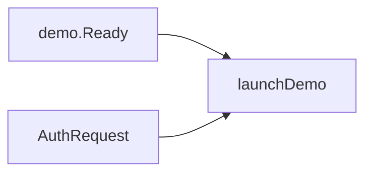
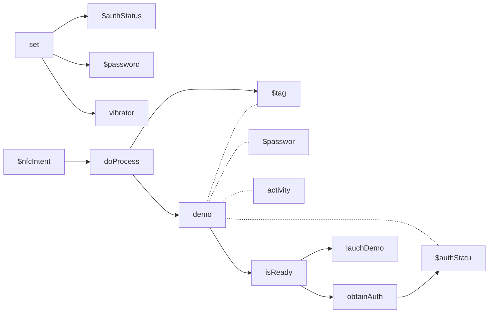
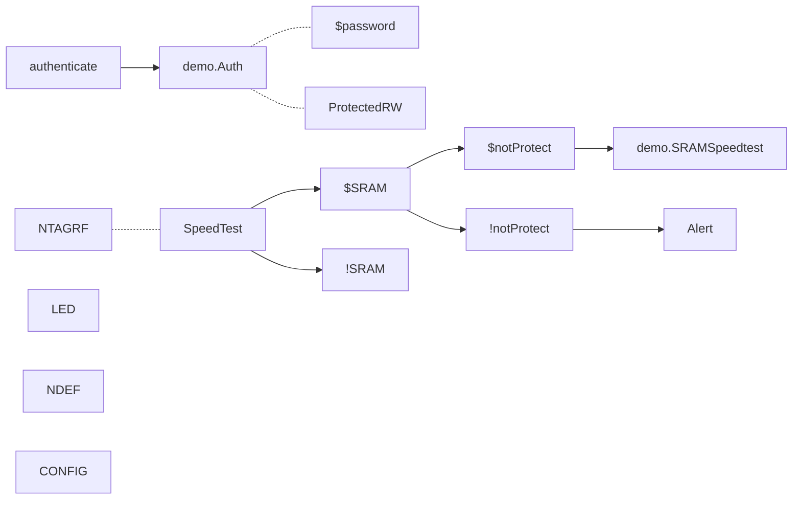

onCreate

```mermaid
graph LR
	onCreate
	setNfcForeGround
	checkNFC

	onCreate --> setNfcForeGround
	onCreate --> checkNFC
	setNfcForeGround --> $pendingIntent
	checkNFC --> $Adapter
	$Adapter --> $enable
	$Adapter --> $disable
	$disable --> NoNfcAlert
	$Adapter --> !Adapter
	!Adapter --> closeNoNfc
```

```mermaid
graph LR
	onPause --> $Adapter
	onPause --> !Adapter
	$Adapter --> disableForeGround
	$Adapter --> Demo.finisTask
```
onActivityResult

```mermaid
graph LR
  demo.Ready --> launchDemo
  AuthRequest --> launchDemo
  
```

onNewIntent

```mermaid
graph LR
	set --> $authStatus
	set --> $password
	set --> vibrator
	$nfcIntent --> doProcess
	doProcess --> $tag
	doProcess --> demo
	demo -.- $passwor
	demo -.- $authStatu
	demo -.- $tag
	demo -.- activity
	demo --> isReady
	isReady --> obtainAuth
	obtainAuth --> $authStatu
	isReady --> lauchDemo
```

launchDemo

```mermaid
graph LR
authenticate --> demo.Auth
demo.Auth -.- $password
demo.Auth -.- ProtectedRW
NTAGRF -.- SpeedTest
SpeedTest --> $SRAM
SpeedTest --> !SRAM
$SRAM --> $notProtect
$SRAM --> !notProtect
$notProtect--> demo.SRAMSpeedtest
!notProtect--> Alert
!SRAM 

LED
NDEF
CONFIG
```
<!--stackedit_data:
eyJoaXN0b3J5IjpbNjE2MjUwNTY3LDEzNTM3NjY1NDMsNDkzOD
QwOF19
-->