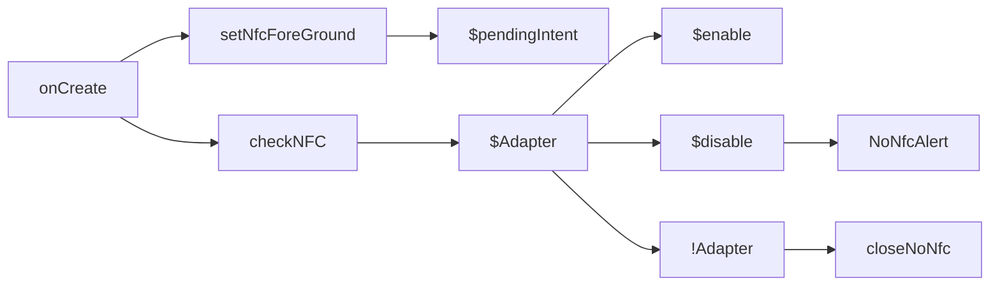
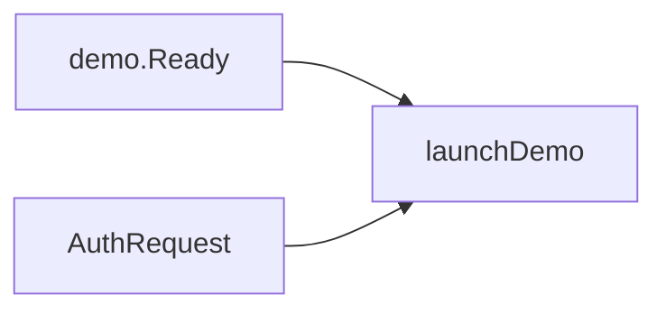
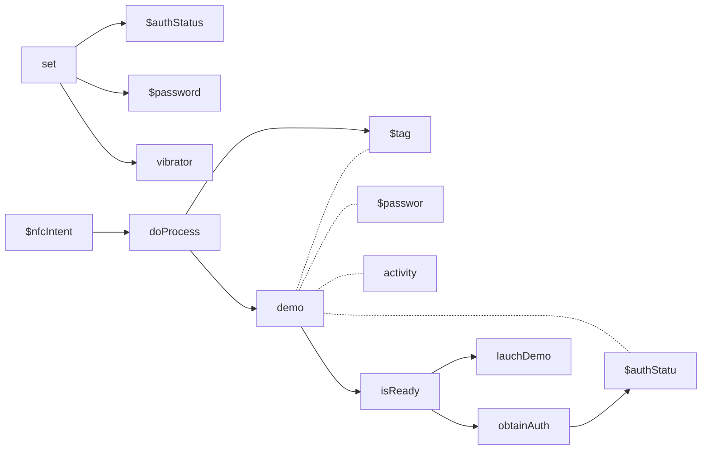
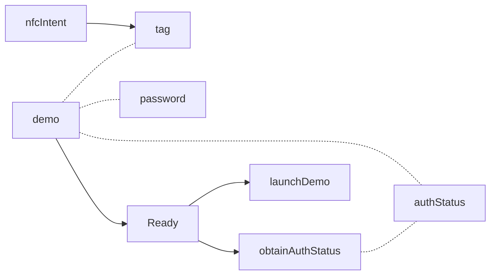
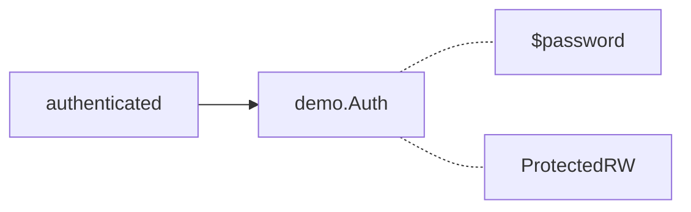
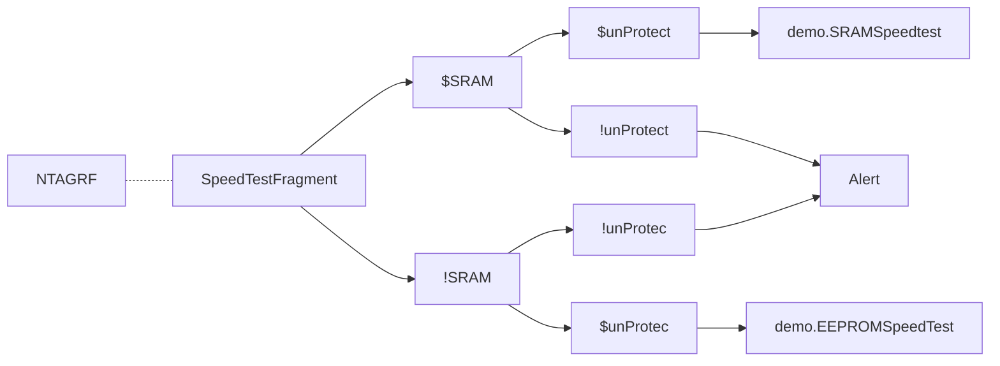
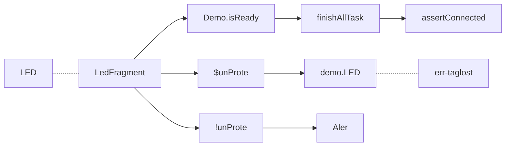
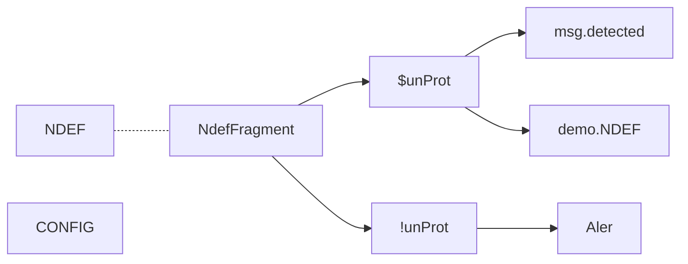
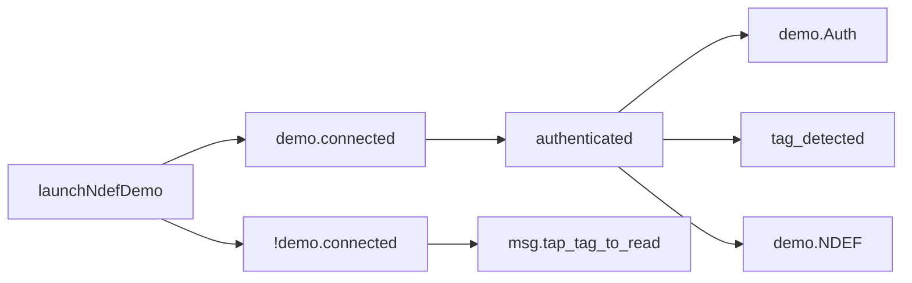

### onCreate


```kotlin
private fun checkNFC() {  
   if (mAdapter != null) {  
      if (!mAdapter!!.isEnabled) {  
         Dart.showSettingNoNfcAlert(this)  
      }  
   } else {  
      Dart.closeAppNoNfcAlert(this)  
   }  
}
fun setNfcForeground() {
  mPendingIntent = PendingIntent.getActivity(
  registrar.activity(), 0,
  Intent(registrar.context(), javaClass)
 .addFlags(Intent.FLAG_ACTIVITY_SINGLE_TOP), 0)
}
```

### onPause

### onActivityResult


### onNewIntent

```kotlin
   override fun onNewIntent(intent: Intent):Boolean {
      val nfc_intent = intent;
      super.onNewIntent(nfc_intent)
      // Set the pattern for vibration
      val pattern = longArrayOf(0, 100)

      // Set the initial auth parameters
      authStatus = AuthStatus.Disabled.value
      password = null

      // Vibrate on new Intent
      val vibrator = registrar.activity().getSystemService(Context.VIBRATOR_SERVICE) as Vibrator
      vibrator.vibrate(pattern, -1)
      doProcess(nfc_intent)
      return true;
   }
```

#### doProcess

```kotlin
fun doProcess(nfc_intent: Intent) {
   nfcIntent = nfc_intent
   val tag = nfc_intent.getParcelableExtra<Tag>(NfcAdapter.EXTRA_TAG)
   demo = Ntag_I2C_Demo(tag, registrar.activity(), password, authStatus)
   if (demo!!.isReady) {
      // Retrieve Auth Status before doing any operation
      authStatus = obtainAuthStatus()
      val currTab = tabname
      launchDemo(currTab)
   }
}
```

### launchDemo


> #### launchDemo - SpeedTest

```kotlin
if (currTab.data == "ntag_rf") {
   try {
      // SRAM Test
      if ((SpeedTestFragment.isSRamEnabled == true)) {
         // This demo is available even if the product is protected
         // as long as the SRAM is unprotected
         if ((authStatus == AuthStatus.Disabled.value
                         || authStatus == AuthStatus.Unprotected.value
                         || authStatus == AuthStatus.Authenticated.value
                         || authStatus == AuthStatus.Protected_W.value
                         || authStatus == AuthStatus.Protected_RW.value)) {
            demo!!.SRAMSpeedtest()
         } else {
            message?.onToastMakeText("NTAG I2C Plus memory is protected",Toast.LENGTH_LONG, this)
            showAuthDialog()
         }
      }
      // EEPROM Test
      if ((SpeedTestFragment.isSRamEnabled == false)) {
         // This demo is only available when the tag is not protected
         if ((authStatus == AuthStatus.Disabled.value
                         || authStatus == AuthStatus.Unprotected.value
                         || authStatus == AuthStatus.Authenticated.value)) {
            demo!!.EEPROMSpeedtest()
         } else {
            message?.onToastMakeText("NTAG I2C Plus memory is protected",Toast.LENGTH_LONG, this)
            showAuthDialog()
         }
      } // end if eeprom test
   } catch (e: Exception) {
      SpeedTestFragment.setAnswer(activity.getString(R.string.Tag_lost))
      e.printStackTrace()
   }
}
```

> #### launchDemo - LED test

```kotlin
if (currTab.data == "leds") {
   //gordianknot....
   if (demo!!.isReady) {
      demo!!.finishAllTasks()
      if ( !demo!!.isConnected) {
         throw Exception("Demo should be connected")
      }
   }
   // This demo is available even if the product is protected
   // as long as the SRAM is unprotected
   if ((authStatus == AuthStatus.Disabled.value
                   || authStatus == AuthStatus.Unprotected.value
                   || authStatus == AuthStatus.Authenticated.value
                   || authStatus == AuthStatus.Protected_W.value
                   || authStatus == AuthStatus.Protected_RW.value)) {
      try {
         // if (LedFragment.getChosen()) {
         demo!!.LED()
      } catch (e: Exception) {
         e.printStackTrace()
         LedFragment.setAnswer(activity.getString(R.string.Tag_lost))
      }

   } else {
      message?.onToastMakeText("NTAG I2C Plus memory is protected", Toast.LENGTH_LONG, this)
      showAuthDialog()
   }
}
```

> #### launchDemo - NDEF Test

```kotlin
if (currTab.data == "ndef") {
    // This demo is only available when the tag is not protected
    if ((authStatus == AuthStatus.Disabled.value
                    || authStatus == AuthStatus.Unprotected.value
                    || authStatus == AuthStatus.Authenticated.value)) {
       NdefFragment.setAnswer("Tag detected")
       try {
          demo!!.NDEF()
       } catch (e: Exception) {
          // NdefFragment.setAnswer(getString(R.string.Tag_lost));
       }

    } else {
       message?.onToastMakeText("NTAG I2C Plus memory is protected",Toast.LENGTH_LONG, this)
       showAuthDialog()
    }
 }
```

### launchNdefDemo
> call from NdefFragment


```kotlin
fun launchNdefDemo(auth: Int, pwd: ByteArray) {
   if (demo!!.isReady) {
      if (demo!!.isConnected) {
         if (auth == AuthStatus.Authenticated.value) {
            demo!!.Auth(pwd, AuthStatus.Protected_RW.value)
         }
         NdefFragment.setAnswer("Tag detected")
         try {
            demo!!.NDEF()
         } catch (e: Exception) {
            NdefFragment.setAnswer("Error: Tag lost, try again")
            e.printStackTrace()
         }

      } else {
         if (NdefFragment.isWriteChosen) {
            NdefFragment.setAnswer("Tap tag to write NDEF content")
         } else {
            NdefFragment.setAnswer("Tap tag to read NDEF content")
         }
      }
   }
}
```

<!--stackedit_data:
eyJoaXN0b3J5IjpbLTIwMTE5MDUyOTAsLTIwNTA0NzM0NzgsLT
E5NzMyNjUyMzQsLTE1NjI3NzY3NjEsLTE0MTI5Mjk0MjcsLTk4
MzAzNTgzMSw2NzQ5NTkxNzQsMTM1Mzc2NjU0Myw0OTM4NDA4XX
0=
-->