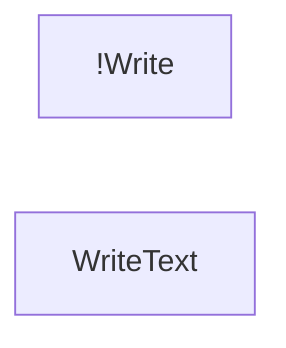
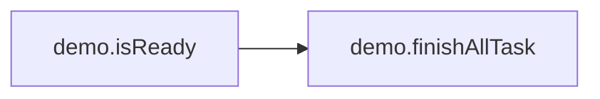

### onCreate

```mermaid
graph LR
!Write
WriteText
```
### enableNdefReadLoop

```mermaid
graph LR
demo.isReady --> demo.finishAllTask

```

### readNdefClick
```mermaid

```
### writeNdefClick
```mermaid

```
<!--stackedit_data:
eyJoaXN0b3J5IjpbNTk5NjY0MjAyXX0=
-->