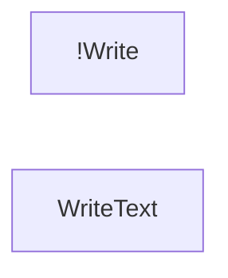
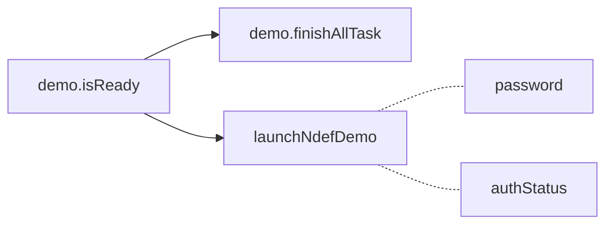
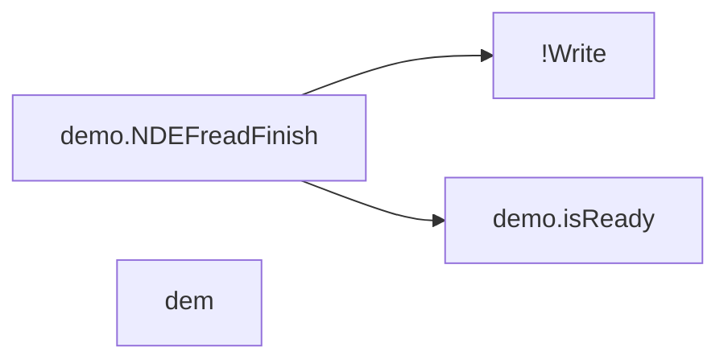

### onCreate

```mermaid
graph LR
!Write
WriteText
```
### enableNdefReadLoop

```mermaid
graph LR
demo.isReady --> demo.finishAllTask
demo.isReady --> launchNdefDemo
launchNdefDemo -.- password
launchNdefDemo -.- authStatus

```

### readNdefClick

```mermaid
graph LR
demo.NDEFreadFinish --> !Write
demo.NDEFreadFinish --> demo.isReady
dem
```
### writeNdefClick
```mermaid

```
<!--stackedit_data:
eyJoaXN0b3J5IjpbLTQ4NDMzOTc0LDgyNTI0MjA4Ml19
-->