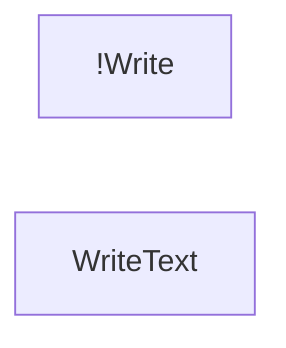
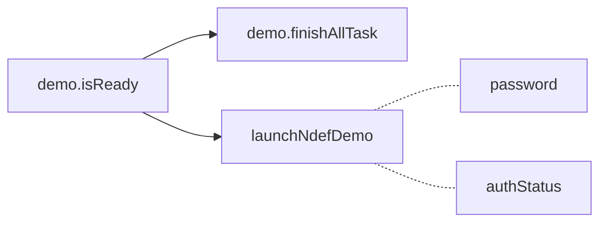
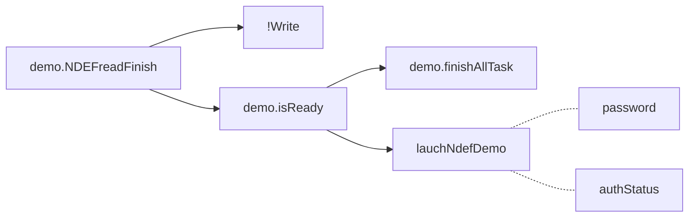
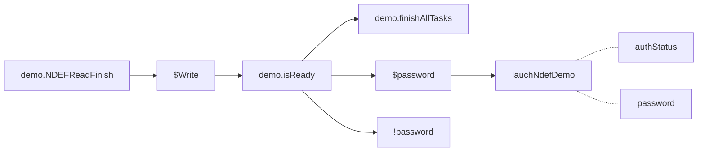
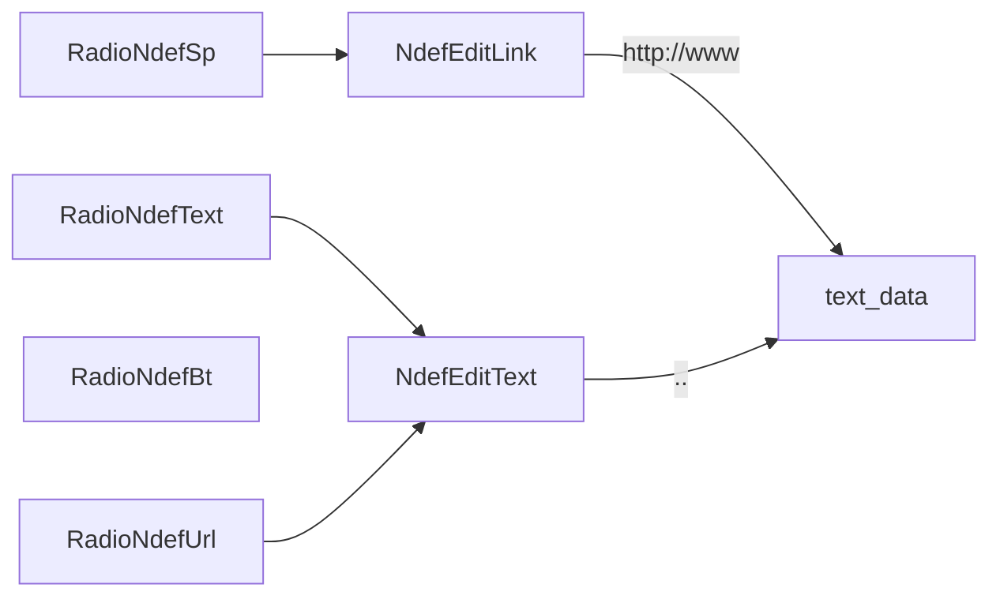

### onCreate

### enableNdefReadLoop

```kotlin
fun enableNdefReadLoop(isChecked: Boolean){  
   if (isChecked == true && PseudoMainActivity.demo!!.isReady) {  
      if (PseudoMainActivity.demo == null)  
         throw ExceptionInInitializerError("demo should not be null")  
      val demo: Ntag_I2C_Demo = PseudoMainActivity.demo as Ntag_I2C_Demo;  
  
  demo.finishAllTasks()  
      if (PseudoMainActivity.password == null)  
         throw ExceptionInInitializerError("password should not be null")  
      PseudoMainActivity.launchNdefDemo(  
              PseudoMainActivity.authStatus,  
  PseudoMainActivity.password as ByteArray)  
   }  
}
```

### readNdefClick

```kotlin
fun readNdefClick(){  
   if (PseudoMainActivity.demo == null)  
      throw ExceptionInInitializerError("demo should not be null")  
   val demo: Ntag_I2C_Demo = PseudoMainActivity.demo as Ntag_I2C_Demo;  
  
  demo.NDEFReadFinish()  
   val resources = registrar.activity().resources  
  ndefPerformance = resources.getString(R.string.layout_input_ndef_read)  
   ndefCallback = resources.getString(R.string.readNdefMsg)  
   isWriteChosen = false  
  
  // Read content  
  if (demo.isReady) {  
      demo.finishAllTasks()  
      if (PseudoMainActivity.password == null)  
         throw ExceptionInInitializerError("password should not be null")  
      PseudoMainActivity.launchNdefDemo(  
              PseudoMainActivity.authStatus,  
  PseudoMainActivity.password as ByteArray)  
   }  
}
```
### writeNdefClick
lauchNdefDemo (MainActivity) --> NdefFragment --> Demo.NDEF

```kotlin
   fun writeNdefClick(){
		...
      if (PseudoMainActivity.demo == null)
         throw ExceptionInInitializerError("demo should not be null")
      val demo: Ntag_I2C_Demo = PseudoMainActivity.demo as Ntag_I2C_Demo;
      // Close the ReadNdef Taks
      demo.NDEFReadFinish()

      if (isWriteChosen == true) {
         if (demo.isReady) {
            demo.finishAllTasks()
            if (PseudoMainActivity.password == null)
               throw ExceptionInInitializerError("password should not be null")
            PseudoMainActivity.launchNdefDemo(
                    PseudoMainActivity.authStatus,
                    PseudoMainActivity.password as ByteArray)
        ....
```

different options

<!--stackedit_data:
eyJoaXN0b3J5IjpbLTE3MjMxOTk2NzMsMTcwOTE2MTU3OCw4Mj
UyNDIwODJdfQ==
-->