### NDEF()
- read - by NDEFReadTask
- write - by NDEFWrite
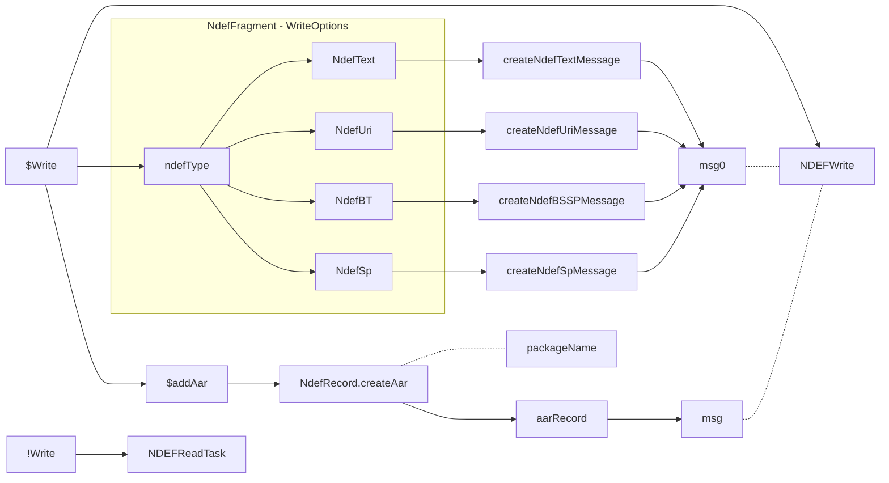
msg: **NDEFMessage** | write: **NdefFragment.Boolean** 
NDEFWrite: 在這裡將 AAR 寫入 NdefRecords 中的第二筆 (android官方建議寫入第二筆)

```kotlin
public void NDEF() throws IOException {
// Check if the operation is read or write
if (NdefFragment.isWriteChosen()) {
	// NDEF Message to write in the tag
	NdefMessage msg = null;

	// Get the selected NDEF type since the creation of the NDEF Msg
	// will vary depending on the type
	if (NdefFragment.getNdefType().equalsIgnoreCase(...)) {
		msg = createNdefTextMessage(NdefFragment.getText());
	} else if (NdefFragment.getNdefType().equalsIgnoreCase(...))) {
		msg = createNdefUriMessage(NdefFragment.getText());
	} else if (NdefFragment.getNdefType().equalsIgnoreCase(...))) {
		msg = createNdefBSSPMessage();
	} else if (NdefFragment.getNdefType().equalsIgnoreCase(...))) {
		msg = createNdefSpMessage(NdefFragment.getSpTitle(), NdefFragment.getSpLink());
	}
	if(msg == null) {
		toastText(main, "Please add correct input values", Toast.LENGTH_LONG) ;
		NdefFragment.setAnswer(...error...);
	}
	if(NdefFragment.isAarRecordSelected()) {
		NdefRecord aarRecord = NdefRecord.createApplicationRecord(PseudoMainActivity.getPACKAGE_NAME());

          assert msg != null;
          NdefRecord records[] = msg.getRecords();
		records  = Arrays.copyOf(records, records.length + 1);
		records[records.length - 1] = aarRecord;
		msg = new NdefMessage(records);
	}
	try {
		long timeToWriteNdef = NDEFWrite(msg);
		toastText(main, "write tag successfully done", Toast.LENGTH_LONG) ;
		NdefFragment.setAnswer("Tag successfully written");

		assert msg != null;
		int bytes = msg.toByteArray().length;

		String Message = "";

		// Transmission Results
		Message = Message.concat("Speed (" + bytes + " Byte / "
				+ timeToWriteNdef + " ms): "
				+ String.format("%.0f", bytes / (timeToWriteNdef / 1000.0))
				+ " Bytes/s");
		NdefFragment.setDatarate(Message);
	} catch (Exception e) {
		toastText(main, "write tag failed", Toast.LENGTH_LONG) ;
		NdefFragment.setDatarate("Error writing NDEF");
		e.printStackTrace();
	}
} else {
	ndefreadtask = new NDEFReadTask();
	ndefreadtask.execute();
}
}
```


### NDEFReadTask()
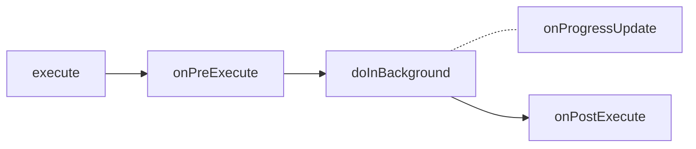

**doInBackground**
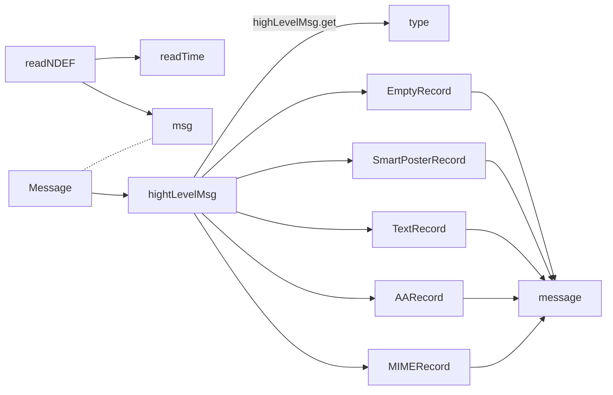
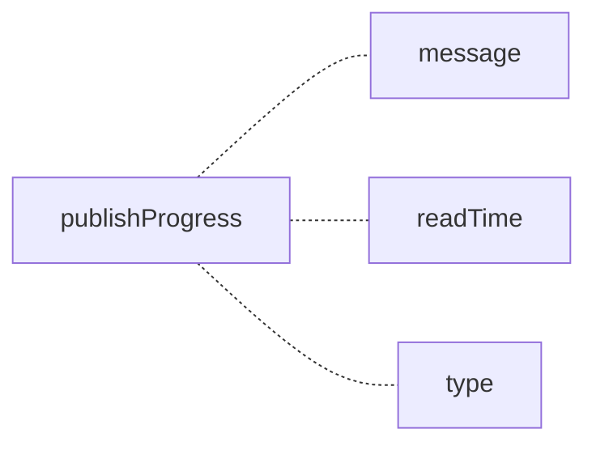
> readNDEF: **reader** | Message: **NDEFTool.Message** | type: **String - NdefType** | msg: **NDEFMessage** | message: **String - NdefMessage** | readTime: **Long - datarate**


### NDEFWrite
只call了read.writeNDEF, 並計算時間
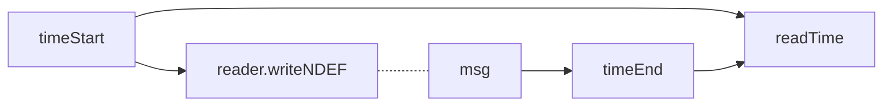
msg: **NDEFMessage**


### NDEFReadFinish


```kotlin
public void NDEFReadFinish() {
	if (ndefreadtask != null && !ndefreadtask.isCancelled()) {
		ndefreadtask.exit = true;
		try {
			ndefreadtask.get();
		} catch (Exception e) {
			e.printStackTrace();
		}
		ndefreadtask = null;
		// Clean all the fields
		NdefFragment.resetNdefDemo();
	}
}
```


### finishAllTasks
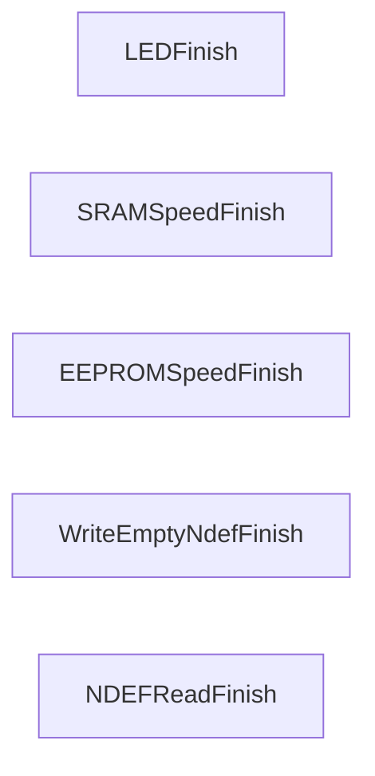


### resetTagMemory
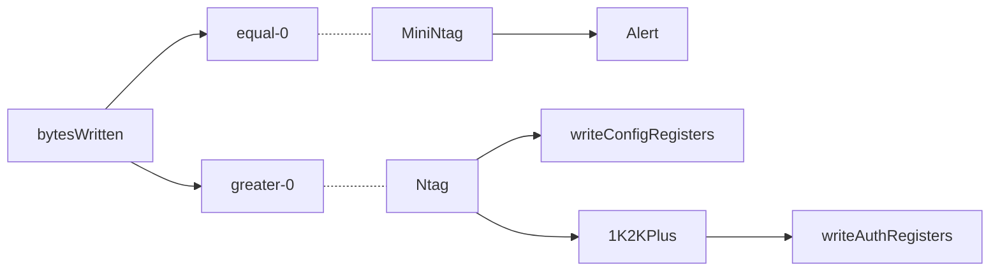
```kotlin
public int resetTagMemory() {
	int bytesWritten = 0;

	try {
		bytesWritten = reader.writeDeliveryNdef();
	} catch (Exception e) {
		e.printStackTrace();
		bytesWritten = -1;
	}
	if(bytesWritten == 0) {
		showDemoNotSupportedAlert();
	} else {
		byte NC_REG = (byte) 0x01;
		byte LD_Reg = (byte) 0x00;
		byte SM_Reg = (byte) 0xF8;
		byte WD_LS_Reg = (byte) 0x48;
		byte WD_MS_Reg = (byte) 0x08;
		byte I2C_CLOCK_STR = (byte) 0x01;
		// If we could reset the memory map, we should be able to write the config registers
		try {
			reader.writeConfigRegisters(NC_REG, LD_Reg,
					SM_Reg, WD_LS_Reg, WD_MS_Reg, I2C_CLOCK_STR);
		} catch (Exception e) {
			//Toast.makeText(main, "Error writing configuration registers", Toast.LENGTH_LONG).show();
			toastText(main, "Error writing configuration registers", Toast.LENGTH_LONG);
			e.printStackTrace();
			bytesWritten = -1;
		}

		try {
			Ntag_Get_Version.Prod prod = reader.getProduct();

			if (prod.equals(Ntag_Get_Version.Prod.NTAG_I2C_1k_Plus)
			 || prod.equals(Ntag_Get_Version.Prod.NTAG_I2C_2k_Plus)) {
				byte AUTH0 = (byte) 0xFF;
				byte ACCESS = (byte) 0x00;
				byte PT_I2C = (byte) 0x00;
				reader.writeAuthRegisters(AUTH0, ACCESS, PT_I2C);
			}
		} catch (Exception e) {
			//Toast.makeText(main, "Error writing authentication registers", Toast.LENGTH_LONG).show();
			toastText(main, "Error writing authentication registers", Toast.LENGTH_LONG);
			e.printStackTrace();
			bytesWritten = -1;
		}
	}
	return bytesWritten;
}
```

### readSessionRegisters
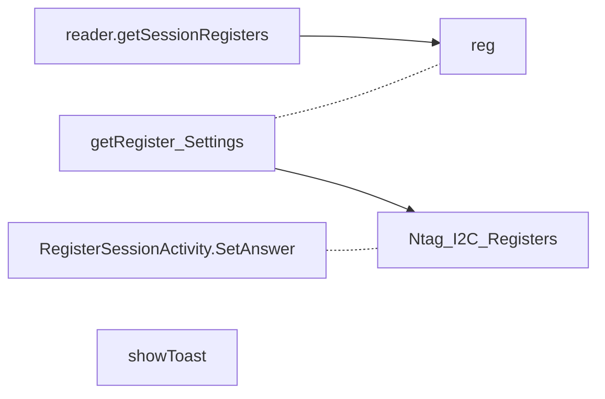
> RegisterSessionActivity.SetAnswer -> turn **Ntag_I2C_Registers** into readable map
>  getRegister_Settings(byte[]) -> **Ntag_I2C_Registers**
```kotlin
public void readSessionRegisters() throws CommandNotSupportedException {
	try {
		byte[] sessionRegisters = reader.getSessionRegisters();
		Ntag_I2C_Registers answer = getRegister_Settings(sessionRegisters);
		RegisterSessionActivity.SetAnswer(answer, main);
		toastText(main, "read tag successfully done", Toast.LENGTH_LONG) ;
	} catch (CommandNotSupportedException e) {
		e.printStackTrace();
		throw e;
	} catch (Exception e) {
		e.printStackTrace();
		toastText(main, "read tag failed", Toast.LENGTH_LONG) ;
	}
}
```

### readWriteConfigRegister
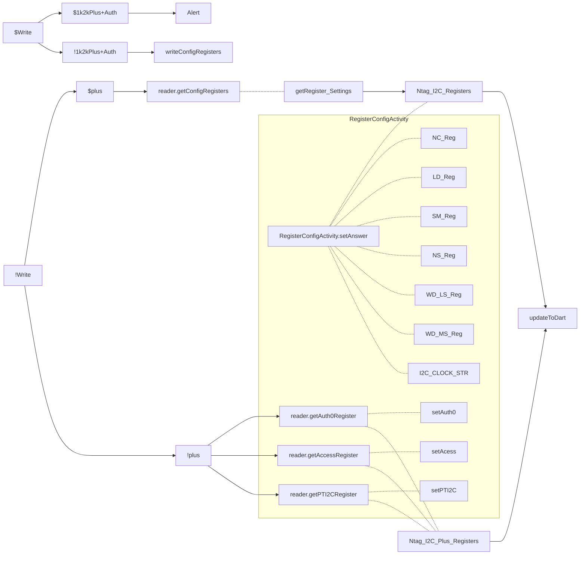
> Write: **RegisterConfigActivity.Boolean**
> 1k2kPlus: **Ntag_Get_version.Prod** via reader.getProduct
> 1k2kPlus+Auth: **RegisterConfigActivity.getAuth0()**
> reader.getConfigRegisters: **byte[]**
> getRegister_Settings(byte[]): **Ntag_I2C_Registers**

```kotlin
public void readWriteConfigRegister() throws CommandNotSupportedException {
	// Check if the operation is read or write
	if (RegisterConfigActivity.isWriteChosen()) {
		try {
			Ntag_Get_Version.Prod prod = reader.getProduct();
			if((prod.equals(Ntag_Get_Version.Prod.NTAG_I2C_1k_Plus)
			 || prod.equals(Ntag_Get_Version.Prod.NTAG_I2C_2k_Plus))
			 && (RegisterConfigActivity.getAuth0() & 0xFF) <= 0xEB) {
				showAuthWriteConfigAlert();
			 } else {
				writeConfigRegisters();
			}
		} catch (IOException e) {
			e.printStackTrace();
		}
	} //END if get chosen
	else {
		try {
			byte[] configRegisters = reader.getConfigRegisters();

			Ntag_I2C_Registers answer = getRegister_Settings(configRegisters);
			RegisterConfigActivity.setAnswer(answer);
			RegisterConfigActivity.setNC_Reg(configRegisters[CR_Offset.NC_REG.getValue()]);
			RegisterConfigActivity.setLD_Reg(configRegisters[CR_Offset.LAST_NDEF_PAGE.getValue()]);
			RegisterConfigActivity.setSM_Reg(configRegisters[CR_Offset.SM_REG.getValue()]);
			RegisterConfigActivity.setNS_Reg(configRegisters[CR_Offset.REG_LOCK.getValue()]);
			RegisterConfigActivity.setWD_LS_Reg(configRegisters[CR_Offset.WDT_LS.getValue()]);
			RegisterConfigActivity.setWD_MS_Reg(configRegisters[CR_Offset.WDT_MS.getValue()]);
			RegisterConfigActivity.setI2C_CLOCK_STR(configRegisters[CR_Offset.I2C_CLOCK_STR.getValue()]);

			Ntag_Get_Version.Prod prod = reader.getProduct();
			if (prod.equals(Ntag_Get_Version.Prod.NTAG_I2C_1k_Plus)
			 || prod.equals(Ntag_Get_Version.Prod.NTAG_I2C_2k_Plus)) {
				byte[] auth0Register = reader.getAuth0Register();
				byte[] accessRegister = reader.getAccessRegister();
				byte[] pti2cRegister = reader.getPTI2CRegister();

				Ntag_I2C_Plus_Registers answerPlus = getPlusAuth_Settings(auth0Register, accessRegister, pti2cRegister);
				RegisterConfigActivity.setAnswerPlus(answerPlus);
				RegisterConfigActivity.setAuth0(auth0Register[3]);
				RegisterConfigActivity.setAccess(accessRegister[0]);
				RegisterConfigActivity.setPtI2C(pti2cRegister[0]);
			}
			//grodianknot
			RegisterConfigActivity.updateToDart();
			toastText(main, "read tag successfully done",
					Toast.LENGTH_LONG) ;
		} catch (CommandNotSupportedException e) {
			e.printStackTrace();
			throw e;
		} catch (Exception e) {
			e.printStackTrace();
			toastText(main, "read tag failed", Toast.LENGTH_LONG);
		}
	}
}
```

### writeConfigRegisters

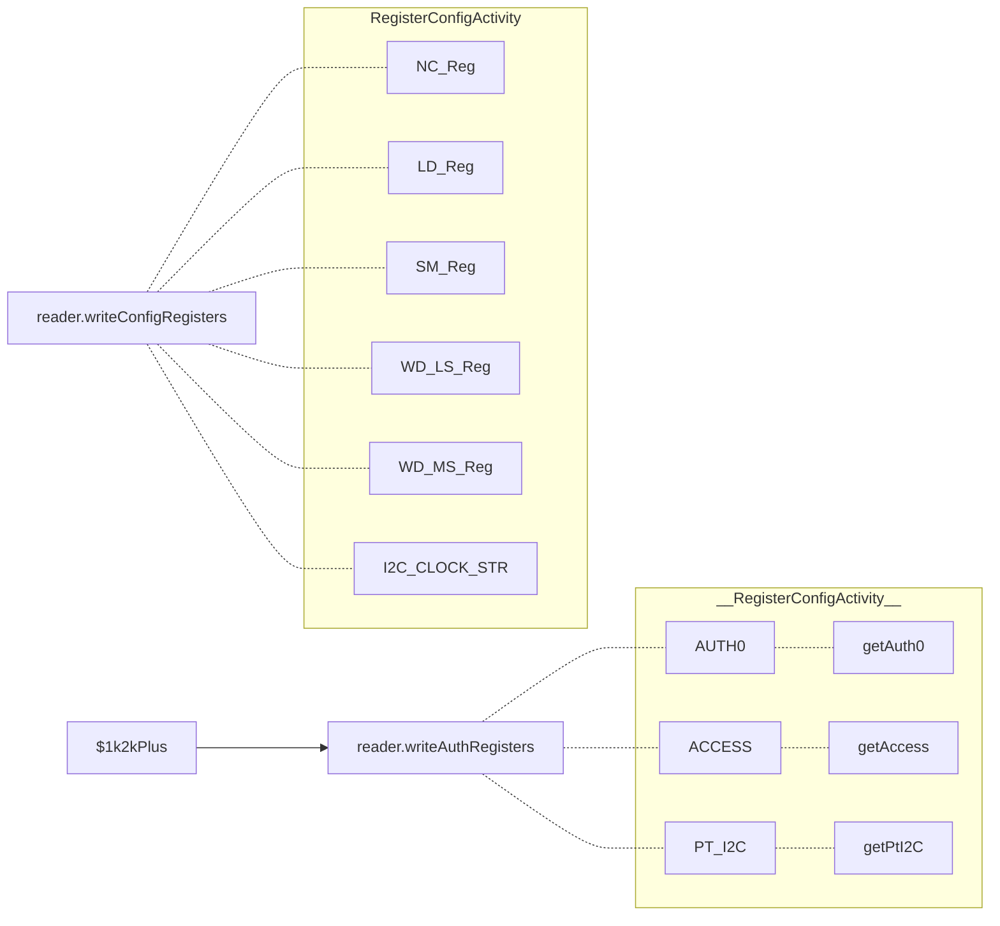
```kotlin
private void writeConfigRegisters() {
	try {
		byte NC_Reg = (byte) RegisterConfigActivity.getNC_Reg();
		byte LD_Reg = (byte) RegisterConfigActivity.getLD_Reg();
		byte SM_Reg = (byte) RegisterConfigActivity.getSM_Reg();
		byte WD_LS_Reg = (byte) RegisterConfigActivity.getWD_LS_Reg();
		byte WD_MS_Reg = (byte) RegisterConfigActivity.getWD_MS_Reg();
		byte I2C_CLOCK_STR = (byte) RegisterConfigActivity.getI2C_CLOCK_STR();
		reader.writeConfigRegisters(NC_Reg, LD_Reg, SM_Reg, WD_LS_Reg, WD_MS_Reg, I2C_CLOCK_STR);
		Ntag_Get_Version.Prod prod = reader.getProduct();
		if (prod.equals(Ntag_Get_Version.Prod.NTAG_I2C_1k_Plus)
		 || prod.equals(Ntag_Get_Version.Prod.NTAG_I2C_2k_Plus)) {
			byte AUTH0 = (byte) RegisterConfigActivity.getAuth0();
			byte ACCESS = (byte) RegisterConfigActivity.getAccess();
			byte PT_I2C = (byte) RegisterConfigActivity.getPtI2C();
			reader.writeAuthRegisters(AUTH0, ACCESS, PT_I2C);
		}
		toastText(main, "write tag successfully done",	Toast.LENGTH_LONG) ;
	} catch (Exception e) {
		e.printStackTrace();
		toastText(main, "write tag failed", Toast.LENGTH_LONG) ;
}
}
```

### readTagContent
Reads the whole tag memory content., return  Boolean indicating success or error
- reader.readEEPROM (start, end)
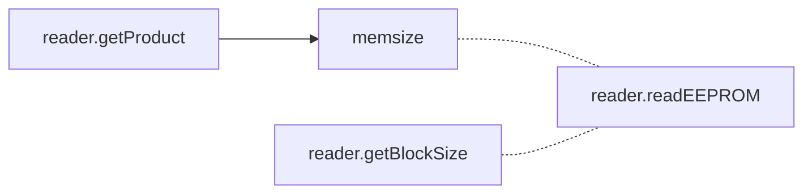
```kotlin
public byte[] readTagContent() {
	byte[] bytes = null;
	try {
		// The user memory and the first four pages are displayed
		int memSize = reader.getProduct().getMemsize() + 16;
		// Read all the pages using the fast read method
		bytes = reader.readEEPROM(0, memSize / reader.getBlockSize());
	} catch (IOException e) {
		e.printStackTrace();
	} catch (FormatException e) {
		e.printStackTrace();
	} catch (CommandNotSupportedException e) {
		e.printStackTrace();
		showDemoNotSupportedAlert();
	} catch (Exception e) {
		e.printStackTrace();
	}
	return bytes;
}
```

### resetTagContent

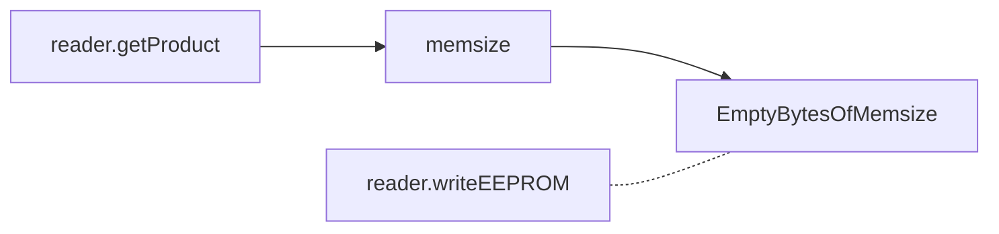
```kotlin
public boolean resetTagContent() {
	boolean success = true;
	try {
		byte[] d = new byte[reader.getProduct().getMemsize()];
		reader.writeEEPROM(d, this);
	} catch (IOException e) {
		success = false;
		e.printStackTrace();
	} catch (FormatException e) {
		success = false;
		e.printStackTrace();
	} catch (CommandNotSupportedException e) {
		showDemoNotSupportedAlert();
		e.printStackTrace();
	}
	return success;
}
```


### LED
Performs the LED Demo
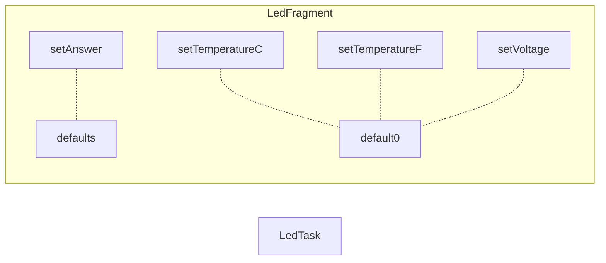

```kotlin
public void LED() throws IOException, FormatException {
	// Reset UI
	LedFragment.setAnswer(main.getResources().getString(R.string.readConf));
	LedFragment.setTemperatureC(0);
	LedFragment.setTemperatureF(0);
	LedFragment.setVoltage(0);

	// The demo is executed in a separate thread to let the GUI run
	lTask = new LedTask();
	lTask.execute();
}
```

### LEDFinish
```mermaid

```

```kotlin
public void LEDFinish() {
	if (lTask != null && !lTask.isCancelled()) {
		lTask.exit = true;
		try {
			lTask.get();
		} catch (Exception e) {
			e.printStackTrace();
		}
		lTask = null;
	}
}
```


### ObtainAuthStatus()
Retrieves the auth status of the tag
- reader.getProductionPlus
- AuthStatus.Disable
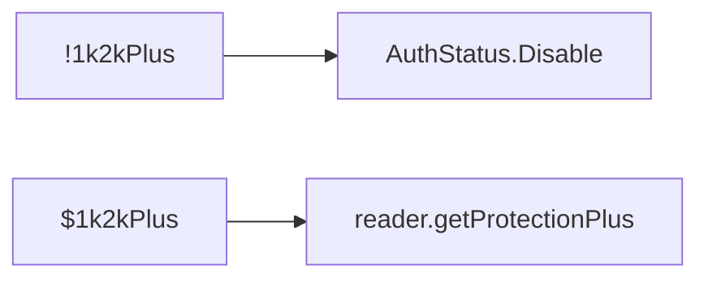
```kotlin
public int ObtainAuthStatus() {
	try {
		Ntag_Get_Version.Prod prod = reader.getProduct();
		if (!prod.equals(Ntag_Get_Version.Prod.NTAG_I2C_1k_Plus)
		 && !prod.equals(Ntag_Get_Version.Prod.NTAG_I2C_2k_Plus)) {
			return AuthStatus.Disabled.getValue();
		} else {
			return reader.getProtectionPlus();
		}
	} catch (IOException e) {
		e.printStackTrace();
	}
	return AuthStatus.Disabled.getValue();
}
```


### Auth()
Performs the authentication operation on NTAG I2C Plus 

- pwd **ByteArray** containing the password  
- authStatus Current Authentication Status  
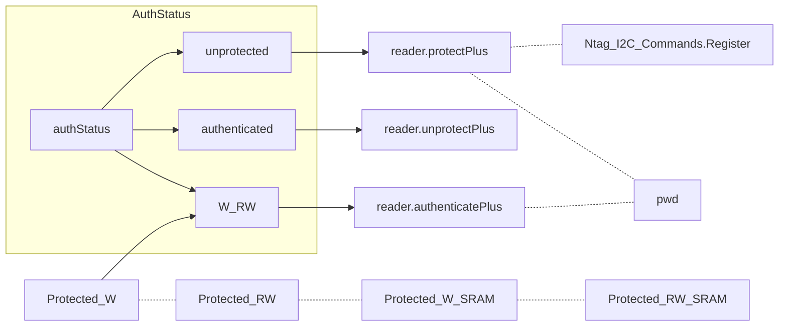
> reader.protectPlus (**byte[]** pwd, **byte[]** startAddr)
> reader.unprotectPlus
> reader.authenticatePlus

```kotlin
public Boolean Auth(byte[] pwd, int authStatus) {
	try {
		if(authStatus == AuthStatus.Unprotected.getValue()) {
			reader.protectPlus(pwd, Register.Capability_Container.getValue());
		} else if(authStatus == AuthStatus.Authenticated.getValue()) {
			reader.unprotectPlus();
		} else if(authStatus == AuthStatus.Protected_W.getValue()
				|| authStatus == AuthStatus.Protected_RW.getValue()
				|| authStatus == AuthStatus.Protected_W_SRAM.getValue()
				|| authStatus == AuthStatus.Protected_RW_SRAM.getValue()) {
			byte[] pack = reader.authenticatePlus(pwd);
			if(pack.length < 2) {
				return false;
			}
		}
		return true;
	} catch (IOException e) {
		e.printStackTrace();
	} catch (FormatException e) {
		e.printStackTrace();
	} catch (NotPlusTagException e) {
		showTagNotPlusAlert();
		e.printStackTrace();
	}
	return false;
}
```

example usage
```kotlin
// Authenticate in order to let the user use the demos
demo!!.Auth(PseudoMainActivity.password, AuthStatus.Protected_RW.value)

// Perform auth operation based on the actual status  
demo!!.Auth(PseudoMainActivity.password,  
  PseudoMainActivity.authStatus)
```


### SRAMSpeedtest | SRAMSpeedtestTask (AsyncTask)
... todo

```kotlin
 
```
<!--stackedit_data:
eyJoaXN0b3J5IjpbMTU5NzUxMTE0MywxMDMzNDA1NjUzLDExMD
I0NzM1OTUsMTExODM1OTU2MSwtNjU1OTg1NDgsLTQ5ODExMTYx
OSwtMTc5MDk4OTgwNiwtMTc5MTU2MjMxOSwtODU3MzIwNDU1LC
0xMTEwOTg5NzMxLC0xMTU3OTA2OTMxLC0xNzg0Nzk1ODI4XX0=

-->