# NXP
<!-- START doctoc generated TOC please keep comment here to allow auto update -->
<!-- DON'T EDIT THIS SECTION, INSTEAD RE-RUN doctoc TO UPDATE -->

- [NXP](#nxp)
  - [Authenticate And Protect](#authenticate-and-protect)
    - [Authenticate](#authenticate)
    - [Protect](#protect)
    - [Unprotect](#unprotect)
  - [How Ntag I2C Demo / Tag be Initialized](#how-ntag-i2c-demo--tag-be-initialized)
  - [Handling null Tag](#handling-null-tag)
  - [Initialize Ntag_IC2_Command](#initialize-ntag_ic2_command)
  - [Initialize MinimalNtag_IC2_Command](#initialize-minimalntag_ic2_command)
  - [Ntag Demo MainActivity](#ntag-demo-mainactivity)
    - [onCreate](#oncreate)
    - [onPause](#onpause)
    - [onActivityResult](#onactivityresult)
    - [onNewIntent](#onnewintent)
    - [launchDemo](#launchdemo)
    - [launchNdefDemo](#launchndefdemo)
  - [NtagDemo - NdefFragment](#ntagdemo---ndeffragment)
    - [onCreate](#oncreate-1)
    - [enableNdefReadLoop](#enablendefreadloop)
    - [readNdefClick](#readndefclick)
    - [writeNdefClick](#writendefclick)
  - [Ntag_I2C_Demo](#ntag_i2c_demo)
    - [Properties and Constructor](#properties-and-constructor)
  - [Constructor](#constructor)
    - [isConnected](#isconnected)
    - [isTagPresent](#istagpresent)
    - [isReady](#isready)
    - [getProduct](#getproduct)
    - [setBoardVersion](#setboardversion)
    - [resetTagMemory](#resettagmemory)
    - [getRegister_Settings](#getregister_settings)
    - [resetSessionRegisters](#resetsessionregisters)
  - [Ntag_I2C_Demo - How New Intent be Processed](#ntag_i2c_demo---how-new-intent-be-processed)
  - [Ntag_I2C_Demo - mermaid](#ntag_i2c_demo---mermaid)
    - [NDEF()](#ndef)
    - [NDEFReadTask()](#ndefreadtask)
    - [NDEFWrite](#ndefwrite)
    - [NDEFReadFinish](#ndefreadfinish)
    - [finishAllTasks](#finishalltasks)
    - [resetTagMemory](#resettagmemory-1)
    - [readSessionRegisters](#readsessionregisters)
    - [readWriteConfigRegister](#readwriteconfigregister)
    - [writeConfigRegisters](#writeconfigregisters)
    - [readTagContent](#readtagcontent)
    - [resetTagContent](#resettagcontent)
    - [LED](#led)
    - [LEDFinish](#ledfinish)
    - [ObtainAuthStatus()](#obtainauthstatus)
    - [Auth()](#auth)
    - [SRAMSpeedtest | SRAMSpeedtestTask (AsyncTask)](#sramspeedtest--sramspeedtesttask-asynctask)
    - [createNdefTextMessage](#createndeftextmessage)
    - [createNdefUriMessage](#createndefurimessage)
    - [createNdefBSSPMessage](#createndefbsspmessage)
    - [createNdefSpMessage](#createndefspmessage)
  - [Ntag_I2C_Demo - How Demo be Initialized](#ntag_i2c_demo---how-demo-be-initialized)
  - [How ReadEEPROM implements](#how-readeeprom-implements)
    - [in Ntag_I2C_Command](#in-ntag_i2c_command)
    - [in MinimalNtag_I2C_Command](#in-minimalntag_i2c_command)
  - [How ReadNDEF Implements](#how-readndef-implements)
    - [in Ntag_I2C_Command](#in-ntag_i2c_command-1)
    - [in MinimalNtag_I2C_Command](#in-minimalntag_i2c_command-1)
  - [Reading Product Information](#reading-product-information)
    - [Ntag_I2C](#ntag_i2c)
    - [MinimalNtag_I2C](#minimalntag_i2c)
  - [Reading configRegisters/sessionRegisters/...](#reading-configregisterssessionregisters)
    - [in Ntag_I2C_Command](#in-ntag_i2c_command-2)
    - [in MinimalNtag_I2C_Command](#in-minimalntag_i2c_command-2)
    - [in MinimalNtag_I2C_Command](#in-minimalntag_i2c_command-3)
    - [difference bewteen MinimalNtag and Ntag](#difference-bewteen-minimalntag-and-ntag)
    - [SR_Offset](#sr_offset)
  - [How readSRAM implements](#how-readsram-implements)
  - [How MFU(MifareUltralight) / NFCA transceive Command](#how-mfumifareultralight--nfca-transceive-command)
  - [How transceive operates](#how-transceive-operates)
  - [Wait for Read and Write](#wait-for-read-and-write)
  - [How to Write EEPROM](#how-to-write-eeprom)
    - [in Ntag_I2C_Command](#in-ntag_i2c_command-3)
    - [in MinimalNtag_I2C_Command](#in-minimalntag_i2c_command-4)
    - [example on writeEEPROM listener](#example-on-writeeeprom-listener)
    - [Difference Between Ntag and Minimal Ntag](#difference-between-ntag-and-minimal-ntag)
  - [How WriteNDEF Implements](#how-writendef-implements)
    - [in Ntag_I2C_Command](#in-ntag_i2c_command-4)
    - [in MinimalNtag_I2C_Command](#in-minimalntag_i2c_command-5)
    - [writeEEPROM listener](#writeeeprom-listener)
    - [CreateNDEFMessage](#createndefmessage)
  - [How Write Auth | Config Registers Imlements](#how-write-auth--config-registers-imlements)
    - [Write Auth Registers](#write-auth-registers)
    - [Write Config Registers](#write-config-registers)
  - [How Write SRAM Implements](#how-write-sram-implements)
    - [in Ntag_I2C_Command](#in-ntag_i2c_command-5)
    - [in MinimalNtag_I2C_Command](#in-minimalntag_i2c_command-6)

<!-- END doctoc generated TOC please keep comment here to allow auto update -->


## Authenticate And Protect

### Authenticate
#### Ntag_I2C_Command
##### authenticatePlus
Authenticate using PWD_AUTH command against NTAG I2C Plus product.

**describe writing process in brief**
- params
	- **byte[]** pwd :: 4Byte password to authenticate with
- check if its an **Ntag_I2C_Plus** product since only **Plus** support auth operation.
- read auth data by using reader.**pwdAuth**

**referenced in**
- Ntag_I2C_Demo
	- constructor
	- Auth
	- SRAMSpeedtestTask / doInBackground
	- EEPROMSpeedtestTask / doInBackground
- Ntag_I2C_Command  
	- writeSRAMBlock
	- readSRAMBlock
```java
@Override  
public byte[] authenticatePlus(byte[] pwd) throws IOException, NotPlusTagException {  
  if(getProduct() != Prod.NTAG_I2C_1k_Plus && getProduct() != Prod.NTAG_I2C_2k_Plus) {  
    throw new NotPlusTagException("Auth Operations are not supported by non NTAG I2C PLUS products");  
  }  
  return reader.pwdAuth(pwd);  
}
```
#### MinimalNtag_I2C_Command
##### authenticatePlus
Authenticate using PWD_AUTH command against NTAG I2C Plus product.
- ##### describe writing process in brief
	- params
		- **byte[]** pwd
			- 4Byte password to authenticate with
	- check if its an **Ntag_I2C_Plus** product since only **Plus** support auth operation.
	- perform auth operation by using **mfu.transceive**
		###### referenced in
		- Ntag_I2C_Demo
			- constructor
			- Auth
			- SRAMSpeedtestTask / doInBackground
			- EEPROMSpeedtestTask / doInBackground
		
```java
@Override  
public byte[] authenticatePlus(byte[] pwd) throws IOException, NotPlusTagException {  
	if(getProduct() != Prod.NTAG_I2C_1k_Plus && getProduct() != Prod.NTAG_I2C_2k_Plus) {  
		throw new NotPlusTagException("Auth Operations are not supported by non NTAG I2C PLUS products");  
	}  
	byte[] command = new byte[5];  
	command[0] = (byte) 0x1B;  
	command[1] = pwd[0];  
	command[2] = pwd[1];  
	command[3] = pwd[2];  
	command[4] = pwd[3];  
	return mfu.transceive(command);  
}
```

### Protect
#### Ntag_I2C_Command
##### protectPlus
Protect NTAG I2C Plus product memory map.
- ##### describe writing process in brief
	- params
		- **byte[]** pwd
			- 4Byte password to authenticate with
		- **byte** staretAddr
			- Page to lock the memory from
	- check if it's an **Ntag_I2C_Plus** product, since auth operation not supported by non Ntag_I2C_Plus 
	- reader.**SectorSelect** 0
	- set password indicated by user - using reader.**write**(pwd, Register.PWD)
	- write access configuration
	- write pt (pass thru) configuration
	- write auth0 configuration
	
		###### referenced in
		- Ntag_I2C_Demo
			- Auth
```java
	@Override  
	public void protectPlus(byte[] pwd, byte startAddr) throws IOException, FormatException, NotPlusTagException {  
		byte[] data = new byte[4];  

		if(getProduct() != Prod.NTAG_I2C_1k_Plus 
		&& getProduct() != Prod.NTAG_I2C_2k_Plus) {  
			throw new NotPlusTagException("Auth Operations are not supported by non NTAG I2C PLUS products");  
		}  
		reader.SectorSelect((byte) 0);  

		// Set the password indicated by the user  
		reader.write(pwd, Register.PWD.getValue());  

		byte access = (byte) 0x00;  
		byte authLimit = 0x00; // Don't limit the number of auth attempts  

		access ^= 1 << Access_Offset.NFC_PROT.getValue(); // NFC_Prot  
		access ^= 0 << Access_Offset.NFC_DIS_SEC1.getValue(); // NFC_DIS_SEC1  
		access |= authLimit << Access_Offset.AUTH_LIM.getValue(); // AUTHLIM  

		// Write the ACCESS configuration  data[0] = access;  
		data[1] = 0x00;  
		data[2] = 0x00;  
		data[3] = 0x00;  
		reader.write(data, Register.ACCESS.getValue());  

		byte ptI2C = 0x00;  
		byte i2CProt = 0x00;  

		ptI2C ^= 0 << PT_I2C_Offset.K2_PROT.getValue(); // 2K Prot  
		ptI2C ^= 1 << PT_I2C_Offset.SRAM_PROT.getValue(); // SRAM Prot  
		ptI2C |= i2CProt << PT_I2C_Offset.I2C_PROT.getValue(); // I2C Prot  

		// Write the PT_I2C configuration  data[0] = ptI2C;  
		data[1] = 0x00;  
		data[2] = 0x00;  
		data[3] = 0x00;  
		reader.write(data, Register.PT_I2C.getValue());  

		// Write the AUTH0 lock starting page  
		data[0] = 0x00;  
		data[1] = 0x00;  
		data[2] = 0x00;  
		data[3] = startAddr;  
		reader.write(data, Register.AUTH0.getValue());  
	}
```

#### MinimalNtag_I2C_Command
almost the same as Ntag_I2C, except using mfu.writePage


### Unprotect
behaviors almost the same as method of protect referred above.

#### Ntag_I2C_Command
#### MinimalNtag_I2C_Command
<!--stackedit_data:
eyJoaXN0b3J5IjpbMjMxNzQ2MDk4XX0=
-->


## How Ntag I2C Demo / Tag be Initialized  
  
#### Ntag_I2C_demo  
Ntag_I2C_demo constructor  
```java  
public Ntag_I2C_Demo(Tag tag, final Activity main, final byte[] passwd, final int authStatus) {
}
```  
  
##### in AuthActivity  
- onCreate  
	```java  
	mTag = getIntent().getParcelableExtra(NfcAdapter.EXTRA_TAG); 
	if(mTag != null && Ntag_I2C_Demo.isTagPresent(mTag)) { 
		demo = new Ntag_I2C_Demo( 
			mTag, this,             
			MainActivity.getPassword(),   
			MainActivity.getAuthStatus());  
		} 
	 ``` 

- onNewIntent  
	```java  
		Tag tag = nfc_intent.getParcelableExtra(NfcAdapter.EXTRA_TAG);
		demo = new Ntag_I2C_Demo( tag, this,             
			MainActivity.getPassword(),   
			MainActivity.getAuthStatus());  
	```  

- startDemo  
	```java  
		private void startDemo(Tag tag) {      
			// This authentication is added in order to avoid authentication problems with old NFC Controllers    
			if(MainActivity.getAuthStatus() == AuthStatus.Authenticated.getValue()) {    
				demo.Auth(MainActivity.getPassword(), AuthStatus.Protected_RW.getValue());    
			}    
			if(demo != null && demo.isReady()) {    
				// Launch the thread    
				task = new authTask();    
				task.execute();    
			}    
		}  
	```  


##### in FlashMemoryActivity  
 - onNewIntent  
	```java  
		Tag tag = nfcIntent.getParcelableExtra(NfcAdapter.EXTRA_TAG); startDemo(tag, true); 
	``` 

- startDemo  
	```java  
		demo = new Ntag_I2C_Demo( tag, this,             
			MainActivity.getPassword(),   
			MainActivity.getAuthStatus());  
		if (!demo.isReady()) return; 
	``` 

##### MainActivity  
 - onCreate  
	```java  
		// Initialize the demo in order to handle tab change events 
		demo = new Ntag_I2C_Demo(null, this, null, 0); 
		mAdapter = NfcAdapter.getDefaultAdapter(this); 
		setNfcForeground(); 
		checkNFC(); 
	``` 

	- onNewIntent  
	```java  
		protected void onNewIntent(Intent nfc_intent) { 
			super.onNewIntent(nfc_intent); 
			// Set the pattern for vibration long pattern[] = { 0, 100 };            
			// Set the initial auth parameters  
			mAuthStatus = AuthStatus.Disabled.getValue(); 
			mPassword = null;            
			// Vibrate on new Intent  
			Vibrator vibrator = (Vibrator) getSystemService(Context.VIBRATOR_SERVICE); 		
			vibrator.vibrate(pattern, -1); 
			doProcess(nfc_intent); 
		} 
	``` 

	- doProcess  
	```java  
		public void doProcess(Intent nfc_intent) { 
			mIntent = nfc_intent; 
			Tag tag = nfc_intent.getParcelableExtra(NfcAdapter.EXTRA_TAG); 
			demo = new Ntag_I2C_Demo(tag, this, mPassword, mAuthStatus); 
			if (demo.isReady()) { 
				// Retrieve Auth Status before doing any operation 
				mAuthStatus = obtainAuthStatus(); 
				String currTab = mTabHost.getCurrentTabTag(); 
				launchDemo(currTab); 
			} 
		} 
	``` 


##### RegisterConfigActivity  
  - onCreate  
	```java  
		// Capture intent to check whether the operation should be automatically launch or not    
		Tag tag = getIntent().getParcelableExtra(NfcAdapter.EXTRA_TAG);    
		if(tag != null && Ntag_I2C_Demo.isTagPresent(tag)) {    
			startDemo(tag, false);    
		}    

		// Add Foreground dispatcher    
		mAdapter = NfcAdapter.getDefaultAdapter(this);    
		pendingIntent = PendingIntent.getActivity(  
			this, 0,      
			new Intent(this, getClass()
		).addFlags(Intent.FLAG_ACTIVITY_SINGLE_TOP), 0);    
		return; // end onCreate  
	```  

- startDemo  
	```java  
		private void startDemo(final Tag tag, boolean getAuthStatus) {      
			demo = new Ntag_I2C_Demo(tag, this,   
				MainActivity.getPassword(), 
				MainActivity.getAuthStatus());    
			if (!demo.isReady())    
				return;  
	```  

##### RegisterSessionActivity  
- onCreate  
	```java  
		// Capture intent to check whether the operation should be automatically launch or not    
		Tag tag = getIntent().getParcelableExtra(NfcAdapter.EXTRA_TAG);    
		if(tag != null && Ntag_I2C_Demo.isTagPresent(tag)) {    
			startDemo(tag, false);    
		}  
	```  

- startDemo  
	```java  
		private void startDemo(final Tag tag, boolean getAuthStatus) {      
			demo = new Ntag_I2C_Demo(tag, this,   
			MainActivity.getPassword(),   
			MainActivity.getAuthStatus());    
			if(!demo.isReady()) {    
				return;    
			}  
	```  

- onNewIntent  
	```java  
		protected void onNewIntent(Intent nfcIntent) {      
			// Set the initial auth parameters    
			MainActivity.setAuthStatus(AuthStatus.Disabled.getValue());    
			MainActivity.setPassword(null);    

			// Store the intent information    
			MainActivity.setNfcIntent(nfcIntent);    
			Tag tag = nfcIntent.getParcelableExtra(NfcAdapter.EXTRA_TAG);    
			startDemo(tag, true);    
		}  
	```


##### ReadMemoryActivity  
- onNewIntent  
	```java  
		protected void onNewIntent(Intent nfcIntent) {      
			// Set the initial auth parameters    
			MainActivity.setAuthStatus(AuthStatus.Disabled.getValue());    
			MainActivity.setPassword(null);    

			// Store the intent information    
			MainActivity.setNfcIntent(nfcIntent);    

			Tag tag = nfcIntent.getParcelableExtra(NfcAdapter.EXTRA_TAG);    
			startDemo(tag, true);    
		}  
	```  

	- startDemo  
	```java  
		private void startDemo(Tag tag, boolean getAuthStatus) {       
			// Complete the task in a new thread in order to be able to show the dialog    
			demo = new Ntag_I2C_Demo(  
				tag, this,        
				MainActivity.getPassword(),   
				MainActivity.getAuthStatus());    
			if(!demo.isReady()) {    
				return;    
			}    
		...  
	} 
	```


- ##### VersionActivity  
  the same as aboves


-----------


## Handling null Tag

```java
	// within onCreate...
	Tag tag = getIntent().getParcelableExtra(NfcAdapter.EXTRA_TAG);    
	if(tag != null && Ntag_I2C_Demo.isTagPresent(tag)) {    
		startDemo(tag, false);    
	}  
```

-----------------


## Initialize Ntag_IC2_Command
**Ntag_IC2_Command** is initialized on only one parameter. Unlike **MinimalNtag_I2C_Command** required two parameters, which is **Tag** tag and **Prod** tagType, since tagType in **Ntag_I2C_Command** can be fetched by **Ntag_Get_Version**.
1) **Tag** tag
```java
public static I2C_Enabled_Commands get(Tag tag) throws IOException, InterruptedException {  
	byte[] answer;  
	byte[] command = new byte[2];  
	NfcA nfca = NfcA.get(tag);  
	Prod prod;  

	// Check for support of setTimout to be able to send an efficient  
	// sector_select - select minimal implementation if not supported  nfca.setTimeout(20);  
	// check for timeout  
	if (nfca.getTimeout() < 50) {  
		// check if GetVersion is supported  
		try {  
			nfca.connect();  
			command = new byte[1];  
			command[0] = (byte) 0x60; // GET_VERSION  
			answer = nfca.transceive(command);  
			prod = (new Ntag_Get_Version(answer)).Get_Product();  
			nfca.close();  
			if (prod == Prod.NTAG_I2C_1k || prod == Prod.NTAG_I2C_2k  
			|| prod == Prod.NTAG_I2C_1k_T || prod == Prod.NTAG_I2C_2k_T  
			|| prod == Prod.NTAG_I2C_1k_V || prod == Prod.NTAG_I2C_2k_V  
			|| prod == Prod.NTAG_I2C_1k_Plus || prod == Prod.NTAG_I2C_2k_Plus) {  
				return new Ntag_I2C_Commands(tag);  
			}  
		} catch (Exception e) {  
			e.printStackTrace();  
			nfca.close();  

			// check if sector select is supported  
			try {  
				nfca.connect();  
				command = new byte[2];  
				command[0] = (byte) 0xC2; //SECTOR_SELECT  
				command[1] = (byte) 0xFF;  
				answer = nfca.transceive(command);  
				nfca.close();  
				return new Ntag_I2C_Commands(tag);  

			} catch (Exception e2) {  
				e.printStackTrace();  
				nfca.close();  
			}  
		}  
	}

```


-----------

## Initialize MinimalNtag_IC2_Command
**MinimalNtag_IC2_Command** is initialized by two parameters
1) **Tag** tag
2) **Prod** tagType (product)
	- generally speaking, tagType was fetched by Ntag_Get_Version(answer)
	- but there are some exceptions occurs in MininalNtag
  **todo: rewrite a new Ntag_Get_Version to consider those exceptions**
 
 
```java
	//check if we can use the minimal Version  
	MifareUltralight mfu = MifareUltralight.get(tag);  
	try {  
		mfu.connect();  
		command = new byte[1];  
		command[0] = (byte) 0x60; // GET_VERSION  
		answer = mfu.transceive(command);  
		prod = (new Ntag_Get_Version(answer)).Get_Product();  
		mfu.close();  
		if (prod == Prod.NTAG_I2C_1k || prod == Prod.NTAG_I2C_2k  
		|| prod == Prod.NTAG_I2C_1k_T || prod == Prod.NTAG_I2C_2k_T  
		|| prod == Prod.NTAG_I2C_1k_V || prod == Prod.NTAG_I2C_2k_V  
		|| prod == Prod.NTAG_I2C_1k_Plus || prod == Prod.NTAG_I2C_2k_Plus) {  
			return new MinimalNtag_I2C_Commands(tag, prod);  
		}  
	} catch (Exception e) {  
		e.printStackTrace();  
		mfu.close();  
		try {  
			mfu.connect();  
			answer = mfu.readPages(0);  
			// no exception is thrown so the phone can use the mfu.readPages  
			// function // also check if: // - tag is from NXP (byte 0 == 0x04) // - CC corresponds to a NTAG I2C 1K  
			if (answer[0] == (byte) 0x04 && answer[12] == (byte) 0xE1  
			&& answer[13] == (byte) 0x10 && answer[14] == (byte) 0x6D  
			&& answer[15] == (byte) 0x00) {  
				// check if Config is readable (distinguish from NTAG216), if  
				// not exception is thrown, and tag is not an // NTAG I2C 1k  answer = mfu.readPages(0xE8);  

				// Try to read session registers to differentiate between standard and PLUS products  
				try {  
					answer = mfu.readPages(0xEC);  
					mfu.close();  

					for (int i = 0; i < 4; i++) {  
						if (answer[i] != 0x00) {  
							prod = Prod.NTAG_I2C_1k_Plus;  
							return new MinimalNtag_I2C_Commands(tag, prod);  
						}  
					}  
					prod = Prod.NTAG_I2C_1k;  
					return new MinimalNtag_I2C_Commands(tag, prod);  
				} catch (Exception e2) {  
					e2.printStackTrace();  
					mfu.close();  
					prod = Prod.NTAG_I2C_1k;  
					return new MinimalNtag_I2C_Commands(tag, prod);  
				}  
			} else if (answer[0] == (byte) 0x04 && answer[12] == (byte) 0xE1  
				&& answer[13] == (byte) 0x10 && answer[14] == (byte) 0xEA  
				&& answer[15] == (byte) 0x00) {  
				// Try to read session registers to differentiate between standard and PLUS products  
				try {  
					answer = mfu.readPages(0xEC);  
					mfu.close();  
					for (int i = 0; i < 4; i++) {  
						if (answer[i] != 0x00) {  
							prod = Prod.NTAG_I2C_2k_Plus;  
							return new MinimalNtag_I2C_Commands(tag, prod);  
						}  
					}  
					prod = Prod.NTAG_I2C_2k;  
					return new MinimalNtag_I2C_Commands(tag, prod);  
				} catch (Exception e2) {  
					e2.printStackTrace();  
					mfu.close();  
					prod = Prod.NTAG_I2C_2k;  
					return new MinimalNtag_I2C_Commands(tag, prod);  
				}  
			} else {  
				mfu.close();  
				return new MinimalNtag_I2C_Commands(tag, Prod.NTAG_I2C_1k_Plus);  
			}  
		} catch (Exception e1) {  
			e1.printStackTrace();  
			mfu.close();  
		}  
	}  
	return new MinimalNtag_I2C_Commands(tag, Prod.NTAG_I2C_1k_Plus);

```
<!--stackedit_data:
eyJoaXN0b3J5IjpbLTExMzE5OTc1MzhdfQ==
-->

## Ntag Demo MainActivity
### onCreate
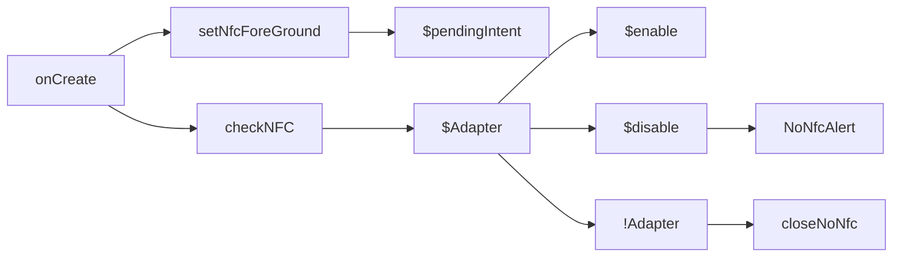

```kotlin
private fun checkNFC() {  
   if (mAdapter != null) {  
      if (!mAdapter!!.isEnabled) {  
         Dart.showSettingNoNfcAlert(this)  
      }  
   } else {  
      Dart.closeAppNoNfcAlert(this)  
   }  
}
fun setNfcForeground() {
  mPendingIntent = PendingIntent.getActivity(
  registrar.activity(), 0,
  Intent(registrar.context(), javaClass)
 .addFlags(Intent.FLAG_ACTIVITY_SINGLE_TOP), 0)
}
```

### onPause
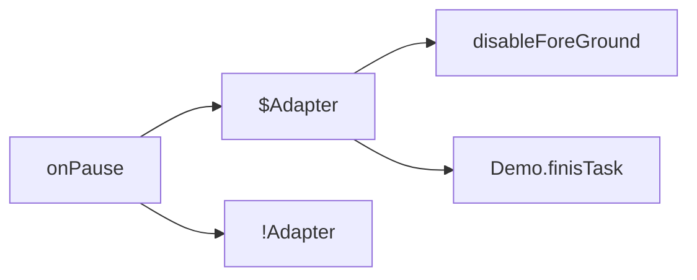
### onActivityResult
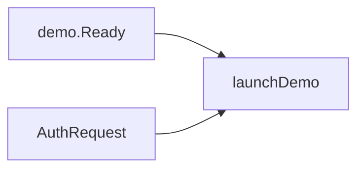

### onNewIntent
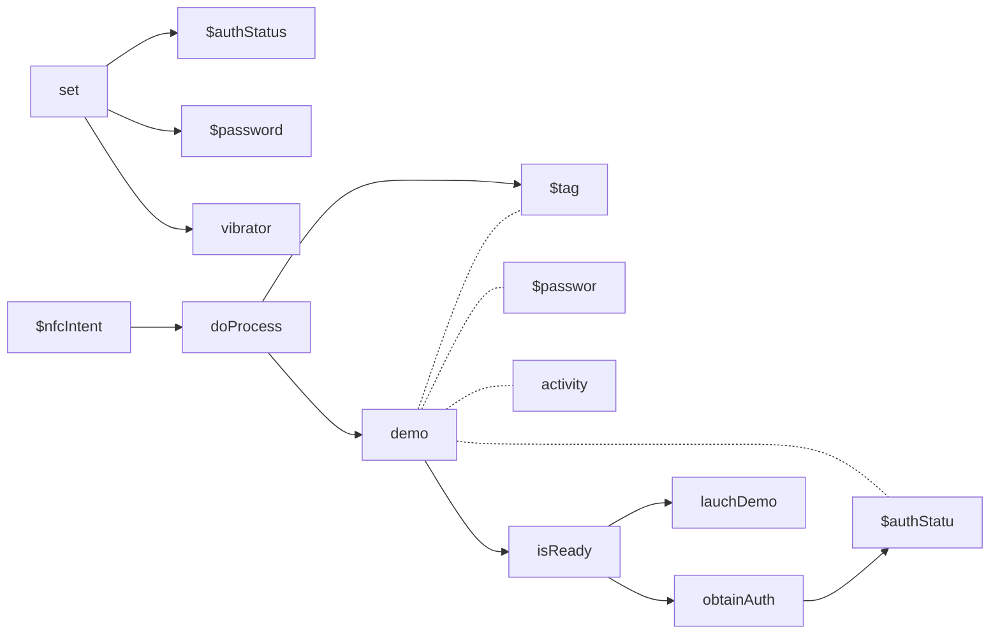
```kotlin
   override fun onNewIntent(intent: Intent):Boolean {
      val nfc_intent = intent;
      super.onNewIntent(nfc_intent)
      // Set the pattern for vibration
      val pattern = longArrayOf(0, 100)

      // Set the initial auth parameters
      authStatus = AuthStatus.Disabled.value
      password = null

      // Vibrate on new Intent
      val vibrator = registrar.activity().getSystemService(Context.VIBRATOR_SERVICE) as Vibrator
      vibrator.vibrate(pattern, -1)
      doProcess(nfc_intent)
      return true;
   }
```

#### doProcess
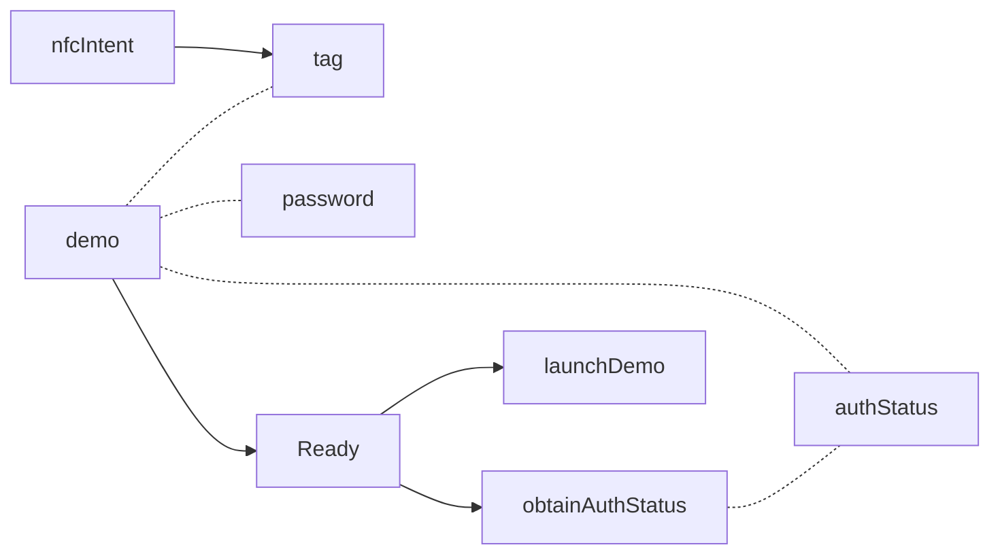
```kotlin
fun doProcess(nfc_intent: Intent) {
   nfcIntent = nfc_intent
   val tag = nfc_intent.getParcelableExtra<Tag>(NfcAdapter.EXTRA_TAG)
   demo = Ntag_I2C_Demo(tag, registrar.activity(), password, authStatus)
   if (demo!!.isReady) {
      // Retrieve Auth Status before doing any operation
      authStatus = obtainAuthStatus()
      val currTab = tabname
      launchDemo(currTab)
   }
}
```

### launchDemo
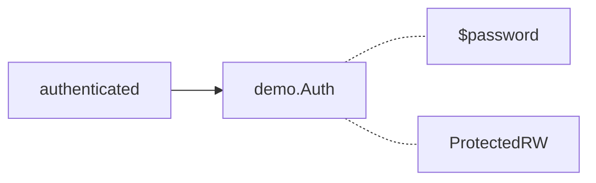

> #### launchDemo - SpeedTest
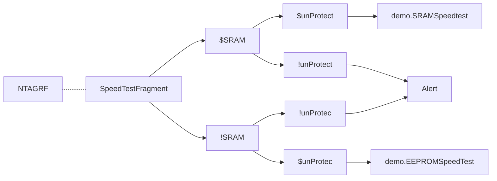
```kotlin
if (currTab.data == "ntag_rf") {
   try {
      // SRAM Test
      if ((SpeedTestFragment.isSRamEnabled == true)) {
         // This demo is available even if the product is protected
         // as long as the SRAM is unprotected
         if ((authStatus == AuthStatus.Disabled.value
                         || authStatus == AuthStatus.Unprotected.value
                         || authStatus == AuthStatus.Authenticated.value
                         || authStatus == AuthStatus.Protected_W.value
                         || authStatus == AuthStatus.Protected_RW.value)) {
            demo!!.SRAMSpeedtest()
         } else {
            message?.onToastMakeText("NTAG I2C Plus memory is protected",Toast.LENGTH_LONG, this)
            showAuthDialog()
         }
      }
      // EEPROM Test
      if ((SpeedTestFragment.isSRamEnabled == false)) {
         // This demo is only available when the tag is not protected
         if ((authStatus == AuthStatus.Disabled.value
                         || authStatus == AuthStatus.Unprotected.value
                         || authStatus == AuthStatus.Authenticated.value)) {
            demo!!.EEPROMSpeedtest()
         } else {
            message?.onToastMakeText("NTAG I2C Plus memory is protected",Toast.LENGTH_LONG, this)
            showAuthDialog()
         }
      } // end if eeprom test
   } catch (e: Exception) {
      SpeedTestFragment.setAnswer(activity.getString(R.string.Tag_lost))
      e.printStackTrace()
   }
}
```

> #### launchDemo - LED test
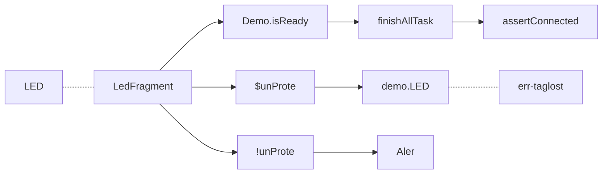
```kotlin
if (currTab.data == "leds") {
   //gordianknot....
   if (demo!!.isReady) {
      demo!!.finishAllTasks()
      if ( !demo!!.isConnected) {
         throw Exception("Demo should be connected")
      }
   }
   // This demo is available even if the product is protected
   // as long as the SRAM is unprotected
   if ((authStatus == AuthStatus.Disabled.value
                   || authStatus == AuthStatus.Unprotected.value
                   || authStatus == AuthStatus.Authenticated.value
                   || authStatus == AuthStatus.Protected_W.value
                   || authStatus == AuthStatus.Protected_RW.value)) {
      try {
         // if (LedFragment.getChosen()) {
         demo!!.LED()
      } catch (e: Exception) {
         e.printStackTrace()
         LedFragment.setAnswer(activity.getString(R.string.Tag_lost))
      }

   } else {
      message?.onToastMakeText("NTAG I2C Plus memory is protected", Toast.LENGTH_LONG, this)
      showAuthDialog()
   }
}
```

> #### launchDemo - NDEF Test
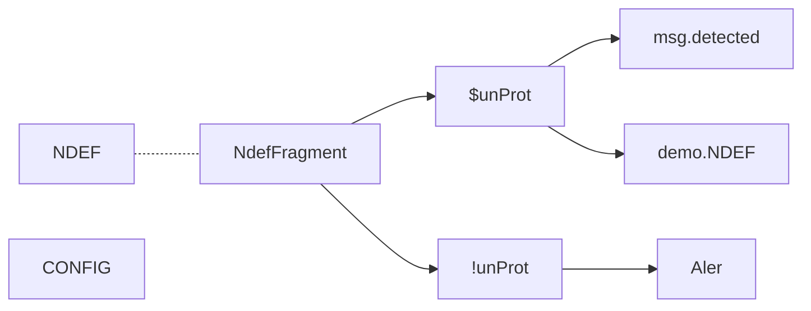
```kotlin
if (currTab.data == "ndef") {
    // This demo is only available when the tag is not protected
    if ((authStatus == AuthStatus.Disabled.value
                    || authStatus == AuthStatus.Unprotected.value
                    || authStatus == AuthStatus.Authenticated.value)) {
       NdefFragment.setAnswer("Tag detected")
       try {
          demo!!.NDEF()
       } catch (e: Exception) {
          // NdefFragment.setAnswer(getString(R.string.Tag_lost));
       }

    } else {
       message?.onToastMakeText("NTAG I2C Plus memory is protected",Toast.LENGTH_LONG, this)
       showAuthDialog()
    }
 }
```

### launchNdefDemo
> call from NdefFragment
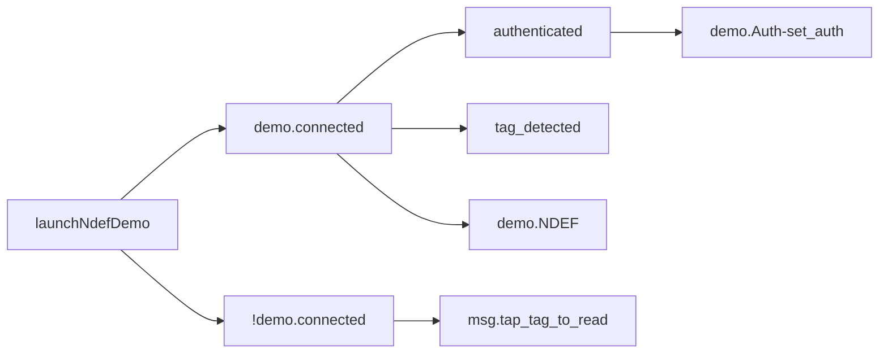

```kotlin
fun launchNdefDemo(auth: Int, pwd: ByteArray) {
   if (demo!!.isReady) {
      if (demo!!.isConnected) {
         if (auth == AuthStatus.Authenticated.value) {
            demo!!.Auth(pwd, AuthStatus.Protected_RW.value)
         }
         NdefFragment.setAnswer("Tag detected")
         try {
            demo!!.NDEF()
         } catch (e: Exception) {
            NdefFragment.setAnswer("Error: Tag lost, try again")
            e.printStackTrace()
         }

      } else {
         if (NdefFragment.isWriteChosen) {
            NdefFragment.setAnswer("Tap tag to write NDEF content")
         } else {
            NdefFragment.setAnswer("Tap tag to read NDEF content")
         }
      }
   }
}
```

<!--stackedit_data:
eyJoaXN0b3J5IjpbNTQxMTE0Mjc0LC0yMDUwNDczNDc4LC0xOT
czMjY1MjM0LC0xNTYyNzc2NzYxLC0xNDEyOTI5NDI3LC05ODMw
MzU4MzEsNjc0OTU5MTc0LDEzNTM3NjY1NDMsNDkzODQwOF19
-->

## NtagDemo - NdefFragment
### onCreate
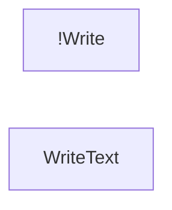
### enableNdefReadLoop
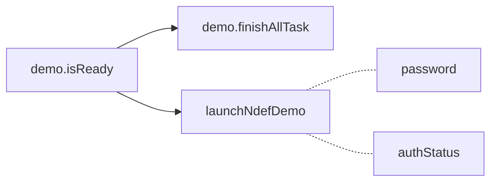
```kotlin
fun enableNdefReadLoop(isChecked: Boolean){  
   if (isChecked == true && PseudoMainActivity.demo!!.isReady) {  
      if (PseudoMainActivity.demo == null)  
         throw ExceptionInInitializerError("demo should not be null")  
      val demo: Ntag_I2C_Demo = PseudoMainActivity.demo as Ntag_I2C_Demo;  
  
  demo.finishAllTasks()  
      if (PseudoMainActivity.password == null)  
         throw ExceptionInInitializerError("password should not be null")  
      PseudoMainActivity.launchNdefDemo(  
              PseudoMainActivity.authStatus,  
  PseudoMainActivity.password as ByteArray)  
   }  
}
```

### readNdefClick
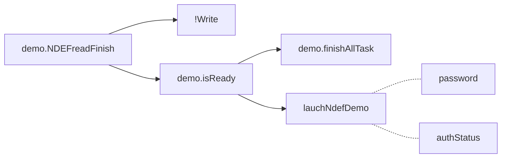
```kotlin
fun readNdefClick(){  
   if (PseudoMainActivity.demo == null)  
      throw ExceptionInInitializerError("demo should not be null")  
   val demo: Ntag_I2C_Demo = PseudoMainActivity.demo as Ntag_I2C_Demo;  
  
  demo.NDEFReadFinish()  
   val resources = registrar.activity().resources  
  ndefPerformance = resources.getString(R.string.layout_input_ndef_read)  
   ndefCallback = resources.getString(R.string.readNdefMsg)  
   isWriteChosen = false  
  
  // Read content  
  if (demo.isReady) {  
      demo.finishAllTasks()  
      if (PseudoMainActivity.password == null)  
         throw ExceptionInInitializerError("password should not be null")  
      PseudoMainActivity.launchNdefDemo(  
              PseudoMainActivity.authStatus,  
  PseudoMainActivity.password as ByteArray)  
   }  
}
```
### writeNdefClick
lauchNdefDemo (MainActivity) --> NdefFragment --> Demo.NDEF
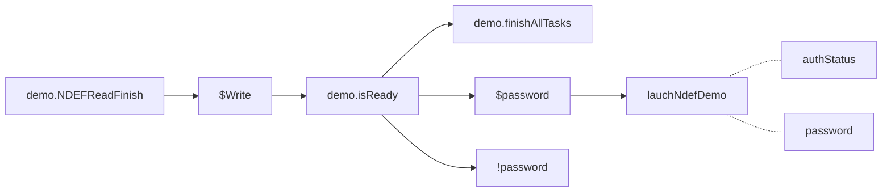
```kotlin
   fun writeNdefClick(){
		...
      if (PseudoMainActivity.demo == null)
         throw ExceptionInInitializerError("demo should not be null")
      val demo: Ntag_I2C_Demo = PseudoMainActivity.demo as Ntag_I2C_Demo;
      // Close the ReadNdef Taks
      demo.NDEFReadFinish()

      if (isWriteChosen == true) {
         if (demo.isReady) {
            demo.finishAllTasks()
            if (PseudoMainActivity.password == null)
               throw ExceptionInInitializerError("password should not be null")
            PseudoMainActivity.launchNdefDemo(
                    PseudoMainActivity.authStatus,
                    PseudoMainActivity.password as ByteArray)
        ....
```

different options
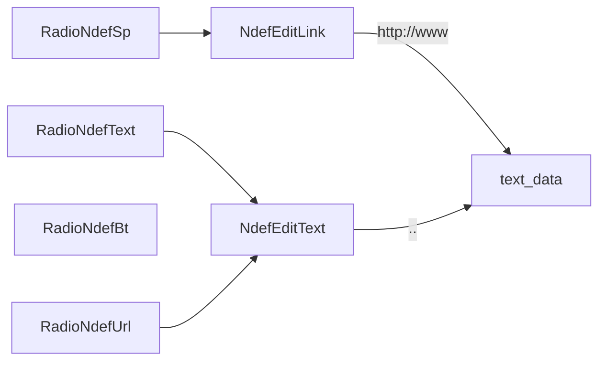
<!--stackedit_data:
eyJoaXN0b3J5IjpbLTE3MjMxOTk2NzMsMTcwOTE2MTU3OCw4Mj
UyNDIwODJdfQ==
-->


## Ntag_I2C_Demo 
### Properties and Constructor

## Constructor
#### describe process in brief
- params
	* tag **Tag** with which the Demos should be performed  
	* main **MainActivity**
	* passwd **byte[]**
	* authStatus **int**
- return null while tag is null
- initialize reader by **I2C_Enabled_Commands**.get(tag)
- connect reader
- get product info by reader.**getProduct**()

**Main Code**
```java
	public Ntag_I2C_Demo(Tag tag, final Activity main, final byte[] passwd, final int authStatus) {
		try {
			if (tag == null) {
				this.main = null;
				this.tag = null;
				return;
			}
			this.main = main;
			this.tag = tag;

			reader = I2C_Enabled_Commands.get(tag);

			if (reader == null) {
				String message = "The Tag could not be identified or this NFC device does not "
						+ "support the NFC Forum commands needed to access this tag";
				String title = "Communication failed";
				showAlert(message, title);
			} else {
				reader.connect();
			}

			Ntag_Get_Version.Prod prod = reader.getProduct();

			if (!prod.equals(Ntag_Get_Version.Prod.Unknown)) {
				if (prod.equals(Ntag_Get_Version.Prod.NTAG_I2C_1k_Plus)
			     || prod.equals(Ntag_Get_Version.Prod.NTAG_I2C_2k_Plus)) {
					// Auth status gets lost after resetting the demo when we
					// obtain the product we are dealing with
					if(authStatus == AuthStatus.Authenticated.getValue()) {
						reader.authenticatePlus(passwd);
					}
				}
			}
		} catch (Exception e) {
			e.printStackTrace();
		}
	}
```

-----------------------------------------------------------

### isConnected
Checks if the tag is still connected based on the **previously** detected reader. Which means we already know what kind of reader has been detected. 
##### referenced in
- MainActivity
	- onCreate -> setOnTabChangedListener
	- launchNdefDemo
- Ntag | MinimalNtag
	- isConnected
- SpeedTestFragment
	-  StartEEPROMSpeedTest
	- StartSRAMSpeedTest
- UI (RegisterConfigActivity.onClick)
##### example in MainActivity.onCreate
```java
	if (tabId.equalsIgnoreCase("leds") && demo.isConnected()) {  
	  launchDemo(tabId);  
	}
```
##### example in StartXSpeedTest
```java
	if (MainActivity.demo.isReady() && MainActivity.demo.isConnected()) {
		...perform some task
```
**Main Code**
```java
public boolean isConnected() {
	// reader here indicates Ncfa ncfa.isConnected
	return reader.isConnected();
}
```

-----------------------------------------------------------
-----------------------------------------------------------


### isTagPresent
Checks if the tag is still connected based on the tag. Which means we don't know what kind of reader has been resolved. 
#### describe process in brief
- params
	- **Tag** tag 
- get Ndef by Ndef.get(tag) then perform following detection.
- detect if it's connected
	- ndef.isConnected()
	- nfca.isConnected()
	- nfcb.isConnected()
	-  nfcf.isConnected()
	- nfcv.isConnected()
- close ndef and return its result ( isConnected)

	##### referenced in
	- RegisterSessionActivity
	- ResetMemoryActivity
	- RegisterConfigActivity
	- AuthActivity
	##### example:
	```java
	// Capture intent to check whether the operation should be automatically launch or not  
	Tag tag = getIntent().getParcelableExtra(NfcAdapter.EXTRA_TAG);  
	if(tag != null && Ntag_I2C_Demo.isTagPresent(tag)) {  
		startDemo(tag, false);  
	}
	```
	
**Main Code**
```java
public static boolean isTagPresent(Tag tag) {
	final Ndef ndef = Ndef.get(tag);
	if (ndef != null && !ndef.getType().equals("android.ndef.unknown")) {
		try {
			ndef.connect();
			final boolean isConnected = ndef.isConnected();
			ndef.close();
			return isConnected;
		} catch (final IOException e) {
			e.printStackTrace();
			return false;
		}
	} else {
		final NfcA nfca = NfcA.get(tag);
		if (nfca != null) {
			try {
				nfca.connect();
				final boolean isConnected = nfca.isConnected();
				nfca.close();

				return isConnected;
			} catch (final IOException e) {
				e.printStackTrace();
				return false;
			}
		} else {
			final NfcB nfcb = NfcB.get(tag);
			if (nfcb != null) {
				try {
					nfcb.connect();
					final boolean isConnected = nfcb.isConnected();
					nfcb.close();
					return isConnected;
				} catch (final IOException e) {
					e.printStackTrace();
					return false;
				}
			} else {
				final NfcF nfcf = NfcF.get(tag);
				if (nfcf != null) {
					try {
						nfcf.connect();
						final boolean isConnected = nfcf.isConnected();
						nfcf.close();
						return isConnected;
					} catch (final IOException e) {
						e.printStackTrace();
						return false;
					}
				} else {
					final NfcV nfcv = NfcV.get(tag);
					if (nfcv != null) {
						try {
							nfcv.connect();
							final boolean isConnected = nfcv.isConnected();
							nfcv.close();
							return isConnected;
						} catch (final IOException e) {
							e.printStackTrace();
							return false;
						}
					} else {
						return false;
					}
				}
			}
		}
	}
}
```

-----------------------------------------------------------

### isReady
Checks if the demo is ready to be executed.
#### describe process in brief
- tag != null
- reader != null
```java
	public boolean isReady() {
		if (tag != null && reader != null) {
			return true;
		}
		return false;
	}
```
-----------------------------------------------------------
-----------------------------------------------------------


### getProduct
Get the product from detected reader.
```java
public Prod getProduct() throws IOException {
	return reader.getProduct();
}

class MyFlutterActivity : FlutterActivity() {  
  override fun onCreate(savedInstanceState: Bundle?) {  
    super.onCreate(savedInstanceState)  
    GeneratedPluginRegistrant.registerWith(this)  
  }  
}
```

-----------------------------------------------------------

### setBoardVersion
Set the current board version.
#### describe process in brief
- UI - onSetBoardVersion
	```java
	 public void onSetBoardVersion(String ver, String fwver){  
	  //todo: link to ui  
	  VersionInfoActivity.setBoardVersion(ver);  
	  VersionInfoActivity.setBoardFWVersion(fwver);  
	}
	```
##### referenced in
- VersionInfoActivity
	- onActivityResult
	- startDemo

-----------------------------------------------------------


### resetTagMemory
Resets the tag to its delivery values (including config registers).
#### describe functioning process in brief
* params
	* @return **int** indicating number of bytes written
	##### referenced in
	- ResetMemoryActivity
		- doInBackground
	 ##### example - statistic time to reset memory
	```java
	long regTimeOutStart = System.currentTimeMillis();  
	// Reset Tag demo will return the number of bytes written  
	int bytes = demo.resetTagMemory();  
	// Memory erase time statistics  
	timeToResetMemory = System.currentTimeMillis() - regTimeOutStart;  
	```
-----------------------------------------------------------


### getRegister_Settings
Builds a String array for the Registers.
#### describe process in brief
* params
	* register **[]byte** of the Registers 
	* @return **Ntag_I2C_Registers** ( a String Array )

##### referenced in
- Ntag_I2C_Demo
	- readSessionRegisters
	- readWriteConfigRegister
##### example


-----------------------------------------------------------


### resetSessionRegisters
Read out the session registers.
#### describe functioning process in brief
	```java

  
	```


<!--stackedit_data:
eyJoaXN0b3J5IjpbLTE2ODYxNDI3NDYsLTEyMTg3MjkxNDldfQ
==
-->


## Ntag_I2C_Demo - How New Intent be Processed
  
- ##### in AuthActivity  
```java
	protected void onNewIntent(Intent nfc_intent) {  
		super.onNewIntent(nfc_intent);  
		// Set the pattern for vibration  
		long pattern[] = { 0, 100 };  

		// Vibrate on new Intent  
		Vibrator vibrator = (Vibrator) getSystemService(Context.VIBRATOR_SERVICE);  
		vibrator.vibrate(pattern, -1);  

		// Get the tag and start the demo  
		Tag tag = nfc_intent.getParcelableExtra(NfcAdapter.EXTRA_TAG);  
		demo = new Ntag_I2C_Demo(tag, 
			this, MainActivity.getPassword(), 
			MainActivity.getAuthStatus());  
		MainActivity.setAuthStatus(demo.ObtainAuthStatus());  

		// This authentication is added in order to avoid authentication problems with old NFC Controllers  
		if(MainActivity.getAuthStatus() == AuthStatus.Authenticated.getValue()) {  
			demo.Auth(MainActivity.getPassword(),
				 AuthStatus.Protected_RW.getValue());  
		}  

		// Set the Auth Status on the screen  
		updateAuthStatus(MainActivity.getAuthStatus());  
	}
```
- ##### MainActivity  
```java
	@Override  
	protected void onNewIntent(Intent nfc_intent) {  
	  super.onNewIntent(nfc_intent);  
	  // Set the pattern for vibration  
	  long pattern[] = { 0, 100 };  
	  
	  // Set the initial auth parameters  
	  mAuthStatus = AuthStatus.Disabled.getValue();  
	  mPassword = null;  
	  
	  // Vibrate on new Intent  
	  Vibrator vibrator = (Vibrator) getSystemService(Context.VIBRATOR_SERVICE);  
	  vibrator.vibrate(pattern, -1);  
	  doProcess(nfc_intent);  
	}

	public void doProcess(Intent nfc_intent) {  
		// m interpreted as mounted
		mIntent = nfc_intent;  
		Tag tag = nfc_intent.getParcelableExtra(NfcAdapter.EXTRA_TAG);  
		demo = new Ntag_I2C_Demo(tag, this, mPassword, mAuthStatus);  
		if (demo.isReady()) {  
			// Retrieve Auth Status before doing any operation  
			mAuthStatus = obtainAuthStatus();  
			String currTab = mTabHost.getCurrentTabTag();  
			launchDemo(currTab);  
		}  
	}
	public static void setNfcIntent(Intent intent) {  
	   mIntent = intent;  
	}
```
- ##### RegisterConfigActivity  
```java
	protected void onNewIntent(Intent nfc_intent) {  
		// Set the initial auth parameters  
		MainActivity.setAuthStatus(AuthStatus.Disabled.getValue());  
		MainActivity.setPassword(null);  

		// Set the Write protection check  
		isWriteProtected = false;  

		// Store the intent information  
		MainActivity.setNfcIntent(nfc_intent);  
		final Tag tag = nfc_intent.getParcelableExtra(NfcAdapter.EXTRA_TAG);  
		startDemo(tag, true);  
	}
```
- ##### RegisterSessionActivity  
- ##### in FlashMemoryActivity  
- ##### VersionActivity  
- ##### ReadMemoryActivity  
- ##### ResetMemeoryActivity
```java
	protected void onNewIntent(Intent nfcIntent) {  
		// Set the initial auth parameters  
		MainActivity.setAuthStatus(AuthStatus.Disabled.getValue());  
		MainActivity.setPassword(null);  

		// Store the intent information  
		MainActivity.setNfcIntent(nfcIntent);  

		// Complete the task in a new thread in order to be able to show the dialog  
		Tag tag = nfcIntent.getParcelableExtra(NfcAdapter.EXTRA_TAG);  
		startDemo(tag, true);  
	}
```
<!--stackedit_data:
eyJoaXN0b3J5IjpbLTk1ODI1MzQ0N119
-->


## Ntag_I2C_Demo - mermaid

### NDEF()
- read - by NDEFReadTask
- write - by NDEFWrite
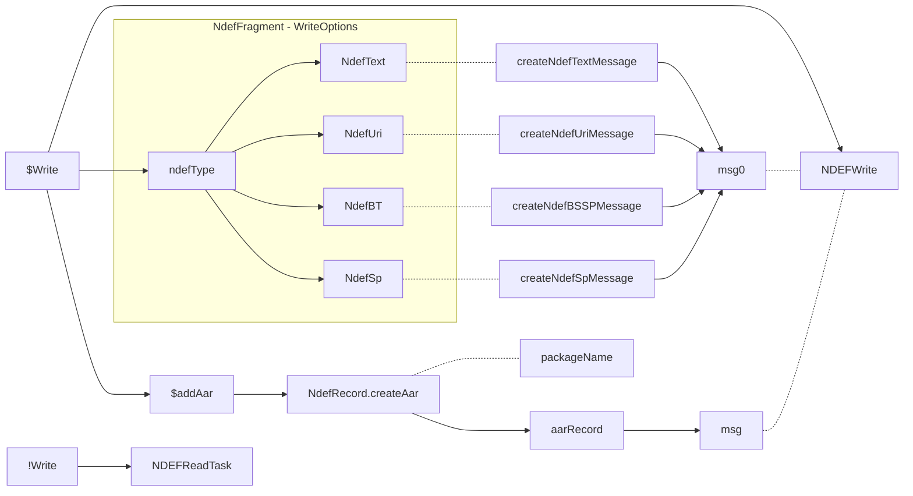
msg: **NDEFMessage** | write: **NdefFragment.Boolean** 
NDEFWrite: 在這裡將 AAR 寫入 NdefRecords 中的第二筆 (android官方建議寫入第二筆)

```kotlin
public void NDEF() throws IOException {
// Check if the operation is read or write
if (NdefFragment.isWriteChosen()) {
	// NDEF Message to write in the tag
	NdefMessage msg = null;

	// Get the selected NDEF type since the creation of the NDEF Msg
	// will vary depending on the type
	if (NdefFragment.getNdefType().equalsIgnoreCase(...)) {
		msg = createNdefTextMessage(NdefFragment.getText());
	} else if (NdefFragment.getNdefType().equalsIgnoreCase(...))) {
		msg = createNdefUriMessage(NdefFragment.getText());
	} else if (NdefFragment.getNdefType().equalsIgnoreCase(...))) {
		msg = createNdefBSSPMessage();
	} else if (NdefFragment.getNdefType().equalsIgnoreCase(...))) {
		msg = createNdefSpMessage(NdefFragment.getSpTitle(), NdefFragment.getSpLink());
	}
	if(msg == null) {
		toastText(main, "Please add correct input values", Toast.LENGTH_LONG) ;
		NdefFragment.setAnswer(...error...);
	}
	if(NdefFragment.isAarRecordSelected()) {
		NdefRecord aarRecord = NdefRecord.createApplicationRecord(PseudoMainActivity.getPACKAGE_NAME());

          assert msg != null;
          NdefRecord records[] = msg.getRecords();
		records  = Arrays.copyOf(records, records.length + 1);
		records[records.length - 1] = aarRecord;
		msg = new NdefMessage(records);
	}
	try {
		long timeToWriteNdef = NDEFWrite(msg);
		toastText(main, "write tag successfully done", Toast.LENGTH_LONG) ;
		NdefFragment.setAnswer("Tag successfully written");

		assert msg != null;
		int bytes = msg.toByteArray().length;

		String Message = "";

		// Transmission Results
		Message = Message.concat("Speed (" + bytes + " Byte / "
				+ timeToWriteNdef + " ms): "
				+ String.format("%.0f", bytes / (timeToWriteNdef / 1000.0))
				+ " Bytes/s");
		NdefFragment.setDatarate(Message);
	} catch (Exception e) {
		toastText(main, "write tag failed", Toast.LENGTH_LONG) ;
		NdefFragment.setDatarate("Error writing NDEF");
		e.printStackTrace();
	}
} else {
	ndefreadtask = new NDEFReadTask();
	ndefreadtask.execute();
}
}
```


### NDEFReadTask()
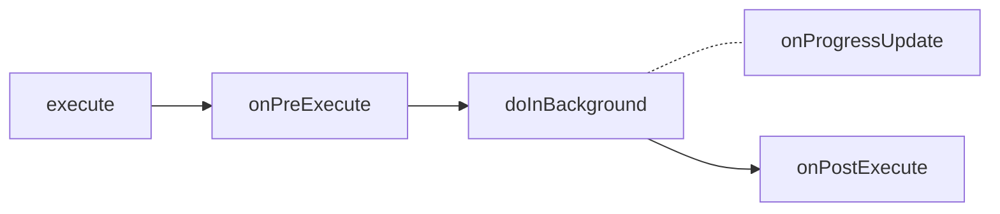

**doInBackground**
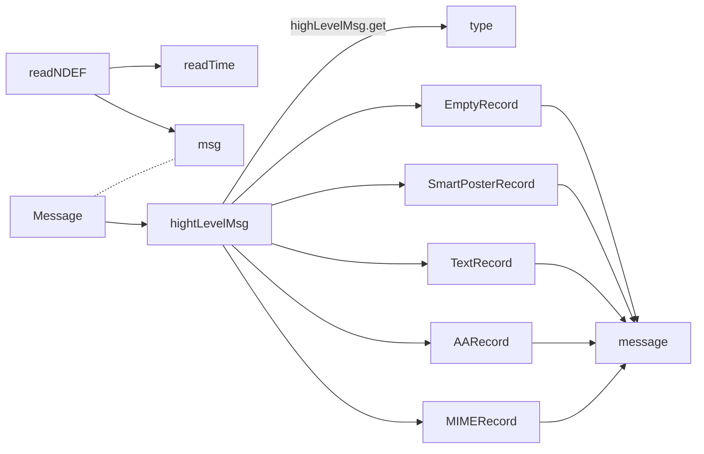
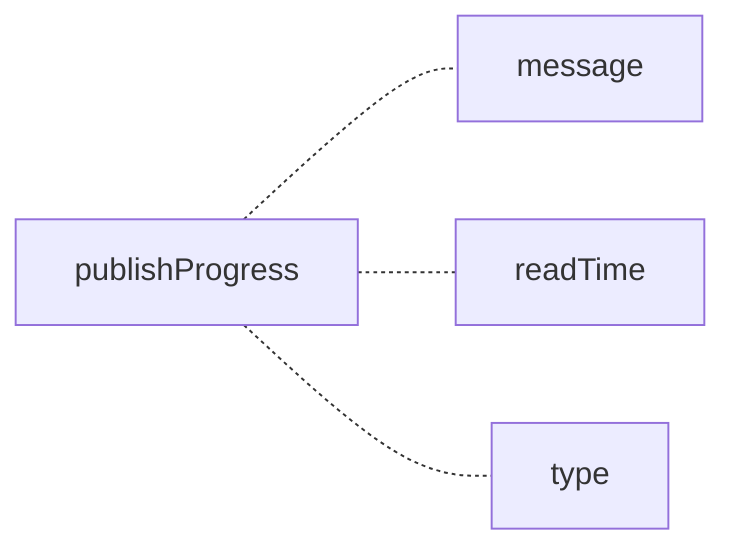
> readNDEF: **reader** | Message: **NDEFTool.Message** | type: **String - NdefType** | msg: **NDEFMessage** | message: **String - NdefMessage** | readTime: **Long - datarate**


### NDEFWrite
只call了read.writeNDEF, 並計算時間
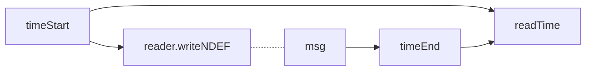
msg: **NDEFMessage**


### NDEFReadFinish
```mermaid
graph LR
NdefFragment.resetNdefDemo
```

```kotlin
public void NDEFReadFinish() {
	if (ndefreadtask != null && !ndefreadtask.isCancelled()) {
		ndefreadtask.exit = true;
		try {
			ndefreadtask.get();
		} catch (Exception e) {
			e.printStackTrace();
		}
		ndefreadtask = null;
		// Clean all the fields
		NdefFragment.resetNdefDemo();
	}
}
```


### finishAllTasks
```mermaid
graph LR
	LEDFinish
	SRAMSpeedFinish
	EEPROMSpeedFinish
	WriteEmptyNdefFinish
	NDEFReadFinish
```


### resetTagMemory
``` mermaid
graph LR
Ntag
MiniNtag
bytesWritten
equal-0
greater-0
bytesWritten --> equal-0
bytesWritten --> greater-0
greater-0 -.-Ntag
equal-0 -.- MiniNtag
MiniNtag --> Alert

Ntag --> writeConfigRegisters
Ntag --> 1K2KPlus
1K2KPlus --> writeAuthRegisters
```
```kotlin
public int resetTagMemory() {
	int bytesWritten = 0;

	try {
		bytesWritten = reader.writeDeliveryNdef();
	} catch (Exception e) {
		e.printStackTrace();
		bytesWritten = -1;
	}
	if(bytesWritten == 0) {
		showDemoNotSupportedAlert();
	} else {
		byte NC_REG = (byte) 0x01;
		byte LD_Reg = (byte) 0x00;
		byte SM_Reg = (byte) 0xF8;
		byte WD_LS_Reg = (byte) 0x48;
		byte WD_MS_Reg = (byte) 0x08;
		byte I2C_CLOCK_STR = (byte) 0x01;
		// If we could reset the memory map, we should be able to write the config registers
		try {
			reader.writeConfigRegisters(NC_REG, LD_Reg,
					SM_Reg, WD_LS_Reg, WD_MS_Reg, I2C_CLOCK_STR);
		} catch (Exception e) {
			//Toast.makeText(main, "Error writing configuration registers", Toast.LENGTH_LONG).show();
			toastText(main, "Error writing configuration registers", Toast.LENGTH_LONG);
			e.printStackTrace();
			bytesWritten = -1;
		}

		try {
			Ntag_Get_Version.Prod prod = reader.getProduct();

			if (prod.equals(Ntag_Get_Version.Prod.NTAG_I2C_1k_Plus)
			 || prod.equals(Ntag_Get_Version.Prod.NTAG_I2C_2k_Plus)) {
				byte AUTH0 = (byte) 0xFF;
				byte ACCESS = (byte) 0x00;
				byte PT_I2C = (byte) 0x00;
				reader.writeAuthRegisters(AUTH0, ACCESS, PT_I2C);
			}
		} catch (Exception e) {
			//Toast.makeText(main, "Error writing authentication registers", Toast.LENGTH_LONG).show();
			toastText(main, "Error writing authentication registers", Toast.LENGTH_LONG);
			e.printStackTrace();
			bytesWritten = -1;
		}
	}
	return bytesWritten;
}
```

### readSessionRegisters
```mermaid
graph LR
reader.getSessionRegisters --> reg
getRegister_Settings -.- reg
getRegister_Settings --> Ntag_I2C_Registers
RegisterSessionActivity.SetAnswer -.- Ntag_I2C_Registers
showToast
```
> RegisterSessionActivity.SetAnswer -> turn **Ntag_I2C_Registers** into readable map
>  getRegister_Settings(byte[]) -> **Ntag_I2C_Registers**
```kotlin
public void readSessionRegisters() throws CommandNotSupportedException {
	try {
		byte[] sessionRegisters = reader.getSessionRegisters();
		Ntag_I2C_Registers answer = getRegister_Settings(sessionRegisters);
		RegisterSessionActivity.SetAnswer(answer, main);
		toastText(main, "read tag successfully done", Toast.LENGTH_LONG) ;
	} catch (CommandNotSupportedException e) {
		e.printStackTrace();
		throw e;
	} catch (Exception e) {
		e.printStackTrace();
		toastText(main, "read tag failed", Toast.LENGTH_LONG) ;
	}
}
```

### readWriteConfigRegister
```mermaid
graph LR
$Write
!Write
$1k2kPlus+Auth
!1k2kPlus+Auth

$Write --> $1k2kPlus+Auth
$1k2kPlus+Auth --> Alert
$Write --> !1k2kPlus+Auth
!1k2kPlus+Auth --> writeConfigRegisters

!Write --> $plus 
$plus --> reader.getConfigRegisters
reader.getConfigRegisters -.- getRegister_Settings
getRegister_Settings --> Ntag_I2C_Registers
RegisterConfigActivity.setAnswer -.- Ntag_I2C_Registers

subgraph RegisterConfigActivity
RegisterConfigActivity.setAnswer -.- NC_Reg
RegisterConfigActivity.setAnswer -.- LD_Reg
RegisterConfigActivity.setAnswer -.- SM_Reg
RegisterConfigActivity.setAnswer -.- NS_Reg
RegisterConfigActivity.setAnswer -.- WD_LS_Reg
RegisterConfigActivity.setAnswer -.- WD_MS_Reg
RegisterConfigActivity.setAnswer -.- I2C_CLOCK_STR
end

!Write --> !plus
!plus --> reader.getAuth0Register
!plus --> reader.getAccessRegister
!plus --> reader.getPTI2CRegister
subgraph RegisterConfigActivity
	reader.getAuth0Register -.- setAuth0
	reader.getAccessRegister -.- setAcess
	reader.getPTI2CRegister -.- setPTI2C
end
reader.getAuth0Register -.- Ntag_I2C_Plus_Registers
reader.getAccessRegister-.- Ntag_I2C_Plus_Registers
reader.getPTI2CRegister-.- Ntag_I2C_Plus_Registers

Ntag_I2C_Registers --> updateToDart
Ntag_I2C_Plus_Registers --> updateToDart
```
> Write: **RegisterConfigActivity.Boolean**
> 1k2kPlus: **Ntag_Get_version.Prod** via reader.getProduct
> 1k2kPlus+Auth: **RegisterConfigActivity.getAuth0()**
> reader.getConfigRegisters: **byte[]**
> getRegister_Settings(byte[]): **Ntag_I2C_Registers**

```kotlin
public void readWriteConfigRegister() throws CommandNotSupportedException {
	// Check if the operation is read or write
	if (RegisterConfigActivity.isWriteChosen()) {
		try {
			Ntag_Get_Version.Prod prod = reader.getProduct();
			if((prod.equals(Ntag_Get_Version.Prod.NTAG_I2C_1k_Plus)
			 || prod.equals(Ntag_Get_Version.Prod.NTAG_I2C_2k_Plus))
			 && (RegisterConfigActivity.getAuth0() & 0xFF) <= 0xEB) {
				showAuthWriteConfigAlert();
			 } else {
				writeConfigRegisters();
			}
		} catch (IOException e) {
			e.printStackTrace();
		}
	} //END if get chosen
	else {
		try {
			byte[] configRegisters = reader.getConfigRegisters();

			Ntag_I2C_Registers answer = getRegister_Settings(configRegisters);
			RegisterConfigActivity.setAnswer(answer);
			RegisterConfigActivity.setNC_Reg(configRegisters[CR_Offset.NC_REG.getValue()]);
			RegisterConfigActivity.setLD_Reg(configRegisters[CR_Offset.LAST_NDEF_PAGE.getValue()]);
			RegisterConfigActivity.setSM_Reg(configRegisters[CR_Offset.SM_REG.getValue()]);
			RegisterConfigActivity.setNS_Reg(configRegisters[CR_Offset.REG_LOCK.getValue()]);
			RegisterConfigActivity.setWD_LS_Reg(configRegisters[CR_Offset.WDT_LS.getValue()]);
			RegisterConfigActivity.setWD_MS_Reg(configRegisters[CR_Offset.WDT_MS.getValue()]);
			RegisterConfigActivity.setI2C_CLOCK_STR(configRegisters[CR_Offset.I2C_CLOCK_STR.getValue()]);

			Ntag_Get_Version.Prod prod = reader.getProduct();
			if (prod.equals(Ntag_Get_Version.Prod.NTAG_I2C_1k_Plus)
			 || prod.equals(Ntag_Get_Version.Prod.NTAG_I2C_2k_Plus)) {
				byte[] auth0Register = reader.getAuth0Register();
				byte[] accessRegister = reader.getAccessRegister();
				byte[] pti2cRegister = reader.getPTI2CRegister();

				Ntag_I2C_Plus_Registers answerPlus = getPlusAuth_Settings(auth0Register, accessRegister, pti2cRegister);
				RegisterConfigActivity.setAnswerPlus(answerPlus);
				RegisterConfigActivity.setAuth0(auth0Register[3]);
				RegisterConfigActivity.setAccess(accessRegister[0]);
				RegisterConfigActivity.setPtI2C(pti2cRegister[0]);
			}
			//grodianknot
			RegisterConfigActivity.updateToDart();
			toastText(main, "read tag successfully done",
					Toast.LENGTH_LONG) ;
		} catch (CommandNotSupportedException e) {
			e.printStackTrace();
			throw e;
		} catch (Exception e) {
			e.printStackTrace();
			toastText(main, "read tag failed", Toast.LENGTH_LONG);
		}
	}
}
```

### writeConfigRegisters

```mermaid
graph LR
$1k2kPlus


subgraph RegisterConfigActivity
	NC_Reg
	LD_Reg
	SM_Reg
	WD_LS_Reg
	WD_MS_Reg
	I2C_CLOCK_STR
end
reader.writeConfigRegisters -.- NC_Reg
reader.writeConfigRegisters -.- LD_Reg
reader.writeConfigRegisters -.- SM_Reg
reader.writeConfigRegisters -.- WD_LS_Reg
reader.writeConfigRegisters -.- WD_MS_Reg
reader.writeConfigRegisters -.- I2C_CLOCK_STR

subgraph __RegisterConfigActivity__
	AUTH0 -.- getAuth0
	ACCESS -.- getAccess
	PT_I2C -.- getPtI2C
end
$1k2kPlus --> reader.writeAuthRegisters
reader.writeAuthRegisters -.- AUTH0
reader.writeAuthRegisters -.- ACCESS
reader.writeAuthRegisters -.- PT_I2C
```
> reader.writeAuthRegisters
>    - write default password (0xFF 0xFF 0xFF 0xFF)
>     
```kotlin
private void writeConfigRegisters() {
	try {
		byte NC_Reg = (byte) RegisterConfigActivity.getNC_Reg();
		byte LD_Reg = (byte) RegisterConfigActivity.getLD_Reg();
		byte SM_Reg = (byte) RegisterConfigActivity.getSM_Reg();
		byte WD_LS_Reg = (byte) RegisterConfigActivity.getWD_LS_Reg();
		byte WD_MS_Reg = (byte) RegisterConfigActivity.getWD_MS_Reg();
		byte I2C_CLOCK_STR = (byte) RegisterConfigActivity.getI2C_CLOCK_STR();
		reader.writeConfigRegisters(NC_Reg, LD_Reg, SM_Reg, WD_LS_Reg, WD_MS_Reg, I2C_CLOCK_STR);
		Ntag_Get_Version.Prod prod = reader.getProduct();
		if (prod.equals(Ntag_Get_Version.Prod.NTAG_I2C_1k_Plus)
		 || prod.equals(Ntag_Get_Version.Prod.NTAG_I2C_2k_Plus)) {
			byte AUTH0 = (byte) RegisterConfigActivity.getAuth0();
			byte ACCESS = (byte) RegisterConfigActivity.getAccess();
			byte PT_I2C = (byte) RegisterConfigActivity.getPtI2C();
			reader.writeAuthRegisters(AUTH0, ACCESS, PT_I2C);
		}
		toastText(main, "write tag successfully done",	Toast.LENGTH_LONG) ;
	} catch (Exception e) {
		e.printStackTrace();
		toastText(main, "write tag failed", Toast.LENGTH_LONG) ;
}
}
```

### readTagContent
Reads the whole tag memory content., return  Boolean indicating success or error
- reader.readEEPROM (start, end)

referenced in ReadMemoryActivity


```mermaid
graph LR
reader.getProduct --> memsize 
memsize -.- reader.readEEPROM
reader.getBlockSize -.- reader.readEEPROM
```
```kotlin
public byte[] readTagContent() {
	byte[] bytes = null;
	try {
		// The user memory and the first four pages are displayed
		int memSize = reader.getProduct().getMemsize() + 16;
		// Read all the pages using the fast read method
		bytes = reader.readEEPROM(0, memSize / reader.getBlockSize());
	} catch (IOException e) {
		e.printStackTrace();
	} catch (FormatException e) {
		e.printStackTrace();
	} catch (CommandNotSupportedException e) {
		e.printStackTrace();
		showDemoNotSupportedAlert();
	} catch (Exception e) {
		e.printStackTrace();
	}
	return bytes;
}
```

### resetTagContent

```mermaid
graph LR
reader.getProduct --> memsize
memsize --> EmptyBytesOfMemsize
reader.writeEEPROM -.- EmptyBytesOfMemsize
```
```kotlin
public boolean resetTagContent() {
	boolean success = true;
	try {
		byte[] d = new byte[reader.getProduct().getMemsize()];
		reader.writeEEPROM(d, this);
	} catch (IOException e) {
		success = false;
		e.printStackTrace();
	} catch (FormatException e) {
		success = false;
		e.printStackTrace();
	} catch (CommandNotSupportedException e) {
		showDemoNotSupportedAlert();
		e.printStackTrace();
	}
	return success;
}
```


### LED
Performs the LED Demo
```mermaid
graph LR
subgraph LedFragment
	setAnswer -.- defaults
	setTemperatureC -.- default0
	setTemperatureF -.- default0
	setVoltage -.- default0
end

LedTask
```

```kotlin
public void LED() throws IOException, FormatException {
	// Reset UI
	LedFragment.setAnswer(main.getResources().getString(R.string.readConf));
	LedFragment.setTemperatureC(0);
	LedFragment.setTemperatureF(0);
	LedFragment.setVoltage(0);

	// The demo is executed in a separate thread to let the GUI run
	lTask = new LedTask();
	lTask.execute();
}
```

### LEDFinish
```mermaid

```

```kotlin
public void LEDFinish() {
	if (lTask != null && !lTask.isCancelled()) {
		lTask.exit = true;
		try {
			lTask.get();
		} catch (Exception e) {
			e.printStackTrace();
		}
		lTask = null;
	}
}
```


### ObtainAuthStatus()
Retrieves the auth status of the tag
- reader.getProductionPlus
- AuthStatus.Disable
``` mermaid
graph LR
!1k2kPlus --> AuthStatus.Disable
$1k2kPlus --> reader.getProtectionPlus

```
```kotlin
public int ObtainAuthStatus() {
	try {
		Ntag_Get_Version.Prod prod = reader.getProduct();
		if (!prod.equals(Ntag_Get_Version.Prod.NTAG_I2C_1k_Plus)
		 && !prod.equals(Ntag_Get_Version.Prod.NTAG_I2C_2k_Plus)) {
			return AuthStatus.Disabled.getValue();
		} else {
			return reader.getProtectionPlus();
		}
	} catch (IOException e) {
		e.printStackTrace();
	}
	return AuthStatus.Disabled.getValue();
}
```


### Auth()
Performs the authentication operation on NTAG I2C Plus 

- pwd **ByteArray** containing the password  
- authStatus Current Authentication Status  

perform authentication on Tag
- reader.authenticate -> reader.pwdAuth
- reader.unprotectPlus
- reader.protectPlus
```mermaid
graph LR
subgraph AuthStatus
	unprotected
	authenticated
	W_RW
	authStatus --> W_RW
	authStatus --> authenticated
	authStatus --> unprotected
end

unprotected --> reader.protectPlus
reader.protectPlus -.- pwd
reader.protectPlus -.- Ntag_I2C_Commands.Register
authenticated --> reader.unprotectPlus
W_RW --> reader.authenticatePlus
reader.authenticatePlus --> reader.pwdAuth
reader.pwdAuth -.- pwd

Protected_W -.- Protected_RW
Protected_RW -.- Protected_W_SRAM
Protected_W_SRAM -.- Protected_RW_SRAM
Protected_W --> W_RW
```
>reader.protectPlus (**byte[]** pwd, **byte[]** startAddr)
	>   - write user password

>reader.unprotectPlus
>   - write default password ( 0xFF, 0xFF, 0xFF, 0xFF )

>reader.authenticatePlus

```kotlin
public Boolean Auth(byte[] pwd, int authStatus) {
	try {
		if(authStatus == AuthStatus.Unprotected.getValue()) {
			reader.protectPlus(pwd, Register.Capability_Container.getValue());
		} else if(authStatus == AuthStatus.Authenticated.getValue()) {
			reader.unprotectPlus();
		} else if(authStatus == AuthStatus.Protected_W.getValue()
				|| authStatus == AuthStatus.Protected_RW.getValue()
				|| authStatus == AuthStatus.Protected_W_SRAM.getValue()
				|| authStatus == AuthStatus.Protected_RW_SRAM.getValue()) {
			byte[] pack = reader.authenticatePlus(pwd);
			if(pack.length < 2) {
				return false;
			}
		}
		return true;
	} catch (IOException e) {
		e.printStackTrace();
	} catch (FormatException e) {
		e.printStackTrace();
	} catch (NotPlusTagException e) {
		showTagNotPlusAlert();
		e.printStackTrace();
	}
	return false;
}
```

example usage
```kotlin
// Authenticate in order to let the user use the demos
demo!!.Auth(PseudoMainActivity.password, AuthStatus.Protected_RW.value)

// Perform auth operation based on the actual status  
demo!!.Auth(PseudoMainActivity.password,  
  PseudoMainActivity.authStatus)
```


### SRAMSpeedtest | SRAMSpeedtestTask (AsyncTask)
... todo
```mermaid
graph LR
	execute
	doInBackground
	onProgressUpdate
	onPostExecute
	execute --> onPreExecute
	onPreExecute --> doInBackground
	doInBackground -.- onProgressUpdate
	doInBackground --> onPostExecute
```
```mermaid
graph LR
$1k2kPlus --> $Authenticated
$1k2kPlus --> !Authenticated
$Authenticated --> reader.authenticatePlus.pw.
```
```kotlin
 
```
### createNdefTextMessage
```mermaid
text-bytes
lang-bytes
text-length
lang-length
```
### createNdefUriMessage
### createNdefBSSPMessage
### createNdefSpMessage
<!--stackedit_data:
eyJoaXN0b3J5IjpbNzIwMzQ0NDE5LDgwNTQ2MTAyNSwtMTA5Nz
I5ODYwNSw0NDcxMzkwMDgsMTYwMjc4MTAwOCwxNTk3NTExMTQz
LDEwMzM0MDU2NTMsMTEwMjQ3MzU5NSwxMTE4MzU5NTYxLC02NT
U5ODU0OCwtNDk4MTExNjE5LC0xNzkwOTg5ODA2LC0xNzkxNTYy
MzE5LC04NTczMjA0NTUsLTExMTA5ODk3MzEsLTExNTc5MDY5Mz
EsLTE3ODQ3OTU4MjhdfQ==
-->


## Ntag_I2C_Demo - How Demo be Initialized

- ##### in AuthActivity
```java
	private void startDemo(Tag tag) {  
		// This authentication is added in order to avoid authentication problems with old NFC Controllers  
		if(MainActivity.getAuthStatus() == AuthStatus.Authenticated.getValue()) {  
			demo.Auth(MainActivity.getPassword(), AuthStatus.Protected_RW.getValue());  
		}  
		if(demo != null && demo.isReady()) {  
			// Launch the thread  
			task = new authTask();  
			task.execute();  
		}  
	}
```
- ##### in FlashMemoryActivity
```java
	private void startDemo(Tag tag, boolean getAuthStatus) {  
		try {  
			if(isAppFW) {  
				bytesToFlash = readFileAssets(indexFW);  
			} else {  
				String path = ((TextView) findViewById(R.id.file_path)).getText().toString();  
				bytesToFlash = readFileMemory(path);  
			}  
		} catch (IOException e) {  
			e.printStackTrace();  

			// Set bytesToFlash to null so that the task is not started  
			bytesToFlash = null;  
		}  
	
		if(bytesToFlash == null || bytesToFlash.length == 0) {  
			Toast.makeText(mContext, "Error could not open File",  
			Toast.LENGTH_SHORT).show();  
			return;  
		}  

		demo = new Ntag_I2C_Demo(tag, this, 
			MainActivity.getPassword(), 
			MainActivity.getAuthStatus());  
		if (!demo.isReady())  
			return;  

		// Retrieve the Auth Status  
		if(getAuthStatus)  
			MainActivity.setAuthStatus(demo.ObtainAuthStatus());  

		// Flashing is only available when the tag is not protected  
		if(MainActivity.getAuthStatus() == AuthStatus.Disabled.getValue()  
		|| MainActivity.getAuthStatus() == AuthStatus.Unprotected.getValue()  
		|| MainActivity.getAuthStatus() == AuthStatus.Authenticated.getValue()) {  
			// Launch the thread  
			task = new flashTask();  
			task.execute();  
		} else {  
			showAuthDialog();  
		}  
	}
```
- ##### MainActivity 
```java

```
- ##### RegisterConfigActivity 
```java
	private void startDemo(final Tag tag, boolean getAuthStatus) {  
	    demo = new Ntag_I2C_Demo(tag, this, 
		    MainActivity.getPassword(), 
		    MainActivity.getAuthStatus());  
		if (!demo.isReady())  
			return;  

		// Calculate the Register Values according to what has been selected by  
		// the user  calcConfiguration();  

		// Retrieve the Auth Status  
		if (getAuthStatus == true) {  
			MainActivity.setAuthStatus(demo.ObtainAuthStatus());  
		}  

		if (MainActivity.getAuthStatus() == AuthStatus.Disabled.getValue()  
		|| MainActivity.getAuthStatus() == AuthStatus.Unprotected.getValue()  
		|| MainActivity.getAuthStatus() == AuthStatus.Authenticated.getValue()  
		|| MainActivity.getAuthStatus() == AuthStatus.Protected_W.getValue()  
		|| MainActivity.getAuthStatus() == AuthStatus.Protected_W_SRAM.getValue()) {  
			try {  
				demo.readWriteConfigRegister();  
			} catch (CommandNotSupportedException e) {  
				new AlertDialog.Builder(this)  
					.setMessage("This NFC device does not support the NFC Forum commands needed to access the config register")  
					.setTitle("Command not supported")  
					.setPositiveButton("OK",  
						new DialogInterface.OnClickListener() {  
							@Override  
							public void onClick(DialogInterface dialog, int which) {  

							}  
						}).show();  
				return;  
			}  
			layout_read.setVisibility(View.GONE);  
			layout_buttons.setVisibility(View.VISIBLE);  
			scroll_regs.setVisibility(View.VISIBLE);  
		} else {  
			showAuthDialog();  
		}  
	}
```
- ##### RegisterSessionActivity 
```java
	private void startDemo(final Tag tag, boolean getAuthStatus) {  
		demo = new Ntag_I2C_Demo(tag, this, 
			MainActivity.getPassword(), 
			MainActivity.getAuthStatus());  
		if (!demo.isReady())  
			return;  

		// Calculate the Register Values according to what has been selected by  
		// the user  calcConfiguration();  

		// Retrieve the Auth Status  
		if (getAuthStatus == true) {  
			MainActivity.setAuthStatus(demo.ObtainAuthStatus());  
		}  

		if (MainActivity.getAuthStatus() == AuthStatus.Disabled.getValue()  
		|| MainActivity.getAuthStatus() == AuthStatus.Unprotected.getValue()  
		|| MainActivity.getAuthStatus() == AuthStatus.Authenticated.getValue()  
		|| MainActivity.getAuthStatus() == AuthStatus.Protected_W.getValue()  
		|| MainActivity.getAuthStatus() == AuthStatus.Protected_W_SRAM.getValue()) {  
			try {  
				demo.readWriteConfigRegister();  
			} catch (CommandNotSupportedException e) {  
				new AlertDialog.Builder(this)  
					.setMessage(  
					"This NFC device does not support the NFC Forum commands needed to access the config register")  
					.setTitle("Command not supported")  
					.setPositiveButton("OK", new DialogInterface.OnClickListener() {  
						@Override  
						public void onClick(DialogInterface dialog,  
						int which) {  

						}  
					}).show();  
				return;  
			}  
			layout_read.setVisibility(View.GONE);  
			layout_buttons.setVisibility(View.VISIBLE);  
			scroll_regs.setVisibility(View.VISIBLE);  
		} else {  
			showAuthDialog();  
		}  
	}
```
- ##### ReadMemoryActivity 
```java
	private void startDemo(Tag tag, boolean getAuthStatus) {  
		// Complete the task in a new thread in order to be able to show the dialog  
		demo = new Ntag_I2C_Demo(tag, this, 
			MainActivity.getPassword(), 
			MainActivity.getAuthStatus());  
		if(!demo.isReady()) {  
			return;  
		}  

		// Retrieve the Auth Status  
		if(getAuthStatus) {  
			MainActivity.setAuthStatus(demo.ObtainAuthStatus());  
		}  

		if(MainActivity.getAuthStatus() == AuthStatus.Disabled.getValue()  
		|| MainActivity.getAuthStatus() == AuthStatus.Unprotected.getValue()  
		|| MainActivity.getAuthStatus() == AuthStatus.Authenticated.getValue()  
		|| MainActivity.getAuthStatus() == AuthStatus.Protected_W.getValue()  
		|| MainActivity.getAuthStatus() == AuthStatus.Protected_W_SRAM.getValue()) {  
		// Launch the thread  
			new readTask().execute();  
		} else {  
			showAuthDialog();  
		}  
	}
```
- ##### VersionActivity 
```java

```
- ##### ResetMemeoryActivity
```java
	private void startDemo(Tag tag, boolean getAuthStatus) {  
		demo = new Ntag_I2C_Demo(tag, this, 
			MainActivity.getPassword(),  
			MainActivity.getAuthStatus());  
		if(!demo.isReady()) {  
			return;  
		}  

		// Retrieve the Auth Status  
		if(getAuthStatus) {  
			MainActivity.setAuthStatus(demo.ObtainAuthStatus());  
		}  

		// Demo is only available when the tag is not protected  
		if(MainActivity.getAuthStatus() == AuthStatus.Disabled.getValue()  
		|| MainActivity.getAuthStatus() == AuthStatus.Unprotected.getValue()  
		|| MainActivity.getAuthStatus() == AuthStatus.Authenticated.getValue()) {  
		// Launch the thread  
			new resetTask().execute();  
		} else {  
			showAuthDialog();  
		}  
	}
```
<!--stackedit_data:
eyJoaXN0b3J5IjpbLTkzMDkxNTkyMV19
-->


##  How ReadEEPROM implements
### in Ntag_I2C_Command
#### readEEPROM
Read Data from the EEPROM.
- params
	- **int** absStart, Start of the read
	- **int** absEnd, End of the read(included in the Answer)

	###### referenced in
	- MinimalNtag_I2C_Command | Ntag_I2C_Command
		- readNDEF
	- Ntag_I2C_Demo
		- doInBackground
		- readTagContent
	 
```java
	@Override  
	public byte[] readEEPROM(int absStart, int absEnd) throws IOException,FormatException {  
		int maxfetchsize = reader.getMaxTransceiveLength();  
		int maxFastRead = (maxfetchsize - 2) / 4;  
		int fetchStart = absStart;  
		int fetchEnd = 0;  
		byte[] data = null;  
		byte[] temp = null;  

		reader.SectorSelect((byte) 0);  

		while (fetchStart <= absEnd) {  
			... see detail 
		}  
		// Let's go back to Sector 0  
		reader.SectorSelect((byte) 0);  
		return data;  
	}	
```


### in MinimalNtag_I2C_Command
#### readEEPROM
Read Data from the EEPROM.
- params
	- **int** absStart, Start of the read
	- **int** absEnd, End of the read(included in the Answer)

	###### referenced in
	- MinimalNtag_I2C_Command | Ntag_I2C_Command
		- readNDEF
	- Ntag_I2C_Demo
		- doInBackground
		- readTagContent
	 
```java
	@Override  
	public byte[] readEEPROM(int absStart, int absEnd) throws IOException,  
		FormatException, CommandNotSupportedException {  
		if ((tagType == Prod.NTAG_I2C_2k && absEnd > 0xFF)  
			|| tagType == Prod.NTAG_I2C_2k_Plus && absEnd > 0xE1)  
			throw new CommandNotSupportedException("readEEPROM is not Supported for this Phone on Second Sector");  

		byte[] temp = new byte[0];  
		answer = new byte[0];  

		if (absStart > 0xFF) {  
			absStart = 0xFF;  
		}  

		if (absEnd > 0xFF) {  
			absEnd = 0xFF;  
		}  

		int i;  
		for (i = absStart; i <= (absEnd - 3); i += 4) {  
			temp = mfu.readPages(i);  
			answer = concat(answer, temp);  
		}  

		if (i < absEnd) {  
			temp = mfu.readPages(absEnd - 3);  
			byte[] bla = Arrays.copyOfRange(temp, (i - (absEnd - 3)) * 4, 16);  
			answer = concat(answer, bla);  
		}  
		return answer;  
	}
```


- **Detail in Ntag_I2C_Command**
```java
	fetchEnd = fetchStart + maxFastRead - 1;  
	// check for last read, fetch only rest  
	if (fetchEnd > absEnd) {  
		fetchEnd = absEnd;  
	}  

	// check for sector change in between and reduce fast_read to stay within sector  
	if (getProduct() != Prod.NTAG_I2C_2k_Plus) {  
		if ((fetchStart & 0xFF00) != (fetchEnd & 0xFF00)) {  
			fetchEnd = (fetchStart & 0xFF00) + 0xFF;  
		}  
	} else {  
		if ((fetchStart & 0xFF00) == 0 && (fetchEnd > 0xE2)) {  
			fetchEnd = (fetchStart & 0xFF00) + 0xE1;  
		}  
	}  
	temp = reader.fast_read((byte) (fetchStart & 0x00FF), (byte) (fetchEnd & 0x00FF));  
	data = concat(data, temp);  

	// calculate next fetch_start  
	fetchStart = fetchEnd + 1;  

	// check for sector change in between and reduce fast_read to stay within sector  
	if (getProduct() != Prod.NTAG_I2C_2k_Plus) {  
		if ((fetchStart & 0xFF00) != (fetchEnd & 0xFF00)) {  
			reader.SectorSelect((byte) 1);  
		}  
	} else {  
		if ((fetchStart & 0xFF00) == 0 && (fetchEnd >= 0xE1)) {  
			reader.SectorSelect((byte) 1);  
			fetchStart = 0x100;  

			// Update the absEnd with pages not read on Sector 0  
			absEnd = absEnd + (0xFF - 0xE2);  
		}  
	} 
```
 

<!--stackedit_data:
eyJoaXN0b3J5IjpbNzk4NTg1NDIzXX0=
-->


##  How ReadNDEF Implements

### in Ntag_I2C_Command
#### readNDEF
> Read a NDEF Message from the tag - not an official NFC Forum NDEF detection routine.
##### describe reading process in brief
- params (none) 
- get size of **TLV** and **NDEF**
	- get **TLV** by **readEEPROM**( P1, P2 )
		- P1: Register.**User_memory_Begin**
		- P2: Register.**User_memory_Begin** + **3** 
	- read byte data using **readEEPROM**( P1, P2 )
 		- P1: Register.**User_memory_Begin**
		- P2: Register.**User_memory_Begin** + tlvPlusNdef
	-  feed byte data into **NdefMessage** as return value 
	###### about TLV (Type Length-Value)
	- A kind of data exchange format
		- T: Type information
		- L: Length information about playload data
		- V: playload data

	###### referenced in
	- Ntag_I2C_Demo
		- getRegister_Settings
		- NDEFReadTask / doInBackground
		- EEPROMSpeedtestTask / doInBackground
	###### example
	```java
		//read records of NdefMessage into String
		NdefMessage message = reader.readNDEF();  
		String NDEFText = new String(message.getRecords()[0].getPayload(),"US-ASCII");
		// Execute Read test  
		readTime = System.currentTimeMillis();  
		NdefMessage message = reader.readNDEF();  
		readTime = System.currentTimeMillis() - readTime;
	```
**Main Code**
```java
	@Override  
	public NdefMessage readNDEF() throws IOException, FormatException {  
		int ndefsize;  
		int tlvsize;  
		int tlvPlusNdef;  

		// get TLV  
		// note: [TLV] seems like a lock control  
		byte[] tlv = readEEPROM(
			Register.User_memory_Begin.getValue(),  
			Register.User_memory_Begin.getValue() + 3);  

		// checking TLV - maybe there are other TLVs on the tag  
		if (tlv[0] != 0x03) {  
			throw new FormatException("Format on Tag not supported");  
		}  
		if (tlv[1] != (byte) 0xFF) {  
			ndefsize = (tlv[1] & 0xFF);  
			tlvsize = 2;  
			tlvPlusNdef = tlvsize + ndefsize;  
		} else {  
			ndefsize = (tlv[3] & 0xFF);  
			ndefsize |= ((tlv[2] << 8) & 0xFF00);  
			tlvsize = 4;  
			tlvPlusNdef = tlvsize + ndefsize;  
		}  
		// Read NDEF Message  
		byte[] data = readEEPROM(
			Register.User_memory_Begin.getValue(),  
			Register.User_memory_Begin.getValue() + (tlvPlusNdef / 4));  

		// delete TLV  
		data = Arrays.copyOfRange(data, tlvsize, data.length);  
		// delete end of String which is not part of the NDEF Message  
		data = Arrays.copyOf(data, ndefsize);  

		// get the String out of the Message  
		NdefMessage message = new NdefMessage(data);  
		return message;
	}
```


### in MinimalNtag_I2C_Command
#### readNDEF
> Read a NDEF Message from the tag - not an official NFC Forum NDEF detection routine.
- params (none) 
- get size of **TLV** and **NDEF**
	- get **TLV** by **readEEPROM**( P1, P2 )
		- P1: Register.**User_memory_Begin**
		- P2: Register.**User_memory_Begin** + **3** 
	- read byte data using **readEEPROM**( P1, P2 )
 		- P1: Register.**User_memory_Begin**
		- P2: Register.**User_memory_Begin** + tlvPlusNdef / **4**
	-  feed byte data into **NdefMessage** as return value 
	###### about TLV (Type Length-Value)
	- A kind of data exchange format
		- T: Type information
		- L: Length information about playload data
		- V: playload data

	###### referenced in
	- Ntag_I2C_Demo
		- getRegister_Settings
		- NDEFReadTask / doInBackground
		- EEPROMSpeedtestTask / doInBackground
```java
	@Override  
	public NdefMessage readNDEF() throws IOException, FormatException, CommandNotSupportedException {  
		int ndefsize;  
		int tlvsize;  
		int tlvPlusNdef;  

		// get TLV  
		byte[] tlv = readEEPROM(
			Register.User_memory_Begin.getValue(),  
			Register.User_memory_Begin.getValue() + 3);  

		// checking TLV - maybe there are other TLVs on the tag  
		if (tlv[0] != 0x03) {  
			throw new FormatException("Format on Tag not supported");  
		}  

		if (tlv[1] != (byte) 0xFF) {  
			ndefsize = (tlv[1] & 0xFF);  
			tlvsize = 2;  
			tlvPlusNdef = tlvsize + ndefsize;  
		} else {  
			ndefsize = (tlv[3] & 0xFF);  
			ndefsize |= ((tlv[2] << 8) & 0xFF00);  
			tlvsize = 4;  
			tlvPlusNdef = tlvsize + ndefsize;  
		}  

		// Read NDEF Message  
		byte[] data = readEEPROM(
			Register.User_memory_Begin.getValue(),  
			Register.User_memory_Begin.getValue() + (tlvPlusNdef / 4));  

		// delete TLV  
		data = Arrays.copyOfRange(data, tlvsize, data.length);  
		// delete end of String which is not part of the NDEF Message  
		data = Arrays.copyOf(data, ndefsize);  

		// Interpret Bytes  
		NdefMessage message = new NdefMessage(data);  
		return message;  
	}
```
 


<!--stackedit_data:
eyJoaXN0b3J5IjpbLTU5MDc2MjUwNl19
-->


## Reading Product Information

### Ntag_I2C
#### getProduct
Gets the Product of the current Tag.
#### describe implementation in brief
- params(none)
	##### referenced in
	- Ntag_I2C_Command | MinimalNtag_I2C_Command
		- writeEEPROM
		- authenticatePlus
		- protectPlus
		- unprotectPlus
	- Ntag_I2C_Command 
		-  constructor
		- getSessionRegisters
		- getConfigRegisters
		- writeConfigRegisters
		- writeEEPROM
		- readEEPROM
		- writeSRAMBlock
		- writeDeliveryNdef
	- Ntag_I2C_Demo
		- constructor
		- resetTagMemory
		- getRegister_Settings
		- readWriteConfigRegister
		- writeConfigRegisters
		- readTagContent
		- resetTagContent
		- ObtainAuthStatus
		- SRAMSpeedtestTask / doInBackground
		- EEPROMSpeedtestTask / onPreExecute
		- EEPROMSpeedtestTask / doInBackground
```java
	@Override  
	public Prod getProduct() throws IOException {  
		if (getVersionResponse == null) {  
			try {  
				getVersionResponse = new Ntag_Get_Version(reader.getVersion());  
			} catch (Exception e) {  
				e.printStackTrace();  
				try {  
					reader.close();  
					reader.connect();  
					byte[] temp = reader.read((byte) 0x00);  

					if (temp[0] == (byte) 0x04 && temp[12] == (byte) 0xE1  
					&& temp[13] == (byte) 0x10  
					&& temp[14] == (byte) 0x6D  
					&& temp[15] == (byte) 0x00) {  
						temp = reader.read((byte) 0xE8);  
						getVersionResponse = Ntag_Get_Version.NTAG_I2C_1k;  

					} else if (temp[0] == (byte) 0x04  
						&& temp[12] == (byte) 0xE1  
						&& temp[13] == (byte) 0x10  
						&& temp[14] == (byte) 0xEA  
						&& temp[15] == (byte) 0x00) {  
						getVersionResponse = Ntag_Get_Version.NTAG_I2C_2k;  
					}  
				} catch (FormatException e2) {  
					reader.close();  
					reader.connect();  
					e2.printStackTrace();  
					getVersionResponse = Ntag_Get_Version.NTAG_I2C_1k;  
				}  
			}  
		}  
		return getVersionResponse.Get_Product();  
	}
```

### MinimalNtag_I2C
product information in MinimalNtag was initialized by its constructor
```java
	@Override  
	public Prod getProduct() throws IOException {  
	  // returns generic NTAG_I2C_1k, because getVersion is not possible  
	  return tagType;  
	}
```
 
<!--stackedit_data:
eyJoaXN0b3J5IjpbNDM5NzM4ODU4XX0=
-->


  
  
## Reading configRegisters/sessionRegisters/...  
  

### in Ntag_I2C_Command  

- #### Session Registers - getSessionRegister  
- #### describe writing process in brief  
 - params  
 - **SR_Offset** off  
 - offset  of the session registers  
  
 ##### referenced in  
 -  

```java  
	// referenced from   
	// 1) Ntag_I2C_Demo / .setBoardVersion()   
		-// 2) Ntag_I2C_Command / .checkPTwritePossible()  
  
```java  
	@Override    
	public byte getSessionRegister(SR_Offset off) throws IOException,FormatException{    
		byte[] register = getSessionRegisters();    
		return register[off.getValue()];    
	}  
  
	// referenced from Ntag_Demo.getSessionRegisters   
	@Override    
	public byte[] getSessionRegisters() throws IOException, FormatException {    
		if (getProduct() == Prod.NTAG_I2C_1k_Plus   
			|| getProduct() == Prod.NTAG_I2C_2k_Plus) {    
			reader.SectorSelect((byte) 0);    
			return reader.read(Register.Session_PLUS.getValue());    
		} else {    
			reader.SectorSelect((byte) 3);    
			return reader.read(Register.Session.getValue());    
		}    
	}  
```  

-   
    
  
  

#### Config Registers - getConfigRegisters  

- #### describe writing process in brief  
 - params (none)  
 ##### referenced in  
 - Ntag_I2C_Demo  
 - readWriteConfigRegister  
    

```java  
	@Override    
	public byte[] getConfigRegisters() throws IOException, FormatException {    
		/*    
		NTAG I2C plus behavior can be configured and read in two separate locations depending if the configurations shall be effective within the communication session (use session registers) or by default after Power-On Reset (POR) (use configuration registers). */    
		if (getProduct() == Prod.NTAG_I2C_1k   
		|| getProduct() == Prod.NTAG_I2C_1k_Plus  		  
		|| getProduct() == Prod.NTAG_I2C_2k_Plus)    
			reader.SectorSelect((byte) 0);    
		else if (getProduct() == Prod.NTAG_I2C_2k)    
			reader.SectorSelect((byte) 1);    
		else throw new IOException();    
  
		return reader.read(Register.Configuration.getValue());    
	}  
  
  
	// this function has not been used   
	@Override    
	public byte getConfigRegister(CR_Offset off) throws IOException,    
		FormatException {    
		byte[] register = getConfigRegisters();    
		return register[off.getValue()];    
	}  
```  

#### PT | Auth | Acess Registers  
    

```java  
	@Override    
	public byte[] getAuth0Register() throws IOException, FormatException,CommandNotSupportedException {    
		reader.SectorSelect((byte) 0);    
		return reader.read(Register.AUTH0.getValue());    
	}    
  
	@Override    
	public byte[] getAccessRegister() throws IOException, FormatException,CommandNotSupportedException {    
		reader.SectorSelect((byte) 0);    
		return reader.read(Register.ACCESS.getValue());    
	}    
  
	@Override    
	public byte[] getPTI2CRegister() throws IOException, FormatException,CommandNotSupportedException {    
		reader.SectorSelect((byte) 0);    
		return reader.read(Register.PT_I2C.getValue());    
	}  
```  
  

-------------------------------  

-------------------------------  
  

### in MinimalNtag_I2C_Command  
  

#### Session Register - getSessionRegisters  

- #### describe writing process in brief  
 - params  
 - **SR_Offset** off  
 - offset  of the session registers  
  
 ##### referenced in  
 - Ntag_I2C_Demo.setBoardVersion()   
 - Ntag_I2C_Command.checkPTwritePossible()  

------------  

### in MinimalNtag_I2C_Command  
  

- #### Config Registers  

```java  
	@Override    
	public byte[] getSessionConfigRegisters() throws IOException, FormatException,    
		CommandNotSupportedException {    
		if (tagType == Prod.NTAG_I2C_1k || tagType == Prod.NTAG_I2C_2k) {    
			throw new CommandNotSupportedException("getSessionConfigRegisters is not sSupported for this Phone with NTAG I2C 2k");    
		}    
		answer = mfu.readPages(0xEC8);    
		return answer;    
	}    
  
  
	@Override    
	public byte getSessionConfigRegister(SCR_Offset off) throws IOException,    
		FormatException, CommandNotSupportedException {    
		if (tagType == Prod.NTAG_I2C_1k || tagType == Prod.NTAG_I2C_2k) {    
			throw new CommandNotSupportedException("getSessionConfigRegister is not sSupported for this Phone with NTAG I2C 2k");    
		}    
		return getSessionConfigRegisters()[off.getValue()];    
	}  
```  
  

#### Config Registers - getConfigRegisters  

- #### describe writing process in brief  
 - params (none)  
 ##### referenced in  
 - Ntag_I2C_Demo  
 - readWriteConfig- ### Session Register  
    

```java  
	@Override    
	public byte[] getConfigSessionRegisters() throws IOException, FormatException,    
		CommandNotSupportedException {    
		if (tagType == Prod.NTAG_I2C_1k || tagType == Prod.NTAG_I2C_2k) {    
			throw new CommandNotSupportedException("getConfigSessionRegisters is not Ssupported for this Phone with NTAG I2C 2k");    
		}    
		answer = mfu.readPages(0xE8C);    
		return answer;    
	}    
  
  
	@Override    
	public byte getConfigSessionRegister(CSR_Offset off) throws IOException,    
		FormatException, CommandNotSupportedException {    
		if (tagType == Prod.NTAG_I2C_1k || tagType == Prod.NTAG_I2C_2k) {    
			throw new CommandNotSupportedException("getConfigSessionRegister is not Ssupported for this Phone with NTAG I2C 2k");    
		}    
		return getConfigSessionRegisters()[off.getValue()];    
	}  
```  

#### PT | Auth | Acess Registers  
    

```java  
	@Override    
	public byte[] getAuth0Register() throws IOException, FormatException,CommandNotSupportedException {    
		return mfu.readPages(0xE3);    
	}    
  
	@Override    
	public byte[] getAccessRegister() throws IOException, FormatException,CommandNotSupportedException {    
		return mfu.readPages(0xE4);    
	}    
  
	@Override    
	public byte[] getPTI2CRegister() throws IOException, FormatException,CommandNotSupportedException {    
		return mfu.readPages(0xE7);  
	}  
```  
  
  

---------------------  

----------  
  

### difference bewteen MinimalNtag and Ntag  

- MinimalNtag has **tagType** assertion to block unsupported product  
- MinimalNtag use **readPages(0xE8)** to fetch configuration, and use getPages(0xEC) to fetch session  
- Ntag use **read(Register.Configuration)** to fetch configuration, and use **read(Register.Session/Register.SessionPlus)** to fetch session.  
- Ntag has different sector settings between different product.  
  

--------  
  

### SR_Offset  

```java  
	public enum SR_Offset {    
		NC_REG((byte) 0x00),   
		LAST_NDEF_PAGE((byte) 0x01),  
		SM_REG((byte) 0x02),   
		WDT_LS((byte) 0x03), 		  
		WDT_MS((byte) 0x04),   
		I2C_CLOCK_STR((byte) 0x05),   
		NS_REG((byte) 0x06),   
		FIXED((byte) 0x07);     
	}  
```  

Markdown 6275  bytes 609  words 208  lines Ln 1, Col 0

HTML 4890  characters 542  words 151  paragraphs
<!--stackedit_data:
eyJoaXN0b3J5IjpbMTk3NDA5MzM2NF19
-->


##  How readSRAM implements

- ### in Ntag_I2C_Command
- #### readSRAM
- readSRAM by specifying blocks(int) and methods (RW mode)
```java
	@Override  
	public byte[] readSRAM(int blocks, R_W_Methods method) throws IOException, FormatException, TimeoutException {  
		byte[] response = new byte[0];  
		byte[] temp;  

		for (int i = 0; i < blocks; i++) {  
			if (method == R_W_Methods.Polling_Mode) {  
				waitforI2Cwrite(100);  
			} else {  
				try {  
					// else wait  
					Thread.sleep(6);  
				} catch (Exception e) {  
					e.printStackTrace();  
				}  
			} 
			temp = readSRAMBlock();  

			// concat read block to the full response  
			response = concat(response, temp);  
		}  
		answer = response;  
		return response;  
	}
```
- #### readSRAMBlock
```java
	@Override  
	public byte[] readSRAMBlock() throws IOException, FormatException {  
		answer = new byte[0];  
		if(MainActivity.getAuthStatus() == AuthStatus.Authenticated.getValue()) {  
			try {  
				// authenticate using reader.pwdAuth  
				authenticatePlus(MainActivity.getPassword());  
			} catch (Exception e) {  
				e.printStackTrace();  
			}  
		}  
		reader.SectorSelect(sramSector);  
		answer = reader.fast_read((byte) 0xF0, (byte) 0xFF);  
		return answer;  
	}
```
- about sramSector
  sramSector could be 1 or zero depends on different type of nxp product
  - 1: Ntag_I2C_2k
  - 0: ...
```java
if (getProduct() == Prod.NTAG_I2C_2k) {  
  sramSector = 1;  
} else {  
  sramSector = 0;  
}
```

----------------


- ### in MinimalNtag_I2C_Command
- #### readSRAM
- readSRAM by specifying blocks(int) and methods (RW mode)
```java
	@Override  
	public byte[] readSRAM(int blocks, R_W_Methods method) throws IOException,  
		FormatException, CommandNotSupportedException {  
		if (tagType == Prod.NTAG_I2C_2k) {  
			throw new CommandNotSupportedException("readSRAM is not Supported for this Phone with NTAG I2C 2k");  
		}  
		byte[] response = new byte[0];  
		byte[] temp;  
		answer = new byte[0];  
		for (int i = 0; i < blocks; i++) {  
			if (method == R_W_Methods.Polling_Mode) {  
				waitforI2Cwrite(100);  
			} else {  
				try {  
					// else wait  
					Thread.sleep(6);  
				} catch (Exception e) {  
					e.printStackTrace();  
				}  
			} 
			temp = readSRAMBlock();  
			// concat read block to the full response  
			response = concat(response, temp);  
		}  
		answer = response;  
		return response;  
	}	 
```
- #### readSRAMBlock
```java
	@Override  
	public byte[] readSRAMBlock() throws IOException, FormatException,CommandNotSupportedException {  
		if (tagType == Prod.NTAG_I2C_2k) {  
			throw new CommandNotSupportedException("readSRAMBlock is not Supported for this Phone with NTAG I2C 2k");  
		}  
		answer = new byte[0];  
		for (int i = 0; i < 0x0F; i += 4) {  
			answer = concat(answer, mfu.readPages(0xF0 + i));  
		}  
		return answer;  
	}	 
```


<!--stackedit_data:
eyJoaXN0b3J5IjpbLTIxMzM0ODI4OF19
-->


## How MFU(MifareUltralight) / NFCA transceive Command
  
- ##### in I2C_Enabled_Commands

```java  
public static I2C_Enabled_Commands get(Tag tag) throws IOException, InterruptedException {  

...
	nfca.connect();
	command = new byte[1];  
	command[0] = (byte) 0x60; // GET_VERSION  
	answer = nfca.transceive(command);  
	prod = (new Ntag_Get_Version(answer)).Get_Product();  
	nfca.close();  

...

	nfca.connect();  
	command = new byte[2];  
	command[0] = (byte) 0xC2; //SECTOR_SELECT  
	command[1] = (byte) 0xFF;  
	answer = nfca.transceive(command);  
	nfca.close();  
 
 
	mfu.connect();  
	command = new byte[1];  
	command[0] = (byte) 0x60; // GET_VERSION  
	answer = mfu.transceive(command);  
	prod = (new Ntag_Get_Version(answer)).Get_Product();  
	mfu.close();  
	
  ...
  
	mfu.connect();  
	answer = mfu.readPages(0);  
	// no exception is thrown so the phone can use the mfu.readPages  
	// function // also check if: // - tag is from NXP (byte 0 == 0x04) // - CC corresponds to a NTAG I2C 1K  
	if (answer[0] == (byte) 0x04 && answer[12] == (byte) 0xE1  
	&& answer[13] == (byte) 0x10 && answer[14] == (byte) 0x6D  
	&& answer[15] == (byte) 0x00) {  
		// check if Config is readable (distinguish from NTAG216), if  
		// not exception is thrown, and tag is not an // NTAG I2C 1k  answer = mfu.readPages(0xE8);  
  
		// Try to read session registers to differentiate between standard and PLUS products  
		try {  
			answer = mfu.readPages(0xEC);  
			mfu.close();  
   ...
   
}  
```  

- ##### in MiniNtag_I2C_Commands

```java  
@Override  
public byte[] authenticatePlus(byte[] pwd) throws IOException, NotPlusTagException {  
	if(getProduct() != Prod.NTAG_I2C_1k_Plus && getProduct() != Prod.NTAG_I2C_2k_Plus) {  
		throw new NotPlusTagException("Auth Operations are not supported by non NTAG I2C PLUS products");  
	}  
	byte[] command = new byte[5];  
	command[0] = (byte) 0x1B;   // pwdauth
	command[1] = pwd[0];  
	command[2] = pwd[1];  
	command[3] = pwd[2];  
	command[4] = pwd[3];  
	return mfu.transceive(command);  
}
```  


## How transceive operates

- ##### SectorSelect

```java  
	command = new byte[2];  
	command[0] = (byte) 0xc2;  
	command[1] = (byte) 0xff;  
	nfca.transceive(command);  
	// pack two  
	command = new byte[4];  
	command[0] = (byte) sector;  
	command[1] = (byte) 0x00;  
	command[2] = (byte) 0x00;  
	command[3] = (byte) 0x00;  
	nfca.setTimeout(sectorSelectTimout);
	try {  
	  nfca.transceive(command);  
	} catch (IOException e) {  
	  e.printStackTrace();  
	}  
	nfca.setTimeout(timeout);  
	currentSec = sector;
```  

- ##### fast_write   

```java  
	command[0] = (byte) 0xA6;  
	command[1] = (byte) startAddr;  
	command[2] = (byte) endAddr;
	System.arraycopy(data, 0, command, 3, data.length);  
	nfca.setTimeout(500);  
	nfca.transceive(command);  
	nfca.setTimeout(timeout);
```  

- ##### write

```java  
	command = new byte[6];  
	command[0] = (byte) 0xA2;  
	command[1] = blockNr;  
	command[2] = data[0];  
	command[3] = data[1];  
	command[4] = data[2];  
	command[5] = data[3];
	nfca.transceive(command);
```  

- ##### fast_read

```java  
	command = new byte[3];  
	command[0] = (byte) 0x3A;  
	command[1] = (byte) startAddr;  
	command[2] = (byte) endAddr;
	nfca.setTimeout(500);  
	answer = nfca.transceive(command);  
	nfca.setTimeout(timeout);  
	return answer;
```  

- ##### read

```java  
	command = new byte[2];  
	command[0] = (byte) 0x30; // command:  
	command[1] = blockNr; // start page address  
	answer = nfca.transceive(command);  
	return answer;
```  


- ##### getVersion

```java  
	command = new byte[1];  
	command[0] = (byte) 0x60;  
	answer = nfca.transceive(command);  
	return answer;
```  

 - ##### pwdAuth

```java  
	command = new byte[5];  
	command[0] = (byte) 0x1B;  
	command[1] = pwd[0];  
	command[2] = pwd[1];  
	command[3] = pwd[2];  
	command[4] = pwd[3];  
	answer = nfca.transceive(command);  
	return answer;
```  


<!--stackedit_data:
eyJoaXN0b3J5IjpbMTcxMzIxNDU5OV19
-->


## Wait for Read and Write

- ### in Ntag_I2C_Command / MinimalNtag_I2C_Command
- waitForI2CWrite
```java
	@Override  
	public void waitforI2Cwrite(int timeoutMS) throws IOException, FormatException, TimeoutException {  
		try {  
			Thread.sleep(timeoutMS);  
		} catch (InterruptedException e) {  
			e.printStackTrace();  
		}  
		return;  
	}
```

- waitForI2CRead
```java
	@Override  
	public void waitforI2Cread(int timeoutMS) throws IOException, FormatException, TimeoutException {  
		try {  
			Thread.sleep(timeoutMS);  
		} catch (InterruptedException e) {  
			e.printStackTrace();  
		}  
		return;  
	}
``` 
<!--stackedit_data:
eyJoaXN0b3J5IjpbMjgzNzU4ODldfQ==
-->


## How to Write EEPROM

### in Ntag_I2C_Command

 - **There are two different type of writeEEPROM**
	   
- writeEEPROM by providing byteData and writeListener, writeListener could be null
	   - writeEEPROM by providing byteData and startAddress
   
 - **Before writing EEPROM**
	   - ensure data length is lower than memory size
	   - sector select by **reader.SectorSelect**
	   - get block number by **Register.user_memory_Begin**
   
 - **After writting into EEPROM**
	   - check if there's onWriteListener for implementing some responses like progression bar to user.

##### referenced in
- MinimalNtag_I2C_Command | Ntag_I2C_Command
	- writeNDEF
- Ntag_I2C_Command
	- writeDeliveryNdef
- Ntag_I2C_Demo
	- resetTagContent


#### writeEEPROM (byte[] data, WriteEEPROMListener listener)
```java
@Override  
public void writeEEPROM(byte[] data, WriteEEPROMListener listener) throws IOException, FormatException {  
	if (data.length > getProduct().getMemsize()) {  
		throw new IOException("Data is to long");  
	}  
	reader.SectorSelect((byte) 0);  
	byte[] temp;  
	int index = 0;  
	byte blockNr = Register.User_memory_Begin.getValue();  

	// write till all Data is written or the Block 0xFF was written(BlockNr  
	// should be 0 then, because of the type byte)  
	for (index = 0; index < data.length && blockNr != 0; index += 4) {  
		// NTAG I2C Plus sits the Config registers in Sector 0  
		if(getProduct() == Prod.NTAG_I2C_2k_Plus && blockNr == (byte) 0xE2) {  
			break;  
		}  

		temp = Arrays.copyOfRange(data, index, index + 4);  
		reader.write(temp, blockNr);  
		blockNr++;  

		// Inform the listener about the writing  
		if(listener != null) {  
			listener.onWriteEEPROM(index + 4);  
		}  
	}  

	// If Data is left write to the 1. Sector  
	if (index < data.length) {  
		reader.SectorSelect((byte) 1);  
		blockNr = 0;  
		for (; index < data.length; index += 4) {  
			temp = Arrays.copyOfRange(data, index, index + 4);  
			reader.write(temp, blockNr);  
			blockNr++;  

			// Inform the listener about the writing  
			if(listener != null) {  
				listener.onWriteEEPROM(index + 4);  
			}  
		}  
	}  
}
```


#### writeEEPROM(int startAddr, byte[] data)
```java
	@Override  
	public void writeEEPROM(int startAddr, byte[] data) throws IOException,  
	FormatException {  
		if ((startAddr & 0x100) != 0x000 && (startAddr & 0x200) != 0x100) {  
			throw new FormatException("Sector not supported");  
		}  
		reader.SectorSelect((byte) ((startAddr & 0x200) >> 16));  
		byte[] temp;  
		int index = 0;  
		byte blockNr = (byte) (startAddr & 0xFF);  

		// write till all Data is written or the Block 0xFF was written(BlockNr  
		// should be 0 then, because of the type byte)  
		for (index = 0; index < data.length && blockNr != 0; index += 4) {  
			temp = Arrays.copyOfRange(data, index, index + 4);  
			reader.write(temp, blockNr);  
			blockNr++;  
		}  

		// If Data is left write and the first Sector was not already written  
		// switch to the first  
		if (index < data.length && (startAddr & 0x100) != 0x100) {  
			reader.SectorSelect((byte) 1);  
			blockNr = 0;  
			for (; index < data.length; index += 4) {  
				temp = Arrays.copyOfRange(data, index, index + 4);  
				reader.write(temp, blockNr);  
				blockNr++;  
			}  
		} else if ((startAddr & 0x100) == 0x100) {  
			throw new IOException("Data is to long");  
		}  
	}
```
-------------

### in MinimalNtag_I2C_Command
MinimalNtag_I2C_Command only has one implementation of writeEEPROM
#### writeEEPROM (byte[] data, WriteEEPROMListener listener)
```java
	@Override  
	public void writeEEPROM(byte[] data, WriteEEPROMListener listener) throws IOException, FormatException,  
	CommandNotSupportedException {  
		if ((tagType == Prod.NTAG_I2C_2k || tagType == Prod.NTAG_I2C_2k_Plus)  
		&& data.length > firstSectorMemsize) {  
			throw new CommandNotSupportedException("writeEEPROM is not Supported for this Phone, with Data bigger then First Sector("+ firstSectorMemsize + " Bytes)");  
		}  

		if (data.length > getProduct().getMemsize()) {  
			throw new IOException("Data is too long");  
		}  

		byte[] temp;  
		int blockNr = Register.User_memory_Begin.getValue();  

		// write till all Data is written  
		for (int i = 0; i < data.length; i += 4) {  
			temp = Arrays.copyOfRange(data, i, i + 4);  
			mfu.writePage(blockNr, temp);  
			blockNr++;  

			// Inform the listener about the writing  
			if(listener != null) {  
				listener.onWriteEEPROM(i + 4);  
			}  
		}  
	}
```

-------------

### example on writeEEPROM listener
writeEEPROM listener had been referenced in following files
- Ntag_Demo / onWriteEEPROM
- Ntag_I2C_Command / writeNDEF
- MinimalNtag_I2C_Command / writeNDEF
```java
@Override  
public void onWriteEEPROM(final int bytes) {  
	main.runOnUiThread(new Runnable() {  
		@Override  
		public void run() {  
			SpeedTestFragment.setDatarateCallback(String.valueOf(bytes) + " Bytes written");  
		}  
	});  
}

```
--------------

### Difference Between Ntag and Minimal Ntag

<!--stackedit_data:
eyJoaXN0b3J5IjpbLTgwNTUzMTgxXX0=
-->


##  How WriteNDEF Implements
#### writeNDEF
>Write a NDEF Message from the tag - not an official NFC Forum NDEF  detection routine.
#### describe writeNDEF process in brief
- **params**
	- **NdefMessage** message
		- NDEF message to write on the tag, can be created via **createNdefMessage** by a **String** text
	- **WriteEEPROMListener** listenr
		- A listener for implementing user responses, e.g. showing writing process to user
- message written into writeNDEF was created by **createNdefMessage** as a **NdefMessage**
- **NdefMessage** then to be transform into **byte[]** by **createRawNdefTlv**  (TLV seems like a lock controller)
- provide a transformed **byte[]** to be feed into **writeEEPROM**

#### about TLV (Type Length-Value)
A kind of data exchange format
T: Type information
L: Length information about playload data
V: playload data

##### referenced in
- Ntag_I2C_Demo
	- NDEF
	- doInBackground
	- NDEFWrite

### in Ntag_I2C_Command
```java
	@Override  
	public void writeNDEF(NdefMessage message, WriteEEPROMListener listener) throws IOException, FormatException {  
		byte[] Ndef_message_byte = createRawNdefTlv(message);  
		writeEEPROM(Ndef_message_byte, listener);  
	}	 
```
-----------------

### in MinimalNtag_I2C_Command
```java
	@Override  
	public void writeNDEF(NdefMessage message, WriteEEPROMListener listener) throws IOException, FormatException, CommandNotSupportedException {  
		byte[] ndefMessageByte = createRawNdefTlv(message);  
		writeEEPROM(ndefMessageByte, listener);  
	}
```
-------------

###  writeEEPROM listener
writeEEPROM listener has been referenced in following files
- Ntag_Demo / onWriteEEPROM
- Ntag_I2C_Command / writeNDEF
- MinimalNtag_I2C_Command / writeNDEF

```java
@Override  
public void onWriteEEPROM(final int bytes) {  
	main.runOnUiThread(new Runnable() {  
		@Override  
		public void run() {  
			SpeedTestFragment.setDatarateCallback(String.valueOf(bytes) + " Bytes written");  
		}  
	});  
}
```
---------------------

### CreateNDEFMessage
##### referenced in
- Ntag_Demo
	- onPreExecute
	- 
```java
	private NdefMessage createNdefMessage(String text) throws UnsupportedEncodingException {  
		String lang = "en";  
		byte[] textBytes = text.getBytes();  
		byte[] langBytes = lang.getBytes("US-ASCII");  
		int langLength = langBytes.length;  
		int textLength = textBytes.length;  
		byte[] payload = new byte[1 + langLength + textLength];  
		payload[0] = (byte) langLength;  
		System.arraycopy(langBytes, 0, payload, 1, langLength);  
		System.arraycopy(textBytes, 0, payload, 1 + langLength, textLength);  

		NdefRecord record = new NdefRecord(NdefRecord.TNF_WELL_KNOWN,  
		NdefRecord.RTD_TEXT, new byte[0], payload);  
		NdefRecord[] records = { record };  
		NdefMessage message = new NdefMessage(records);  
		return message;  
	}  
```

<!--stackedit_data:
eyJoaXN0b3J5IjpbMTk0NTIyMTgwXX0=
-->

## How Write Auth | Config Registers Imlements

### Write Auth Registers
#### Ntag_I2C_Command
##### writeAuthRegisters
##### describe writing process in brief
- params
	- **byte** auth0
	- **byte** access
	- **byte** ptI2C
- write following configurations by reader.**write**
	- write access configuration  
	- write PT(Pass Thru) configuration 
	- write password 
	- write auth0  

###### referenced in
- Ntag_I2C_Demo
	- resetTagMemory
	- writeConfigRegisters

```java
	@Override  
	public void writeAuthRegisters(byte auth0, byte access, byte ptI2C) throws IOException, FormatException, CommandNotSupportedException {  
	  byte[] data = new byte[4];  
	  
	  reader.SectorSelect((byte) 0);  
	  
	  // Write the ACCESS configuration  
	  data[0] = access;  
	  data[1] = 0x00;  
	  data[2] = 0x00;  
	  data[3] = 0x00;  
	  reader.write(data, Register.ACCESS.getValue());  
	  
	  // Write the PT I2C configuration  
	  data[0] = ptI2C;  
	  data[1] = 0x00;  
	  data[2] = 0x00;  
	  data[3] = 0x00;  
	  reader.write(data, Register.PT_I2C.getValue());  
	  
	  // Set the password to FFs  
	  data[0] = (byte) 0xFF;  
	  data[1] = (byte) 0xFF;  
	  data[2] = (byte) 0xFF;  
	  data[3] = (byte) 0xFF;  
	  reader.write(data, Register.PWD.getValue());  
	  
	  // Set the pack to 00s  
	  data[0] = (byte) 0x00;  
	  data[1] = (byte) 0x00;  
	  data[2] = (byte) 0x00;  
	  data[3] = (byte) 0x00;  
	  reader.write(data, Register.PACK.getValue());  
	  
	  data[0] = 0x00;  
	  data[1] = 0x00;  
	  data[2] = 0x00;  
	  data[3] = auth0;  
	  reader.write(data, Register.AUTH0.getValue());  
	}
```

#### MinimalNtag_I2C_Command

##### writeAuthRegisters
##### describe writing process in brief
- params
	- **byte** auth0
	- **byte** access
	- **byte** ptI2C
- write following configurations by mfu.**writePage**
	- write access configuration  
	- write PT(Pass Thru) configuration 
	- write password 
	- write auth0  

###### referenced in
- Ntag_I2C_Demo
	- resetTagMemory
	- writeConfigRegisters
	
```java
	@Override  
	public void writeAuthRegisters(byte auth0, byte access, byte ptI2C) throws IOException, FormatException,CommandNotSupportedException {  
	  byte[] data = new byte[4];  
	  
	  // Write the ACCESS configuration  
	  data[0] = access;  
	  data[1] = 0x00;  
	  data[2] = 0x00;  
	  data[3] = 0x00;  
	  mfu.writePage(0xE4, data);  
	  
	  // Write the PT I2C configuration  
	  data[0] = ptI2C;  
	  data[1] = 0x00;  
	  data[2] = 0x00;  
	  data[3] = 0x00;  
	  mfu.writePage(0xE7, data);  
	  
	  // Set the password to FFs  
	  data[0] = (byte) 0xFF;  
	  data[1] = (byte) 0xFF;  
	  data[2] = (byte) 0xFF;  
	  data[3] = (byte) 0xFF;  
	  mfu.writePage(0xE5, data);  
	  
	  // Set the pack to 00s  
	  data[0] = (byte) 0x00;  
	  data[1] = (byte) 0x00;  
	  data[2] = (byte) 0x00;  
	  data[3] = (byte) 0x00;  
	  mfu.writePage(0xE6, data);  
	  
	  data[0] = 0x00;  
	  data[1] = 0x00;  
	  data[2] = 0x00;  
	  data[3] = auth0;  
	  mfu.writePage(0xE3, data);  
	}
```

### Write Config Registers

#### Ntag_I2C_Command
##### writeConfigRegisters
###### referenced in
- Ntag_I2C_Demo
	- resetTagMemory
	- writeConfigRegisters
```java
	@Override  
	public void writeConfigRegisters(byte NC_R, byte LD_R, byte SM_R, byte WD_LS_R, byte WD_MS_R, byte I2C_CLOCK_STR) throws IOException,FormatException {  
		byte[] Data = new byte[4];  
		if (getProduct() == Prod.NTAG_I2C_1k 
		|| getProduct() == Prod.NTAG_I2C_1k_Plus 
		|| getProduct() == Prod.NTAG_I2C_2k_Plus)  
			reader.SectorSelect((byte) 0);  
		else if (getProduct() == Prod.NTAG_I2C_2k)  
			reader.SectorSelect((byte) 1);  
		else throw new IOException();  
		
		// Write the Config Regs  
		Data[0] = NC_R;  
		Data[1] = LD_R;  
		Data[2] = SM_R;  
		Data[3] = WD_LS_R;  
		reader.write(Data, Register.Configuration.getValue());  

		Data[0] = WD_MS_R;  
		Data[1] = I2C_CLOCK_STR;  
		Data[2] = (byte) 0x00;  
		Data[3] = (byte) 0x00;  
		reader.write(Data, (byte) (Register.Configuration.getValue() + 1));  
	}
```

#### MinimalNtag_I2C_Command
##### writeConfigRegisters
###### referenced in
- Ntag_I2C_Demo
	- resetTagMemory
	- writeConfigRegisters
```java
	@Override  
	public void writeConfigRegisters(byte ncR, byte ldR, byte smR, byte wdLsR, byte wdMsR, byte i2CClockStr) throws IOException, FormatException, CommandNotSupportedException {  
		if (tagType == Prod.NTAG_I2C_2k) {  
			throw new CommandNotSupportedException("writeConfigRegisters is not Supported for this Phone with NTAG I2C 2k");  
		}  
		byte[] data = new byte[4];  

		// Write the Config Regs  
		data[0] = ncR;  
		data[1] = ldR;  
		data[2] = smR;  
		data[3] = wdLsR;  
		mfu.writePage(0xE8, data);  

		data[0] = wdMsR;  
		data[1] = i2CClockStr;  
		data[2] = (byte) 0x00;  
		data[3] = (byte) 0x00;  
		mfu.writePage(0xE9, data);  
	}
```

<!--stackedit_data:
eyJoaXN0b3J5IjpbLTE5MDE4OTQ2NDNdfQ==
-->


##  How Write SRAM Implements


### in Ntag_I2C_Command
#### writeSRAM
##### describe writing process in brief
- **params**
	- **byte[]** data
	- **WriteSRAMListener** listenr
		- A listener for implementing user responses, e.g. showing writing process to user
- Calculate data blocks by dividing data into dataBlocks of each 64 bytes
- Write each dataBlock by **writeSRAMBlock**
- Check if Ntag is in **Polling_Mode** to determine whether needs to wait for device or not

	###### About Polling Mode
	Polling is the process where the computer or controlling device waits for an [external device](https://en.wikipedia.org/wiki/External_device "External device") to check for its readiness or state, often with low-level hardware.

	###### referenced in
	- Ntag_Demo / Flash

```java
	@Override  
	public void writeSRAM(byte[] data, R_W_Methods method, WriteSRAMListener listener) throws IOException, FormatException, TimeoutException {  
		int blocks = (int) Math.ceil(data.length / 64.0);  
		for (int i = 0; i < blocks; i++) {  
			byte[] dataBlock = new byte[64];  
			if (data.length - (i + 1) * 64 < 0) {  
				Arrays.fill(dataBlock, (byte) 0);  
				System.arraycopy(data, i * 64, dataBlock, 0, data.length % 64);  
			} else {  
				System.arraycopy(data, i * 64, dataBlock, 0, 64);  
			}  
			writeSRAMBlock(dataBlock, listener);  
			if (method == R_W_Methods.Polling_Mode) {  
				waitforI2Cread(100);  
			} else {  
				try {  
				// else wait  
				Thread.sleep(6);  
				} catch (Exception e) {  
					e.printStackTrace();  
				}  
			}  
		}  
	}   
```

#### writeSRAMBlock
##### describe writing process in brief
- **params**
	- **byte[]** data
	- **WriteSRAMListener** listener
		- A listener for implementing user responses, e.g. inform  to user about the writing process
- get **sramSector**
	- about sramSector
  sramSector could be 1 or zero depends on different type of nxp product (1) Ntag_I2C_2k (0) ...
- determine if it can be applied on fast_write mode
	- only NTAG_I2C_X_Plus has fast_write/ fast_read mode
	- in fast_write, data is directly written in SRAM
	- only non-authenticated state in AuthState can be applied into fast_write 
- if not, use MifareUltralight 

	###### referenced in
		- Ntag_I2C_Demo / setBoardVersion
		- Ntag_I2C_Demo / doInBackground
		- Ntag_I2C_Command / writeSRAM
 		- MinimalNtag_I2C_Command / writeSRAM
 		- 
```java
	@Override  
	public void writeSRAMBlock(byte[] data, WriteSRAMListener listener) throws IOException,FormatException {  
		byte[] txBuffer = new byte[4];  
		int index = 0;  
		reader.SectorSelect(sramSector);  
		/*
		* Samsung controllers do not like NfcA Transceive method, 
		* so it is better using MUL writePage command when possible 
		* For NTAG_I2C_2k it is not possible to use MUL commands because when 
		* establishing the connection the Sector is moved back to 0 */  
		if((getProduct() == Prod.NTAG_I2C_1k_Plus 
			|| getProduct() == Prod.NTAG_I2C_2k_Plus)  
			&& MainActivity.getAuthStatus() != AuthStatus.Authenticated.getValue()) {  
			reader.fast_write(
				data, 
				(byte) Register.SRAM_Begin.getValue(),  
				(byte) (Register.SRAM_Begin.getValue() + 0x0F));  
		} else {  
			if (getProduct() == Prod.NTAG_I2C_1k) {  
				reader.close();  
				MifareUltralight ul = MifareUltralight.get(tag);  
				if (ul != null) {  
					ul.connect();  
					int SRAM_Begin = (int) Register.SRAM_Begin.getValue() & 0xFF;  
					for (int i = 0; i < 16; i++) {  
						for (int dI = 0; dI < 4; dI++) {  
							if (index < data.length) {  
								txBuffer[dI] = data[index++];  
							} else {  
								txBuffer[dI] = (byte) 0x00;  
							}  
						}  
						ul.writePage(SRAM_Begin + i, txBuffer);  
					}  
					ul.close();  
				}  
				reader.connect();  
			} else {  
				if(MainActivity.getAuthStatus() == AuthStatus.Authenticated.getValue()) {  
					try {  
						// NTAG_I2C_1k_Plus | NTAG_I2C_2k_Plus
						authenticatePlus(MainActivity.getPassword());  
					} catch (Exception e) {  
						e.printStackTrace();  
					}  
				}  
				// if not authenticated and not one of (NTAG_I2C_1k_Plus | NTAG_I2C_2k_Plus)
				for (int i = 0; i < 16; i++) {  
					for (int dI = 0; dI < 4; dI++) {  
						if (index < data.length) {  
							txBuffer[dI] = data[index++];  
						} else {  
							txBuffer[dI] = (byte) 0x00;  
						}  
					}  
					reader.write(txBuffer, (byte) (Register.SRAM_Begin.getValue() + i));  
				}  
			}  
		}  
		// Inform the listener about the writing  
		if(listener != null) {  
			listener.onWriteSRAM();  
		}  
	}
```
-----------------
-----------------


### in MinimalNtag_I2C_Command

#### writeSRAM
##### describe writing process in brief
- **params**
	- **byte[]** data
	- **WriteSRAMListener** listenr
		- A listener for implementing user responses, e.g. showing writing process to user
- MinimalNtag not support for NTAG_I2C_2k
- Calculate data blocks by dividing data into dataBlocks of each 64 bytes
- Write each dataBlock by **writeSRAMBlock**
- Check if Ntag is in **Polling_Mode** to determine whether needs to wait for device or not

	###### referenced in
	- Ntag_I2C_Demo / setBoardVersion
	- Ntag_I2C_Demo / doInBackground
	- Ntag_I2C_Command / writeSRAM
	- MinimalNtag_I2C_Command / writeSRAM

```java
	@Override  
	public void writeSRAM(byte[] data, R_W_Methods method, WriteSRAMListener listener) throws IOException, FormatException, CommandNotSupportedException {  
		if (tagType == Prod.NTAG_I2C_2k) {  
			throw new CommandNotSupportedException("writeSRAM is not Supported for this Phone with NTAG I2C 2k");  
		}  
		int blocks = (int) Math.ceil(data.length / 64.0);  
		for (int i = 0; i < blocks; i++) {  
			writeSRAMBlock(data, listener);  
			if (method == R_W_Methods.Polling_Mode) {  
				waitforI2Cread(100);  
			} else {  
				try {  
					// else wait  
					Thread.sleep(6);  
				} catch (Exception e) {  
					e.printStackTrace();  
				}  
			}  
			if (data.length > 64) {  
				data = Arrays.copyOfRange(data, 64, data.length);  
			}  
		}  
	}
```


#### writeSRAMBlock
##### describe writing process in brief
- **params**
	- **byte[]** data
	- **WriteSRAMListener** listener
		- A listener for implementing user responses, e.g. inform  to user about the writing process
- MinimalNtag not support for NTAG_I2C_2k
- mfu.**writePage**


	###### referenced in
	- Ntag_Demo / Flash


```java
	@Override  
	public void writeSRAMBlock(byte[] data, WriteSRAMListener listener) throws IOException,  
		FormatException, CommandNotSupportedException {  
		if (tagType == Prod.NTAG_I2C_2k) {  
			throw new CommandNotSupportedException("writeSRAMBlock is not Supported for this Phone with NTAG I2C 2k");  
		}  
		byte[] txBuffer = new byte[4];  
		int index = 0;  

		for (int i = 0; i < 16; i++) {  
			for (int dI = 0; dI < 4; dI++) {  
				if (index < data.length) {  
					txBuffer[dI] = data[index++];  
				} else {  
					txBuffer[dI] = (byte) 0x00;  
				}  
			}  
			mfu.writePage(0xF0 + i, txBuffer);  
		}  
		// Inform the listener about the writing  
		if(listener != null) {  
			listener.onWriteSRAM();  
		}  
	}
```

-------------

####  writeSRAM listener
WriteSRAMListener has been referenced in following files
- Ntag_Demo / onWriteSRAM
- Ntag_I2C_Command / writeSRAMBlock
- MinimalNtag_I2C_Command / writeSRAMBlock

```java
	@Override  
	public void onWriteSRAM() {  
		main.runOnUiThread(new Runnable() {  
			@Override  
			public void run() {  
				FlashMemoryActivity.updateFLashDialog();  
			}  
		});  
	}
```
---------------------

#### R_W_Methods
there are three R/W modes in Ntag
- fast_mode
- polling_mode
- error mode
```java
	public enum R_W_Methods {  
	   Fast_Mode, Polling_Mode, Error  
	} ###### ReadMemoryActivity 
``` 
<!--stackedit_data:
eyJoaXN0b3J5IjpbMzc4NDkyNzg2XX0=
-->
